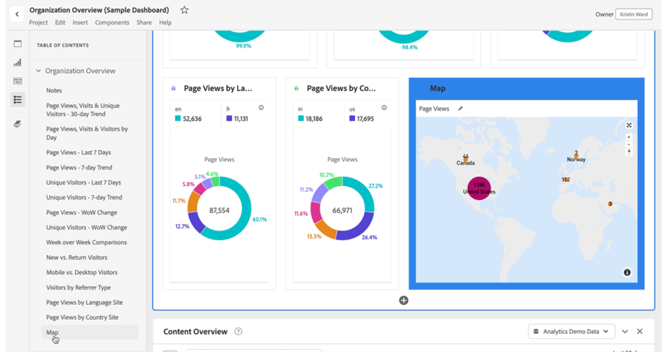

# Sommario

In Analysis Workspace puoi visualizzare il sommario di un progetto, per spostarti rapidamente tra i pannelli e le visualizzazioni al suo interno. Il sommario è particolarmente utile quando si visualizzano progetti più grandi che contengono molti pannelli e visualizzazioni.

>[!BEGINSHADEBOX]

Per un video dimostrativo, guarda  [Creare un sommario](https://experienceleague.adobe.com/it/docs/analytics-learn/tutorials/analysis-workspace/navigating-workspace-projects/create-a-toc-in-analysis-workspace){target="_blank"}.

>[!ENDSHADEBOX]

>[!TIP]
>
>Puoi utilizzare la visualizzazione dell’intestazione Sezione per identificare e articolare una sezione all’interno di un pannello che contiene molte visualizzazioni. Anche queste intestazioni di sezione vengono visualizzate come voci nel sommario.
>

Per visualizzare il sommario di un progetto:

1. In Analysis Workspace, vai al progetto in cui desideri visualizzare il sommario.

1. Nel pannello del pulsante, seleziona  **[!UICONTROL Table of contents]**. Per ulteriori informazioni, consulta [Panoramica su Analysis Workspace](/help/analyze/analysis-workspace/home.md). 

   Viene visualizzato il **[!UICONTROL Table of contents]** del progetto e ogni pannello viene espanso per impostazione predefinita.

1. Nel **[!UICONTROL Table of contents]**, seleziona una visualizzazione. 

   La visualizzazione selezionata viene scorsa automaticamente ed evidenziata brevemente.

   

>[!MORELIKETHIS]
>
>* [Semplifica la navigazione nella dashboard con la nuova funzione Sommario in Adobe Analytics](https://experienceleaguecommunities.adobe.com/t5/adobe-analytics-blogs/simplify-dashboard-navigation-with-the-new-table-of-contents/ba-p/731284?profile.language=it)

<!--
# Project table of contents

You can view a table of contents within each project in Analysis Workspace, allowing you to quickly move between any panels and visualizations that exist in the project. This is especially useful when viewing larger projects that contain many panels and visualizations.

>[!BEGINSHADEBOX]

See  [Table of contents](https://experienceleague.adobe.com/it/docs/analytics-learn/tutorials/analysis-workspace/navigating-workspace-projects/create-a-toc-in-analysis-workspace){target="_blank"} for a demo video.

>[!ENDSHADEBOX]

To view the table of contents on a project:

1. In Analysis Workspace, go to the project where you want to view the table of contents.

1. In the left nav, select the table of contents icon . 

   The table of contents for the project is displayed, and each panel is expanded by default.

   

1. In the table of contents, select a visualization to go to it within the project.
-->