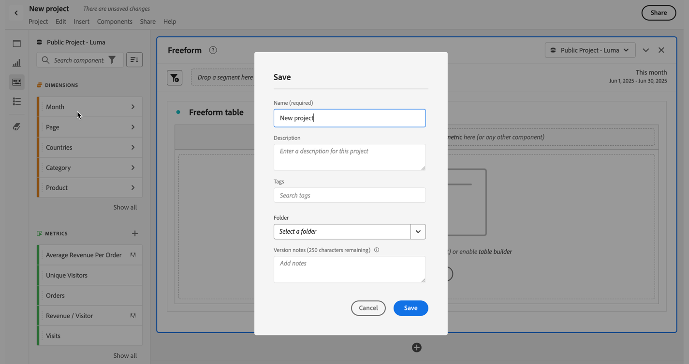
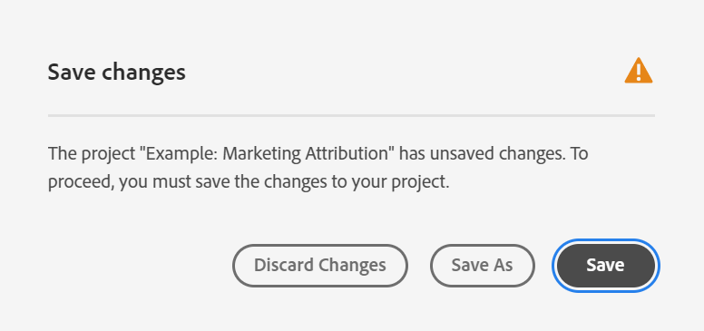

# Salvare i progetti

Per salvare le modifiche apportate a un progetto, vai al menu **[!UICONTROL Project]** di Workspace. Inoltre, in alcuni casi Adobe salva automaticamente i progetti.

## Opzioni di salvataggio dei progetti {#Save}

È possibile effettuare diverse azioni di salvataggio nel menu **[!UICONTROL Project]**, a seconda di come desideri accedere all’analisi in futuro.

| Azione | Descrizione |
|---|---| 
| **[!UICONTROL Save]** | Salva le modifiche apportate al progetto. Se il progetto è condiviso, i destinatari del progetto visualizzeranno anche le modifiche. Quando salvi il progetto per la prima volta, viene richiesto di assegnare al progetto un nome, una descrizione (facoltativa) e di aggiungere tag (facoltativi). |
| **[!UICONTROL Save as]** | Crea un duplicato del progetto. Il progetto originale non subirà modifiche. |
| **[!UICONTROL Save as template]** | Salva il progetto come [modello personalizzato](https://docs.adobe.com/content/help/it-IT/analytics/analyze/analysis-workspace/build-workspace-project/starter-projects.html) che diventa disponibile per la tua organizzazione in **[!UICONTROL Project > New]** |

## Salvataggio automatico {#Autosave}

I progetti esistenti, ovvero quelli salvati almeno una volta, vengono salvati automaticamente ogni due minuti nel dispositivo locale. I nuovi progetti che non sono mai stati salvati non vengono attualmente salvati automaticamente.

Esistono alcune situazioni che possono allontanarti dalle modifiche non salvate apportate a un progetto, risultando in diverse azioni disponibili.

### Aprire un nuovo progetto Workspace

Adobe fornisce l’opzione di salvare prima di uscire dalla pagina. Dopo aver abbandonato un progetto esistente, la copia locale salvata automaticamente viene eliminata.

### Spostarsi o chiudere una scheda

Il browser avverte che le modifiche non salvate andranno perse. È possibile scegliere di uscire o annullare.

### Arresto anomalo del browser o timeout della sessione

Per i progetti **esistenti**, una volta tornato in Workspace l’utente visualizzerà una finestra di dialogo modale per il **recupero del progetto**. Selezionando “Sì” il progetto verrà ripristinato dalla copia locale salvata automaticamente. Selezionando “No” la copia locale salvata automaticamente viene eliminata e viene aperta l’ultima versione del progetto salvata dall’utente.

Per i **nuovi** progetti che non sono mai stati salvati, non è possibile recuperare le modifiche non salvate.