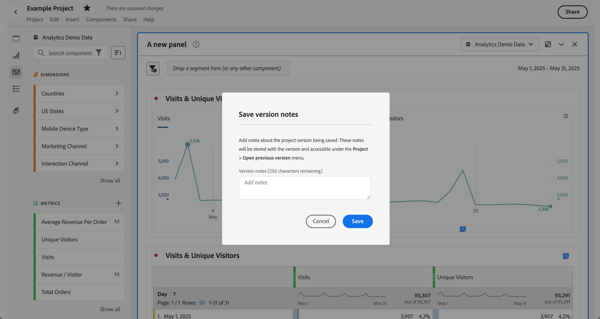
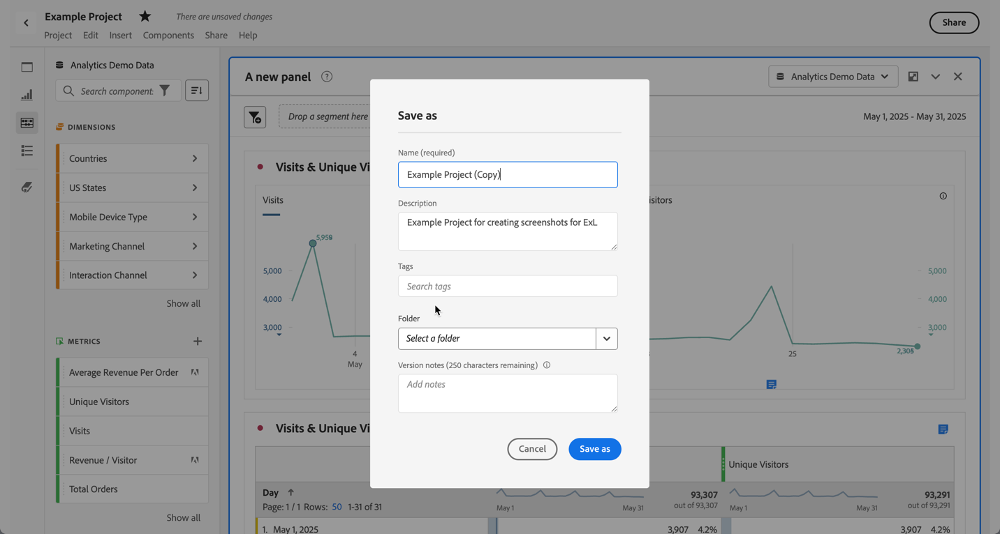
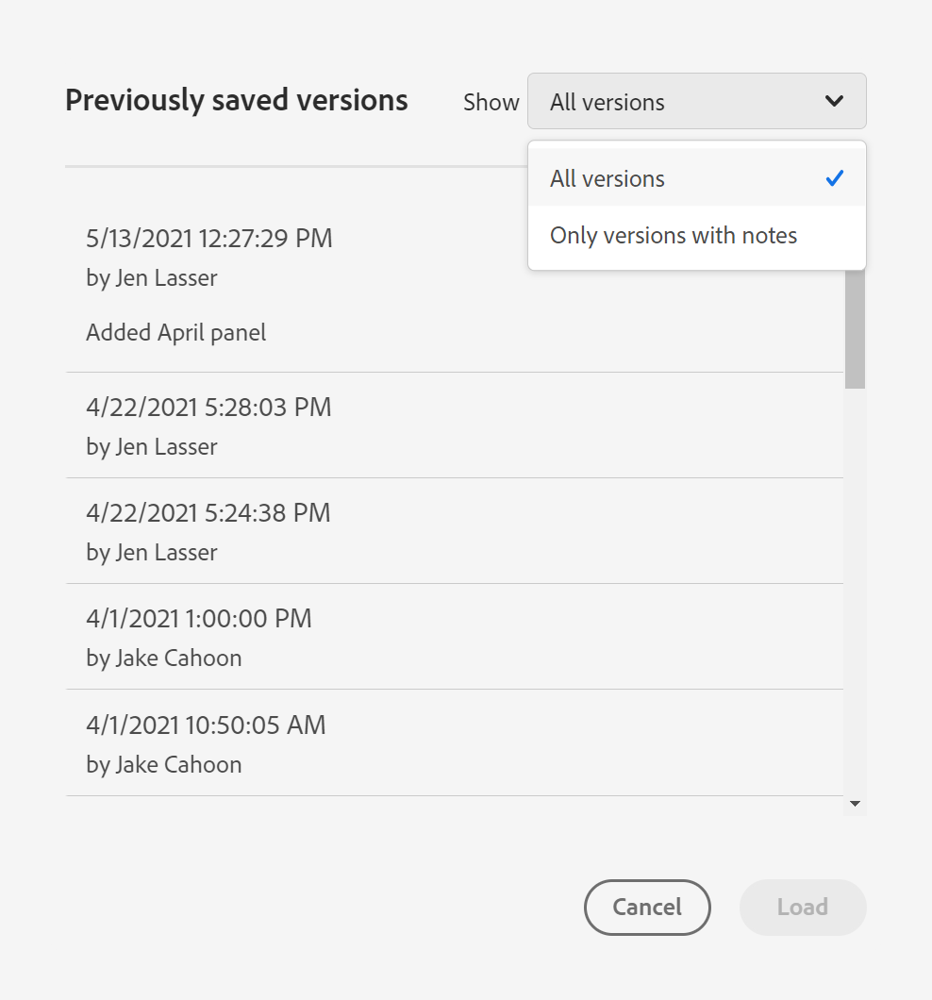

# Salvare i progetti {#save-projects}

<!-- markdownlint-disable MD034 -->

>[!CONTEXTUALHELP]
>id="workspace_project_addnotes"
>title="Aggiungere note"
>abstract="Aggiungi note sulla versione del progetto che viene salvata. Queste note verranno archiviate con la versione e saranno accessibili dal menu **[!UICONTROL Project]** > **[!UICONTROL Open previous version]**."

<!-- markdownlint-enable MD034 -->

I progetti in Analysis Workspace vengono salvati automaticamente ogni 2 minuti. Puoi anche salvare i progetti autonomamente, salvare un progetto come duplicato o salvare un progetto con le note sulla versione.

## Salva

Per salvare un progetto manualmente, con il progetto aperto in Analysis Workspace, seleziona **[!UICONTROL Project]**, quindi scegli tra le seguenti opzioni:

* **[!UICONTROL Save]**

  Salva le modifiche apportate al progetto. Se il progetto è condiviso, anche i destinatari del progetto visualizzeranno le modifiche.

  Quando salvi il progetto per la prima volta, viene visualizzata una finestra di dialogo **[!UICONTROL Save]**.

  

   1. Specifica:

      * **[!UICONTROL Name]** (obbligatorio). nome del progetto.
      * **[!UICONTROL Description]**. Descrizione del progetto.
      * **[!UICONTROL Tags]**. Cerca i tag nel campo [!UICONTROL *Ricerca tag*] o aggiungine di nuovi utilizzando **[!UICONTROL ENTER]**.
      * **[!UICONTROL Folder]**. Selezionare una cartella dal menu a discesa [!UICONTROL *Seleziona una cartella*]. Se non specifichi una cartella, il progetto viene salvato nella cartella corrente dalla quale hai creato un nuovo progetto.
      * **[!UICONTROL Version notes]**. Aggiungi le note sulla versione nell’area di testo *Aggiungi note*.

   1. Seleziona **[!UICONTROL Save]** per salvare il progetto.

  Il salvataggio del progetto in realtà salva una versione del progetto che viene memorizzata per 90 giorni.

  Se salvi un progetto condiviso, una finestra di dialogo di avviso **[!UICONTROL Save changes to shared project]** ti chiede di confermare.

  

   * Seleziona **[!UICONTROL Save]** per salvare il progetto.
   * Seleziona **[!UICONTROL Save as]** per salvare il progetto come duplicato con un nuovo nome.

* **[!UICONTROL Save with notes]**

  

  Quando salvi il progetto, aggiungi note sulle modifiche apportate al progetto. Nella finestra di dialogo Salva note sulla versione:

   1. Immetti le **[!UICONTROL Version notes]** nell’area di testo **[!UICONTROL Add notes]**.
   1. Seleziona **[!UICONTROL Save]**.

  Le note sono archiviate con la versione del progetto e sono disponibili quando [apri una versione precedente](open-projects.md#open-previous-version) del progetto. Una versione salvata con le note viene automaticamente memorizzata per un anno.

* **[!UICONTROL Save As]**

  

  Crea un duplicato del progetto con un nuovo nome. Viene visualizzata la finestra di dialogo Salva con nome.

   1. Specifica:

      * **[!UICONTROL Name]** (obbligatorio). nome del progetto.
      * **[!UICONTROL Description]**. Descrizione del progetto.
      * **[!UICONTROL Tags]**. Cerca i tag nel campo [!UICONTROL *Ricerca tag*] o aggiungine di nuovi utilizzando **[!UICONTROL ENTER]**.
      * **[!UICONTROL Folder]**. Selezionare una cartella dal menu a discesa [!UICONTROL *Seleziona una cartella*]. Se non specifichi una cartella, il progetto viene salvato nella cartella corrente dalla quale hai creato un nuovo progetto.
      * **[!UICONTROL Version notes]**. Aggiungi le note sulla versione nell’area di testo *Aggiungi note*.

   1. Seleziona **[!UICONTROL Save]** per salvare il progetto.

  Puoi salvare il progetto in un’altra cartella. Il progetto originale non verrà interessato.

<!-- Cannot find this option in CJA 
| **[!UICONTROL Save as template]** | Save your project as a [custom template](https://experienceleague.adobe.com/docs/analytics/analyze/analysis-workspace/build-workspace-project/starter-projects.html) that becomes available to your organization under **[!UICONTROL Project > New]** | 
-->

## Salvataggio automatico

>[!IMPORTANT]
>
>Anche se i nuovi progetti vengono salvati automaticamente, è necessario salvare manualmente ogni nuovo progetto la **prima** volta.
>

Tutti i progetti in Analysis Workspace vengono salvati automaticamente ogni 2 minuti nel computer locale. Il salvataggio automatico include i progetti appena creati che non sono ancora stati salvati manualmente.

### Nuovi progetti

Analysis Workspace richiede di salvare manualmente nuovi progetti quando si passa a un altro progetto, si chiude la scheda del browser e così via.

Se per qualsiasi motivo perdi inaspettatamente l’accesso a un nuovo progetto creato prima di salvarlo manualmente, viene salvata una versione di ripristino del progetto nella pagina di destinazione di Analysis Workspace in una cartella denominata **[!UICONTROL Recovered Projects (Last 7 Days)]** (Ultimi 7 giorni). Rripristina il progetto recuperato e salvalo manualmente nella posizione desiderata.

Per ripristinare un progetto recuperato:

1. Passa alla cartella **[!UICONTROL Recovered Projects (Last 7 Days)]** nella pagina di destinazione di Analysis Workspace.

<!-- 
     
  -->

1. Apri il progetto e salvalo nella posizione desiderata.

### Progetti esistenti

Se per qualsiasi motivo esci da un progetto con modifiche non ancora salvate automaticamente, Analysis Workspace richiede di salvare le modifiche o mostra un messaggio di avviso.

Alcuni scenari comuni:

#### Aprire un altro progetto

Se apri un altro progetto mentre lavori a un progetto contenente modifiche non ancora salvate automaticamente, Analysis Workspace richiede di salvare il progetto in corso.

Sono disponibili le seguenti opzioni:

* **[!UICONTROL Save]**: sostituisce la copia locale più recente del progetto salvata automaticamente con le ultime modifiche.
* **[!UICONTROL Discard Changes]**: ignora le modifiche più recenti. Il progetto conserva la copia locale salvata automaticamente più recente.
* **[!UICONTROL Cancel]**: annulla l’azione per aprire un altro progetto e mantenere aperto il progetto esistente.

<!--  -->

#### Uscire o chiudere una scheda

In caso di uscita o chiusura della scheda del browser durante la visualizzazione di un progetto con modifiche non ancora salvate automaticamente, il browser avverte che le modifiche non salvate andranno perse. È possibile scegliere di uscire o annullare. Il modo in cui il browser avvisa l’utente dipende dal browser utilizzato.

### Arresto anomalo del browser o timeout della sessione

Se il browser subisce un arresto anomalo o se la sessione si interrompe, al prossimo accesso ad Analysis Workspace ti verrà richiesto di ripristinare eventuali modifiche al progetto che non sono ancora state salvate automaticamente.

* Seleziona **[!UICONTROL Yes]** per ripristinare il progetto dalla copia salvata automaticamente più recente.

* Seleziona **[!UICONTROL No]** per eliminare la copia salvata automaticamente e aprire l’ultima versione del progetto salvata dall’utente.

<!---->

Per i **nuovi** progetti che non sono mai stati salvati, non è possibile recuperare le modifiche non salvate.

<!-- Shouldn't this belong to another page?  Moved it to a new open projects page

## Open previously saved version

To open a previously saved version of a project:

1. Select **[!UICONTROL Open previous version]** from the **[!UICONTROL Project]** menu.

   

1. Review the list of previous versions available. You can switch between **[!UICONTROL All versions]** and **[!UICONTROL Only versions with notes]**.

   For each version, the list shows a timestamp
   [!UICONTROL Timestamp] and [!UICONTROL Editor] are shown, in addition to [!UICONTROL Notes] if they were added when the [!UICONTROL Editor] saved. Versions without notes are stored for 90 days; versions with notes are stored for 1 year.
1. Select a previous version and click **[!UICONTROL Load]**.
   The previous version then loads with a notification. The previous version does not become the current saved version of your project until you click **[!UICONTROL Save]**. If you navigate away from the loaded version, when you return, you will see the last saved version of the project.

-->

<!--
# Save projects {#save-projects}

>[!CONTEXTUALHELP]
>id="workspace_project_addnotes"
>title="Add notes"
>abstract="Add notes about the project version being saved. These notes will be stored with the version and accessible under the **[!UICONTROL Project]** > **[!UICONTROL Open previous version]** menu."

Projects in Analysis Workspace are automatically saved every 2 minutes. 

You can also manually save projects. Additional options such as adding tags or notes are available when you manually save a project.

## Save projects manually {#Save} 

Various options are available when manually saving a project in Analysis Workspace.

To manually save a project:

1. With your project open in Analysis Workspace, select **[!UICONTROL Project]**, then choose from the following options: 

   | Action | Description | 
   |---|---| 
   | **[!UICONTROL Save]** | Save changes to your project. If the project is shared, recipients of the project will also see the changes. When you first save your project, you are prompted to give the project a name, (optional) description and add (optional) tags. | 
   | **[!UICONTROL Save with notes]** | Before your project saves, add notes about what changed in the project. Notes are stored with the project version and are available to all editors under [!UICONTROL Project] > [!UICONTROL Open previous version]. | 
   | **[!UICONTROL Save as]** | Create a duplicate of your project. The original project will not be affected. | 
   | **[!UICONTROL Save as template]** | Save your project as a [template](/help/analyze/analysis-workspace/templates/create-templates.md) that becomes available to your organization under **[!UICONTROL Project > New]** | 

## Auto-save {#Autosave} 

All projects in Analysis Workspace are automatically saved every 2 minutes to your local machine. This includes newly created projects that are not yet saved manually. 

* **New projects:** Even though new projects are auto-saved, you must save each new project manually the first time. Analysis Workspace prompts you to save new projects manually when switching to another project, closing the browser tab, and so forth. 

  If for any reason you unexpectedly lose access to a newly created project before manually saving it, a recovery version of your project is saved on the Analysis Workspace landing page in a folder called `Recovered Projects (Last 7 Days)`. You must restore the recovered project and manually save it to a desired location. 

  To restore a recovered project:
  
  1. Go to the [!UICONTROL **Recovered Projects**] folder on the Analysis Workspace landing page.

     

  1. Open your project and save it to a desired location. 

* **Existing projects:** If for any reason you leave a project with changes that are not yet auto-saved, Analysis Workspace either prompts you to save your changes or provides a warning message. 

  Following are some common scenarios:

### Open another project 

If you open an additional project while working on a project that contains changes that are not yet auto-saved, Analysis Workspace prompts you to save the current project before leaving.

The following options are available:

* **Save:** Replaces the most recent auto-saved local copy of your project with your latest changes.
* **Save As:** Saves your latest changes as a new project. The original project is saved only with the most recent auto-saved changes.
* **Discard Changes:** Discards your latest changes. The project retains the most recent auto-saved changes.

### Navigate away or close a tab 

If you navigate away from the page or close the browser tab while viewing a project with changes that are not yet auto-saved, the browser warns that your unsaved changes will be lost. You can choose to leave or cancel. 

### Browser crashes or session times out 

If your browser crashes or if your session times out, then the next time you access Analysis Workspace you're prompted to recover any changes to your project that are not yet auto-saved.

Following is the Project Recovery dialog box that displays the first time you access Analysis Workspace after a crash or a timeout.

Select **Yes** to restore the project from the most recent auto-saved copy.

Select **No** to delete the auto-saved copy and open the last user-saved version of the project.

For **new** projects that have never been saved, unsaved changes are not recoverable.

## Open a previous version {#previous-version}

To open a previous version of a project:

1. Go to **[!UICONTROL Project]** > **[!UICONTROL Open previous version]**

   
   
1. Review the list of prior versions available. 
   [!UICONTROL Timestamp] and [!UICONTROL Editor] are shown, in addition to [!UICONTROL Notes] if they were added when the [!UICONTROL Editor] saved. Versions without notes are stored for 90 days; versions with notes are stored for 1 year.
1. Select a previous version and click **[!UICONTROL Load]**.
   The previous version then loads with a notification. The previous version does not become the current saved version of your project until you click **[!UICONTROL Save]**. If you navigate away from the loaded version, when you return, you will see the last saved version of the project. 

-->