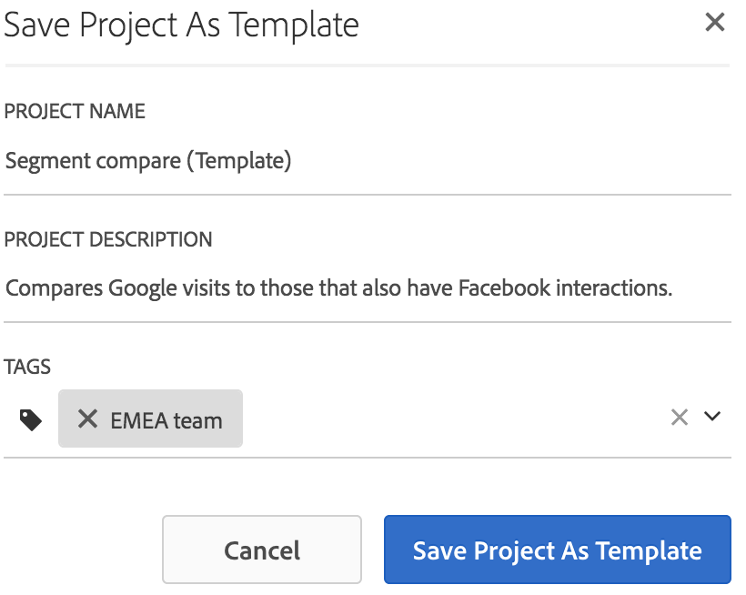

# Modelli

## Modelli{#topic_40932F09E18A467983AFBB29908E1CB8} per progetti 

Puoi scegliere se creare un progetto da:

* Un progetto vuoto (impostazione predefinita). For instructions, see [Create an Analysis Workspace Project](../../../analyze/analysis-workspace/build-workspace-project/t-freeform-project.md#task_C2C698ACC7954062A28E4784911E6CF2).
* Un modello standard. Sono modelli già pronti creati e forniti da Adobe.
* Un modello personalizzato. Questi modelli possono essere creati da utenti con o senza autorizzazioni di tipo amministratore, purché sia stata loro concessa l’autorizzazione “Salva come modello”. (See [Manage product permissions](https://helpx.adobe.com/enterprise/using/manage-permissions-and-roles.html) in the Admin Console documentation for more information.

* [Creare un modello personalizzato](../../../analyze/analysis-workspace/build-workspace-project/starter-projects.md#task_279637F56CFD4B6094D7CBDB82FA4835)
* [Modelli standard](../../../analyze/analysis-workspace/build-workspace-project/starter-projects.md#concept_4FE900FEEC894E849CB6C6A0E0ADA524)

## Create a custom template {#task_279637F56CFD4B6094D7CBDB82FA4835}

Gli utenti con diritti di amministratore possono trasformare qualunque progetto che creano in un modello personalizzato effettuando le seguenti operazioni:

1. Apri il progetto.
1. Go to **[!UICONTROL Project]** &gt; **[!UICONTROL Save As Template]**.

   

   Il progetto viene salvato con il nome corrente, seguito dalla parola (Modello) tra parentesi. Gli amministratori possono cambiare questo nome modificando il modello.

   >[!NOTE]
   >
   >Per impostazione predefinita, i modelli di progetto sono visibili a tutti gli utenti dell'organizzazione. Puoi utilizzare dei tag per organizzare i modelli. (Go to **[!UICONTROL Project]** &gt; **[!UICONTROL Project Info & Settings]** to edit tags and descriptions.)

### Azioni eseguibili sui modelli personalizzati

<table id="table_D7C7B0CA1EE64E108484C03426800EBC"> 
 <thead> 
  <tr> 
   <th colname="col1" class="entry"> Azione </th> 
   <th colname="col2" class="entry"> Descrizione </th> 
  </tr>
 </thead>
 <tbody> 
  <tr> 
   <td colname="col1"> 
Modificare       un modello 
 </td> 
   <td colname="col2"> 
Consente a un amministratore di modificare il modello cambiandone l’origine dati e modificando componenti, visualizzazioni, intervalli di date ecc. 
 
Sono disponibili due modi per modificare un modello personalizzato: 
 
    <ul id="ul_2B3A371F83334E14806385753A360903"> 
     <li id="li_EE75E0281B764BA9B56FF1DB1B12D2CC">Visualizza l’elenco dei modelli personalizzati in Analysis Workspace, selezionane uno e fai clic su Modifica modello, oppure </li> 
     <li id="li_4934DAAA46204990A295E22A97F81EDA">In Analytics, vai a Componenti &gt; Progetti, quindi applica il filtro Modelli. Fai clic sul nome del modello da modificare. </li> 
    </ul> 
 
 
Nota: dopo aver modificato un modello, a seconda della situazione, puoi scegliere Salva o Salva con nome. Queste sono le differenze tra le due opzioni: 
     <ul id="ul_87E2842C8AA442399585B1C6189F5E16"> 
      <li id="li_AB7B189729E14E40A0141ECE2A24C113"><b>Salva</b>: aggiorna il modello personalizzato per tutti gli utenti. Quando un altro utente crea un progetto basato su questo modello personalizzato, vedrà le modifiche che hai apportato. </li> 
      <li id="li_C85B0B9873A3404D8B443BBD30B37CEB"><b>Salva con nome</b>: crea una copia del modello personalizzato con le tue modifiche. </li> 
     </ul> 
 
(Per verificare che sia attiva la modalità di modifica, controlla che la voce di menu Condividi &gt; Condividi progetto sia disabilitata.) 
 </td> 
  </tr> 
  <tr> 
   <td colname="col1"> 
Cercare nei modelli 
 </td> 
   <td colname="col2"> 
Nella finestra di dialogo Modelli personalizzati, fai clic su Cerca modelli. 
 </td> 
  </tr> 
  <tr> 
   <td colname="col1"> 
Ordinare i modelli 
 </td> 
   <td colname="col2"> 
Puoi organizzare i modelli in ordine alfabetico, per rilevanza e per data di creazione. 
 
Nella finestra di dialogo Modelli personalizzati, fai clic su Ordina:. 
 </td> 
  </tr> 
  <tr> 
   <td colname="col1"> 
Applicare tag a un modello 
 </td> 
   <td colname="col2"> 
Apri il modello e vai a Progetto &gt; Informazioni e impostazioni progetto. Fai clic su Aggiungi tag. 
 </td> 
  </tr> 
  <tr> 
   <td colname="col1"> 
Modificare la descrizione di un modello 
 </td> 
   <td colname="col2"> 
Apri il modello e vai a Progetto &gt; Informazioni e impostazioni progetto. Fai doppio clic sulla descrizione e modificala. 
 </td> 
  </tr> 
 </tbody> 
</table>

## Standard templates {#concept_4FE900FEEC894E849CB6C6A0E0ADA524}

Quando aprite un'area di lavoro, i modelli sono disponibili nella barra a sinistra. I modelli di Analysis Workspace coprono i casi d’uso più comuni. Sono raggruppati in base all’applicazione verticale a cui fanno riferimento e sono compilati con dimensioni, segmenti, metriche e visualizzazioni, a seconda della suite per rapporti selezionata.

Puoi usare questi modelli precompilati così come sono o adattarli alle tue esigenze (ad esempio, aggiungendo o sostituendo metriche o visualizzazioni) e salvarli con un nuovo nome.

[Modelli standard in Analysis Workspace su YouTube](https://www.youtube.com/watch?v=aRgYwPneVXg&list=PL2tCx83mn7GuNnQdYGOtlyCu0V5mEZ8sS&index=6) (2:46)

Di seguito sono elencati i modelli e le domande che ogni modello contribuisce a rispondere:

### Media

* **Consumo contenuto**: Quali contenuti vengono maggiormente consumati e coinvolgono gli utenti?
* **Recency - Frequenza - Fedeltà**: Chi sono i miei lettori più fedeli?

### Dispositivi mobili

>[!IMPORTANT]
>
>I modelli per dispositivi mobili sono disponibili solo se la suite di rapporti è abilitata per Mobile.

* **Messaggi:** Si focalizza sulle prestazioni di messaggi in-app e push.
* **Posizione:** Include una mappa che mostra i dati della posizione.
* **Metriche chiave:** Controlla le metriche chiave dell'app.
* **Utilizzo app:** Quanti utenti, avvii e primi avvii sono stati registrati nell'app e qual è la durata media della sessione?
* **Acquisizione:** Scopri le prestazioni dei collegamenti di acquisizione mobile.
* **Prestazioni:** In che modo l'app viene eseguita e dove gli utenti hanno problemi?
* **Mantenimento:** Chi sono i miei utenti più fedeli e cosa fanno?
* **Percorsi:** Quali sono i pattern di utilizzo principali per la mia app?

### Vendita al dettaglio

* **Prestazioni campagna:** Quali campagne generano maggior fatturato?
* **Prodotti:** Quali prodotti hanno prestazioni migliori?

### Web

* **Acquisizione:** Quali sono i principali driver del traffico?
* **Consumo contenuto:** Quali sono le posizioni più visitate sul sito?
* **Mantenimento:** Quali tipi di utenti saranno più fedeli a quelli del sito?
* **Tecnologia:** Quali tecnologie utilizzano per accedere al sito?

### Persone

>[!NOTE]
>
>The People template and its associated People metric is available for use only as part of the [Adobe Experience Cloud Device Co-op](https://marketing.adobe.com/resources/help/en_US/mcdc/mcdc-people.html).

Si basa sulla metrica Persone, una versione deduplicata della metrica Visitatori unici. La metrica Persone misura la frequenza con cui i consumatori che utilizzano più dispositivi interagiscono con il tuo marchio. Il modello consente di:

* Segmentare i dati relativi a USA/Canada rispetto al resto del mondo. Device Co-op attualmente è disponibile solo nel Nord America.
* Affiancare e confrontare le metriche Persone e Visitatori unici.
* Visualizzare il “tasso di compressione”, una metrica calcolata che mostra lo scarto della metrica Persone come percentuale di Visitatori unici.
* Confrontare i totali dei diversi tipi di dispositivi utilizzati dalla clientela
* Verificare la media dei dispositivi pro capite.
* Scoprire come raggruppare i segmenti con la metrica Persone.
* Capire in che modo l’uso di Experience Cloud ID nel tuo ambiente riesca a ottimizzare l’efficacia della metrica Persone.

