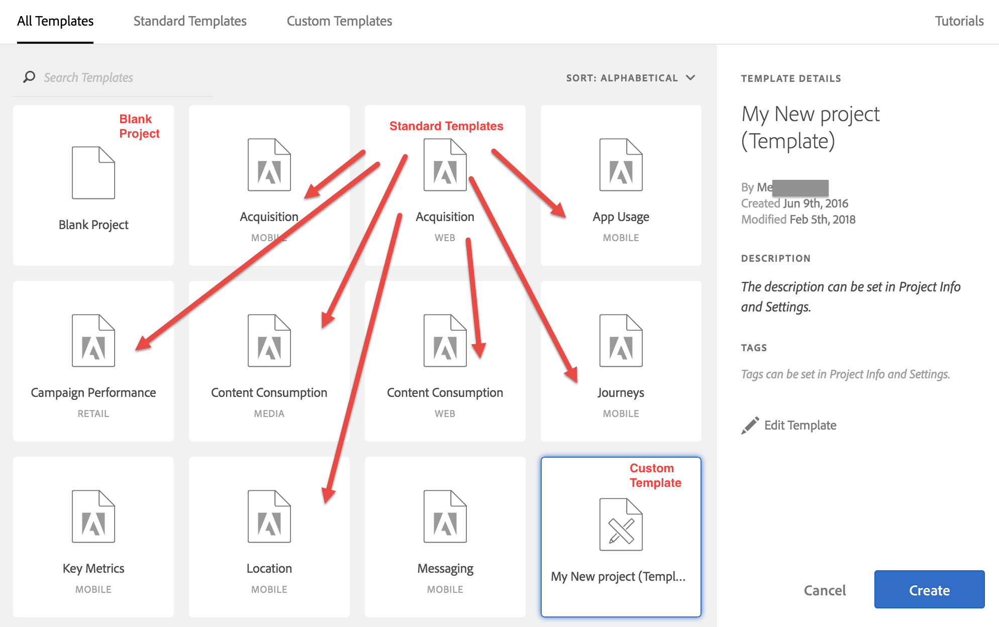

# Modelli

Puoi scegliere di creare un progetto da:

* **Progetto vuoto (predefinito)**: per le istruzioni consulta [Creazione di un progetto di Analysis Workspace](/help/analyze/analysis-workspace/home.md).
* **Modello standard**: questi modelli vengono creati da Adobe e vengono forniti con il prodotto.
* **Modello personalizzato**: questi modelli possono essere creati, condivisi o eliminati da utenti con diritti di amministratore o da non amministratori, a condizione che dispongano dell’autorizzazione [!UICONTROL Analysis Workspace: Save as Template] in Admin Console. [Ulteriori informazioni...](https://experienceleague.adobe.com/docs/analytics/admin/admin-console/permissions/product-profile.html?lang=it)

## Creare modelli personalizzati {#create-custom-template}

Gli utenti con diritti di amministratore possono trasformare qualunque progetto che creano in un modello personalizzato Ecco come:

1. Apri il progetto.
1. Vai a **[!UICONTROL Project]** > **[!UICONTROL Save As Template]**.

   

   Il progetto viene salvato con il nome corrente, seguito dalla parola (Modello) tra parentesi. Gli amministratori possono cambiare questo nome modificando il modello.

   >[!NOTE]
   >
   >Per impostazione predefinita, i modelli di progetto sono visibili a tutti gli utenti dell’organizzazione. Puoi utilizzare dei tag per organizzare i modelli. (Vai a **[!UICONTROL Project]** (Progetto) > **[!UICONTROL Project Info & Settings]** (Informazioni e impostazioni progetto) per modificare tag e descrizioni.)

Ecco un video sulla creazione e la gestione di modelli personalizzati:

>[!VIDEO](https://video.tv.adobe.com/v/23231/?quality=12)

### Gestire i modelli personalizzati {#manage-custom-template}

| Azione | Descrizione |
|--- |--- |
| Modificare un modello | Consente a un amministratore di modificare il modello cambiandone l’origine dati e modificando componenti, visualizzazioni, intervalli di date ecc.  Sono disponibili due modi per modificare un modello personalizzato:<ul><li>Visualizza l’elenco dei modelli personalizzati in Analysis Workspace, selezionane uno e fai clic su Modifica modello, oppure</li><li>In Analytics, vai a Componenti > Progetti, quindi applica il filtro Modelli. Fai clic sul nome del modello da modificare.</li></ul>**Nota:** dopo aver modificato un modello, a seconda della situazione, puoi scegliere Salva o Salva con nome. Queste sono le differenze tra le due opzioni:<ul><li>**Salva:** aggiorna il modello personalizzato per tutti gli utenti. Quando un altro utente crea un progetto basato su questo modello personalizzato, vedrà le modifiche che hai apportato.</li><li>**Salva con nome:** crea una copia del modello personalizzato con le modifiche apportate. Per verificare che sia attiva la modalità di modifica, controlla che la voce di menu Condividi > Condividi progetto sia disabilitata.</li></ul> |
| Cercare nei modelli | Nella finestra di dialogo Modelli personalizzati, fai clic su Cerca modelli. |
| Ordinare i modelli | Puoi organizzare i modelli in ordine alfabetico, per rilevanza e per data di creazione.  Nella finestra di dialogo Modelli personalizzati, fai clic su Ordina. |
| Applicare tag a un modello | Apri il modello e vai a Progetto > Informazioni e impostazioni progetto. Fai clic su Aggiungi tag. |
| Modificare la descrizione di un modello | Apri il modello e vai a Progetto > Informazioni e impostazioni progetto. Fai doppio clic sulla descrizione e modificala. |

## Modelli standard

La prima volta che si apre un’Workspace i modelli sono disponibili nella barra a sinistra. I modelli di Analysis Workspace coprono i casi d’uso più comuni. Sono raggruppati in base all’applicazione verticale a cui fanno riferimento e sono compilati con dimensioni, segmenti, metriche e visualizzazioni, a seconda della suite per rapporti selezionata.

Puoi usare questi modelli precompilati così come sono o adattarli alle tue esigenze (ad esempio, aggiungendo o sostituendo metriche o visualizzazioni) e salvarli con un nuovo nome.

Video tutorial sui [modelli standard in Analysis Workspace](https://experienceleague.adobe.com/docs/analytics-learn/tutorials/analysis-workspace/analysis-workspace-basics/standard-templates-in-analysis-workspace.html?lang=it) (2:46)

Di seguito sono riportati i modelli disponibili e le domande che ogni modello può rispondere.

### Formazione

Questo modello standard illustra la terminologia e i passaggi comuni per lo svolgimento della prima analisi in Workspace. È disponibile come modello standard nel modale Nuovo progetto e sostituisce il progetto di esempio attuale per i nuovi utenti che non hanno altri progetti nel loro elenco.

Ecco un video sulla [!UICONTROL Training Tutorial] modello:

>[!VIDEO](https://video.tv.adobe.com/v/33773/?quality=12)

### Advertising

>[!IMPORTANT]
>
>I modelli pubblicitari sono disponibili solo se la suite di rapporti è abilitata per [Advertising Analytics](https://experienceleague.adobe.com/docs/analytics/integration/advertising-analytics/overview.html?lang=it).

* **Motori di ricerca a pagamento**: questo modello suddivide le tendenze pubblicitarie, le piattaforme di annunci, le parole chiave, gli account, le campagne e molto altro.

### Commerce

* **Magento: Marketing e Commerce**: questo modello suddivide la conversione e-commerce in base all’attribuzione del canale di marketing, oltre a fornire informazioni dettagliate in base a parole chiave di ricerca, pagina di destinazione, posizione geografica e altro ancora. Questo è un video tutorial sulla [Magento: modello di marketing e commercio](https://experienceleague.adobe.com/docs/analytics-learn/tutorials/integrations/magento/magento-analysis-workspace-template.html?lang=it).

### Raccolta dati

* **Impatto ITP**: scopri in che modo l’ITP di Apple influisce sui dati e come regolare di conseguenza il reporting.

### Media

* **Consumo di contenuti**: Chi sono i miei lettori più fedeli
* **Recency - Frequenza - Fedeltà**: quali contenuti vengono maggiormente consumati e coinvolgono maggiormente gli utenti?
* **Consumo di contenuti multimediali in streaming**: fornisce tendenze e metriche principali del consumo di contenuti multimediali su tutti i dispositivi digitali. Ecco un video sul modello di consumo di contenuti multimediali in streaming:

   >[!VIDEO](https://video.tv.adobe.com/v/23901/?quality=12)

### Mobile

>[!IMPORTANT]
>
>I modelli mobili sono disponibili solo se la suite di rapporti è abilitata per l’analisi delle app mobili.

* **Acquisizione:** scopri le prestazioni dei collegamenti per acquisizione mobile.
* **Utilizzo app:** quanti utenti, avvii e primi avvii sono stati registrati per l’app, e quanto dura in media una sessione?
* **Percorsi:** Quali sono i pattern di utilizzo principali per la l’app?
* **Metriche chiave:** controlla le metriche chiave della tua app.
* **Posizione:** include una mappa che mostra i dati della posizione.
* **Messaggistica:** si focalizza sulle prestazioni di messaggi in-app e push.
* **Prestazioni:** quali sono le prestazioni dell’app e dove vengono riscontrati problemi dagli utenti?
* **Fidelizzazione:** chi sono i miei utenti più fedeli e cosa fanno?

### Vendita al dettaglio

* **Prestazione campagna:** quali campagne generano maggior fatturato?
* **Prodotti:** quali prodotti hanno prestazioni migliori?

### Web

* **Acquisizione:** quali fattori generano maggior traffico verso il sito Web?
* **Panoramica sulle prestazioni del sito AEM:** Come stanno andando le prestazioni del mio sito Adobe Experience Manager?
* **Consumo di contenuti:** quali sono le aree del sito più visitate?
* **Fidelizzazione:** che tipi di utenti hanno più probabilità di diventare utenti fedeli del sito?
* **Tecnologia:** quali tecnologie vengono usate per accedere al sito?

### Persone

Questo modello è basato sulla metrica Persone, che è una versione deduplicata della metrica Visitatori univoci. La metrica Persone misura la frequenza con cui i consumatori che utilizzano più dispositivi interagiscono con il tuo marchio. Il modello consente di::

* Segmentare i dati relativi a USA/Canada rispetto al resto del mondo
* Affiancare e confrontare le metriche Persone e Visitatori univoci
* Visualizzare il “tasso di compressione”, una metrica calcolata che mostra lo scarto della metrica Persone come percentuale di Visitatori univoci
* Confrontare i totali dei diversi tipi di dispositivi utilizzati dalla clientela.
* Verificare la media dei dispositivi pro capite
* Scoprire come raggruppare i segmenti con la metrica Persone
* Capire in che modo l’uso di Experience Cloud ID nel tuo ambiente riesca a ottimizzare l’efficacia della metrica Persone

### Percorsi IQ: modello di Analytics tra dispositivi

<!--This content is mirrored in the CDA doc.-->

Questo modello consente di visualizzare dati vitali delle prestazioni tra dispositivi. È disponibile solo per i clienti che hanno accesso a [Cross-Device Analytics](https://experienceleague.adobe.com/docs/analytics/components/cda/overview.html?lang=it) (CDA).

* **Identificazione degli utenti**: mostra la frequenza con cui i visitatori del sito vengono identificati utilizzando metodi basati su Cross-Device Analytics.
* **Misurazione della dimensione dell’audience**: mostra un confronto tra “Dispositivi univoci” e “Persone”. La proporzione di questi due numeri è nota come “compressione tra dispositivi”, una metrica calcolata visibile in questo pannello. Questa metrica di compressione dipende da un’ampia gamma di fattori:
   * **Tasso di accesso**: più utenti accedono al sito, più Adobe è in grado di identificare e unire i visitatori tra i dispositivi. I siti con un tasso di accesso basso hanno anche tassi di compressione bassi.
   * **Copertura di Experience Cloud ID**: è possibile unire solo i visitatori con un ECID. Una percentuale inferiore di visitatori del sito che utilizza un ECID è correlata a tassi di compressione più bassi.
   * **Utilizzo di più dispositivi**: se i visitatori del sito non utilizzano più dispositivi le percentuali di compressione potrebbero essere più basse.
   * **Granularità del reporting**: la compressione per giorno è generalmente inferiore della compressione per mese o per anno. Le possibilità che una sola persona utilizzi più dispositivi si riducono maggiormente in un singolo giorno che nell’arco di un mese intero. Segmentazione, filtraggio o utilizzo di dimensioni di suddivisione possono mostrare inoltre un tasso di compressione più basso.
* **Segmenti basati sulle persone**: contiene un elenco a discesa dei segmenti che consente di visualizzare dati specifici per il dispositivo. Questo pannello incoraggia la sperimentazione con i segmenti per vedere in che modo i rapporti possono essere influenzati dall’inclusione o esclusione di tipi di dispositivi.
* **Analisi del percorso tra dispositivi**: fornisce rapporti di flusso e di fallout in base al tipo di dispositivo.
* **Attribuzione tra dispositivi**: combina le funzioni di Journey IQ e Attribution IQ.
* **Altri suggerimenti e trucchi**: argomenti utili che riguardano CDA e permettono di ottenere il massimo dal suo utilizzo.
