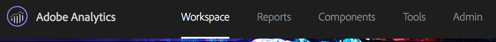
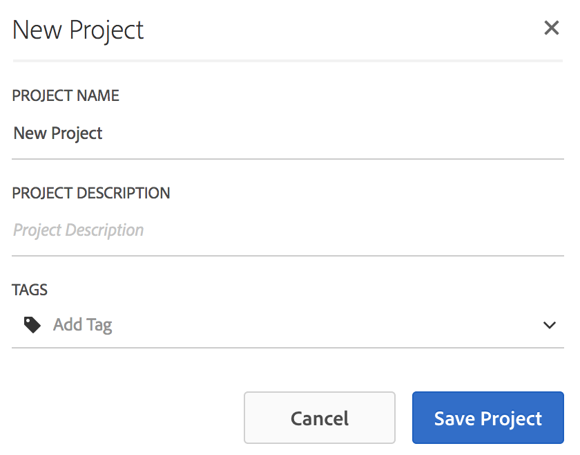
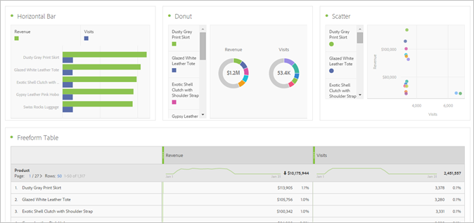

# Creare un progetto Workspace

Crea un progetto e aggiungi componenti (dimensioni, metriche, segmenti e intervalli di date) al pannello a forma libera.

Questo articolo presenta gli elementi dell’interfaccia di Analysis Workspace e mostra come creare un progetto. Per casi d’uso specifici, consulta Casi [d’uso per Analysis Workspace](../../../analyze/analysis-workspace/freeform-analysis-examples-use-cases.md#concept_173D1EB783F24EA89E754628BA30FF4B).

## Creazione di un progetto

1. Specifica le autorizzazioni per l’utente per creare e curare progetti.

   Before creating or curating an Analysis Workspace project, administrators must add you to a group with the **[!UICONTROL Create / Curate Projects in Analysis Workspace]** permission enabled, or to the **[!UICONTROL All Report Access]** user group. ( **[!UICONTROL Admin]** &gt; **[!UICONTROL User Management]** &gt; [Groups](https://marketing.adobe.com/resources/help/en_US/reference/groups.html)).

1. In the [!DNL Experience Cloud], click **[!UICONTROL Analytics]** &gt; **[!UICONTROL Workspace]**.

   

   In alternativa, inserisci una barra (/) per aprire la barra di ricerca del rapporto, quindi digita *`workspace`*.

   

1. Fai clic su **[!UICONTROL Create New Project]**.

   Puoi scegliere di creare un progetto in base a:

* Un progetto vuoto (impostazione predefinita). Per le istruzioni del caso, leggi di seguito.
* Un modello standard. Sono modelli già pronti creati e forniti da Adobe. Per le istruzioni del caso, vedi [Modelli](../../../analyze/analysis-workspace/build-workspace-project/starter-projects.md#concept_49B9A327C5004DB0A4BE6291435625C5)
* Un modello personalizzato. Questi modelli vengono creati da utenti provvisti di diritti di amministratore. Per le istruzioni del caso, vedi [Modelli](../../../analyze/analysis-workspace/build-workspace-project/starter-projects.md#concept_49B9A327C5004DB0A4BE6291435625C5)

   

1. To create a project from a blank project, click **[!UICONTROL Blank Project]**.

   * Then click **[!UICONTROL Create]**, or
   * Basta fare clic **[!UICONTROL Enter]**.
   Viene visualizzato un progetto vuoto con un pannello a forma libera e una visualizzazione della tabella di dati.

   

   >[!NOTE]
   >
   >A volte, durante il caricamento di un progetto (o il passaggio a una suite di rapporti) viene visualizzato un messaggio "Suite di rapporti non compatibile" in cui non tutti i componenti (metriche/dimensioni) inclusi nel progetto sono inclusi nella suite di rapporti. Viene visualizzato un elenco dei componenti non compatibili, per segnalare all’utente il motivo della generazione di questo messaggio.

<table id="table_3989E45D9D4241CBB2E58B29DA257B2F"> 
 <thead> 
  <tr> 
   <th colname="col1" class="entry"> Elemento </th> 
   <th colname="col2" class="entry"> Descrizione </th> 
  </tr> 
 </thead>
 <tbody> 
  <tr> 
   <td colname="col1"><a href="../../../analyze/analysis-workspace/components/analysis-workspace-components.md#concept_BEBE3A75E072495D9E2F895567BBD462" format="dita" scope="local"> Componenti</a> </td> 
   <td colname="col2"> 
Dimensioni, metriche, segmenti e intervalli di date che possono essere trascinati nei progetti. 
 </td> 
  </tr> 
  <tr> 
   <td colname="col1"><a href="../../../analyze/analysis-workspace/visualizations/freeform-analysis-visualizations.md#concept_09242627629147A88A68F1506954C276" format="dita" scope="local"> Visualizzazioni</a> </td> 
   <td colname="col2"> 
Elementi da trascinare nel pannello o nelle aree di progetto dell’interfaccia. 
 </td> 
  </tr> 
  <tr> 
   <td colname="col1"><a href="../../../analyze/analysis-workspace/visualizations/freeform-table.md#concept_0D2E24FCCBAF4194AA941448860E422F" format="dita" scope="local">Pannello a forma libera</a> </td> 
   <td colname="col2"> 
Area di lavoro con la quale interagisci in Analysis Workspace. 
 </td> 
  </tr> 
 </tbody> 
</table>

1. Salva il progetto. Name the project, provide a description (optional, but useful) and tag the project (optional), then click **[!UICONTROL Save Project]**.

   

1. Ora puoi fare clic con il pulsante destro del mouse e copiare una visualizzazione o un pannello, quindi incollare (inserire) l’elemento copiato in un’altra posizione all’interno del progetto o in un progetto diverso.

   Puoi utilizzare questa funzionalità per creare “blocchi costitutivi” (visualizzazioni/pannelli predefiniti) che possono essere copiati in altri progetti da avviare più rapidamente, con dati specifici della tua attività.

   >[!NOTE]
   >
   >Dopo l’operazione di copia/salvataggio con nome, gli intra-link sono ora relativi al progetto a cui sono collegati, non al progetto originale da cui sono stati copiati.

## Aggiungere componenti e visualizzazioni {#task_CDAC9B3007BE4A3790AFAD3746D669B1}

1. Create il progetto trascinando *`components`* e *`visualizations`* fino al progetto.

   **Componenti**

   La barra degli strumenti dei componenti presenta le dimensioni, le metriche, i segmenti e gli intervalli di date che utilizzi più spesso e supporta la funzione di ricerca.

<table id="table_4626163E26DE46CB86391868BBA3AD32"> 
 <thead> 
  <tr> 
   <th colname="col1" class="entry"> Componente </th> 
   <th colname="col2" class="entry"> Descrizione </th> 
  </tr> 
 </thead>
 <tbody> 
  <tr> 
   <td colname="col1"> Dimensioni (arancione) </td> 
   <td colname="col2"> 
Sono componenti a livello di progetto 
 
 
 
Ai nomi delle dimensioni vengono aggiunti i numeri relativi a proprietà, variabili ed eventi (prop#, eVar#, event#) ed è possibile eseguire delle ricerche in base a tali numeri. Esempio: “Internal Campaign” compare nella barra a sinistra come “Internal Campaign (evar2)”. 
 
 Tieni presente che i numeri di proprietà, variabili ed eventi non sono riportati nella tabella (per evitare titoli troppo lunghi). 
 
Alcune dimensioni predefinite vengono ordinate in modo prestabilito quando vengono trascinate in una tabella a forma libera o visualizzate nella barra a sinistra. Ad esempio, se la dimensione “Ora del giorno” viene rilasciata in una tabella o visualizzata nella barra a sinistra, verrà ordinata dalle 00:00 alle 23:00. L’opzione di ordinamento per qualsiasi colonna di metrica rimane valida. 
 </td> 
  </tr> 
  <tr> 
   <td colname="col1"> Metriche (verde) </td> 
   <td colname="col2"> 
Sono componenti a livello di progetto. 
 
 
 
  Occorrenze è la metrica predefinita per la tabella di dati. 
 </td> 
  </tr> 
  <tr> 
   <td colname="col1"> Segmenti (blu) </td> 
   <td colname="col2"> 
Sono trascinabili solo a livello di pannello, tuttavia puoi creare segmenti in linea nella tabella di dati. 
 
 
 
Per ulteriori informazioni, consulta <a href="../../../analyze/analysis-workspace/freeform-analysis-examples-use-cases.md#concept_173D1EB783F24EA89E754628BA30FF4B" format="dita" scope="local"> Casi di utilizzo per Analysis Workspace</a> . 
 </td> 
  </tr> 
  <tr> 
   <td colname="col1"> Intervalli di date e granularità temporali (viola) </td> 
   <td colname="col2"> 
Sono trascinabili solo a livello di pannello. In fase di configurazione di un intervallo di date, puoi creare un progetto direttamente dal calendario. 
 
 
 </td> 
  </tr> 
 </tbody> 
</table>

**[Visualizzazioni](../../../analyze/analysis-workspace/visualizations/freeform-analysis-visualizations.md#concept_09242627629147A88A68F1506954C276)**

Il [!UICONTROL Visualizations] pannello fornisce grafici standard di Analytics, grafici, ciambelle, tabelle di dati, tabelle di [coorte](../../../analyze/analysis-workspace/visualizations/cohort-table/cohort-analysis.md#concept_9D240A490265427DA694D18D14EACC0E) , diagrammi di Venn e così via. Puoi trascinare diverse visualizzazioni all’interno del progetto.

1. Passaggio

## Usa il menu di scelta rapida per personalizzare i dati.{#concept_8117C300F21843B99F4E1B9AB7B11B6F}

Il menu di scelta rapida consente di effettuare le seguenti azioni in base alla cella su cui fai clic con il pulsante destro, all’interno di una tabella.

<table id="table_0F84CC5B604D4D41BD0C9668DF525929"> 
 <thead> 
  <tr> 
   <th colname="col1" class="entry"> Azione </th> 
   <th colname="col2" class="entry"> Descrizione </th> 
  </tr>
 </thead>
 <tbody> 
  <tr> 
   <td colname="col1"><a href="../../../analyze/analysis-workspace/components/calendar-date-ranges/time-comparison.md#concept_93BCAD81B7A54ABBBA5CD9E419F6F764" format="dita" scope="local"> Aggiunta di una colonna di periodi temporali</a> </td> 
   <td colname="col2"> </td> 
  </tr> 
  <tr> 
   <td colname="col1"><a href="../../../analyze/analysis-workspace/components/calendar-date-ranges/time-comparison.md#concept_93BCAD81B7A54ABBBA5CD9E419F6F764" format="dita" scope="local"> Confronto tra periodi temporali</a> </td> 
   <td colname="col2"> </td> 
  </tr> 
  <tr> 
   <td colname="col1"> 
Copia negli Appunti 
 </td> 
   <td colname="col2"> </td> 
  </tr> 
  <tr> 
   <td colname="col1"> 
Elimina selezionati 
 </td> 
   <td colname="col2"> </td> 
  </tr> 
  <tr> 
   <td colname="col1"><a href="/help/components/c-alerts/intellligent-alerts.md" format="dita" scope="local"> Creazione di un avviso da una selezione</a> </td> 
   <td colname="col2"> </td> 
  </tr> 
  <tr> 
   <td colname="col1"><a href="../../../analyze/analysis-workspace/components/dimensions/t-breakdown-fa.md#task_B594DA2476E84DFDA8279E831F0BD9C4" format="dita" scope="local"> Suddividi</a> 
    <ul id="ul_18C83B8514AD4C1C86C071AA8402CB5C"> 
     <li id="li_6CA84ED293EA4940A7495DA9D9121264">Dimensioni </li> 
     <li id="li_EA16EE017B2E4A6998918706938A21BF">Metriche </li> 
     <li id="li_0405D339CD01405DB508A7D8D1A976B4">Segmenti </li> 
     <li id="li_819CE81C552F49BB9C1B83ED3B42C5F7">Tempo </li> 
    </ul> </td> 
   <td colname="col2"> </td> 
  </tr> 
  <tr> 
   <td colname="col1"><a href="../../../analyze/analysis-workspace/visualizations/freeform-analysis-visualizations.md#concept_09242627629147A88A68F1506954C276" format="dita" scope="local"> Creazione di visualizzazioni</a> </td> 
   <td colname="col2"> </td> 
  </tr> 
  <tr> 
   <td colname="col1"><a href="../../../analyze/analysis-workspace/curate-share/download-send.md#concept_BB548979F47F45739679B830428C3025" format="dita" scope="local"> Scarica come CSV</a> </td> 
   <td colname="col2"> </td> 
  </tr> 
  <tr> 
   <td colname="col1"><a href="../../../analyze/analysis-workspace/analysis-workspace-features.md#concept_4D69EE46E3C24EEB97C935A8789364F9" format="dita" scope="local"> Selezione di tendenze</a> </td> 
   <td colname="col2"> </td> 
  </tr> 
  <tr> 
   <td colname="col1"><a href="../../../analyze/analysis-workspace/components/t-freeform-project-segment.md#task_11C6A2C7717B48049E5750B9D20FEC80" format="dita" scope="local"> Crea segmenti dalla selezione</a> </td> 
   <td colname="col2"> </td> 
  </tr> 
  <tr> 
   <td colname="col1"><a href="../../../analyze/analysis-workspace/c-panels/c-segment-comparison/segment-comparison.md#concept_74FAC1C6D0204F9190A110B0D9005793" format="dita" scope="local"> Esecuzione di un confronto fra segmenti</a> </td> 
   <td colname="col2"> </td> 
  </tr> 
  <tr> 
   <td colname="col1"> Visualizzare solo le righe selezionate </td> 
   <td colname="col2"> </td> 
  </tr> 
  <tr> 
   <td colname="col1"> Visualizza tutte le righe </td> 
   <td colname="col2"> </td> 
  </tr> 
 </tbody> 
</table>

See [Keyboard and Mouse Interactions Available in Analysis Workspace](../../../analyze/analysis-workspace/build-workspace-project/fa-shortcut-keys.md#concept_9A6356084DBC4D468E265E7A65B3E051) for information about copying and selecting rows.
