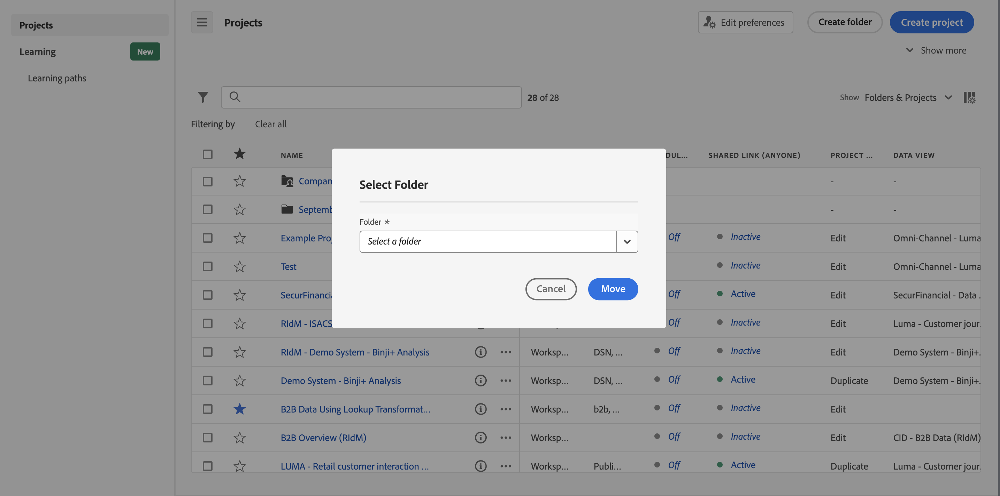

# Aggiungere o spostare progetti nelle cartelle

Puoi aggiungere o spostare i progetti in una cartella direttamente dall’[Elenco progetti](/help/analyze/analysis-workspace/build-workspace-project/freeform-overview.md#project-list).

## Spostare i progetti in una cartella

>[!NOTE]
>
>Quando un amministratore sposta un progetto nella cartella dell’azienda, la cartella viene condivisa con tutti, anche se i privilegi di condivisione esistenti sono limitati. Quando un amministratore sposta un progetto al di fuori dalla cartella dell’azienda, sono applicati nuovamente i privilegi di condivisione esistenti.
>

Per spostare i progetti in una cartella dall’[Elenco progetti](/help/analyze/analysis-workspace/build-workspace-project/freeform-overview.md#project-list):

1. Seleziona  uno o più progetti da spostare in una cartella.

1. Seleziona  **Sposta in** dall’elenco delle [azioni](/help/analyze/analysis-workspace/build-workspace-project/freeform-overview.md#actions) possibili. Viene visualizzata la finestra di dialogo **[!UICONTROL Select Folder]**.

1. Seleziona il nome di una cartella dal menu a discesa **[!UICONTROL Folder]**. Il menu a discesa consente di esplorare la gerarchia delle cartelle per selezionare una sottocartella a qualsiasi livello.

   

1. Seleziona **[!UICONTROL Move]**.

   I progetti selezionati vengono aggiunti alla cartella.

## Aggiungere progetti a una cartella

Per aggiungere progetti a una cartella dall’[Elenco progetti](/help/analyze/analysis-workspace/build-workspace-project/freeform-overview.md#project-list):

1. Seleziona  la cartella a cui desideri aggiungere i progetti.

1. Seleziona  **Aggiungi progetti** dall’elenco delle [azioni](/help/analyze/analysis-workspace/build-workspace-project/freeform-overview.md#actions) possibili. Viene visualizzata la finestra di dialogo **[!UICONTROL Select Folder]**.

1. Seleziona uno o più progetti da [!UICONTROL *Seleziona i progetti da aggiungere alla cartella*].

   

1. Seleziona **[!UICONTROL Add]**.

>[!NOTE]
>
>Solo gli amministratori possono aggiungere progetti alla cartella aziendale o creare un nuovo progetto e salvarlo nella cartella aziendale

<!--
# Add Projects to Folders

You can add projects to a folder in the table view or from within a folder.

>[!NOTE]
>
>Only Analytics administrators can add projects to the Company Folder or create a new project and save it to the Company Folder

## From the table view {#table-view}

Add projects to a folder from the table view on the home page.

1.  Select one or more projects that you want to add to a folder.

    

1.  Select **Move to**. 

    The Select Folder dialogue is displayed.

1.  In the drop-down menu, select the folder where you want to move the selected projects.

    

1.  Select **Move**.

    

    The selected projects are added to the folder.

    

    The Workspace landing page now shows the folder contains (3) projects.

    

## From inside a folder {#inside-folder}

You can also add projects from inside a folder using the ellipses link.

1.  Select and open a folder from the table view.

    

1.  Select the **...** ellipsis icon in the upper-right.
   
    

1.  Select **Add projects** and select the project that you want to add from the drop-down list.

    

    
1.  (Optional) Select additional projects from the drop-down list to add multiple projects.

    

1.  Select **Add** to add the projects to the folder.

    

-->