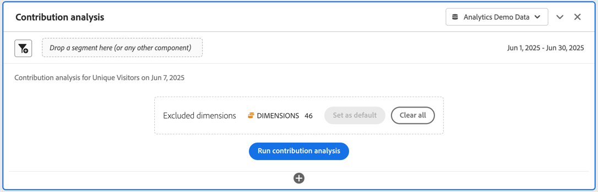
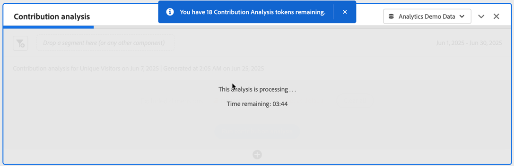

# Eseguire l’analisi dei contributi

L’[analisi dei contributi](/help/analyze/analysis-workspace/c-anomaly-detection/anomaly-detection.md#contribution-analysis) è un potente processo di machine learning progettato per individuare i fattori che contribuiscono a un’anomalia osservata in Adobe Analytics. Questa funzione è utile per individuare aree di interesse o opportunità per ulteriore analisi, in modo molto più rapido di quanto sarebbe altrimenti possibile.

>[!NOTE]
>
>Analisi contributi è supportata solo per i dati con granularità giornaliera.

I passaggi per eseguire Analisi contributi sono i seguenti:

1. Richiama l’analisi dei contributi in un progetto.

   

   1. In una visualizzazione Linee, basata su una tabella a forma libera con granularità giornaliera, seleziona un punto dati di anomalia. Dal popup, selezionare **[!UICONTROL Analyze]**.
   1. In una tabella a forma libera con granularità giornaliera selezionare **[!UICONTROL Run contribution analysis]** dal menu di scelta rapida su qualsiasi riga. Puoi anche eseguire l’analisi su righe in cui non sono visualizzate anomalie.
   1. In una tabella a forma libera con granularità giornaliera, su una riga che indica un’anomalia:
      1. Selezionare l&#39;indicatore ◥.
      1. Dalla finestra di dialogo  **[!UICONTROL Anomaly detected]**, seleziona **[!UICONTROL Open Contribution Analysis]**.

1. (Facoltativo) Puoi restringere l&#39;ambito dell&#39;analisi (e quindi velocizzarla) [escludendo le dimensioni](#exclude-dimensions).

   

1. Seleziona **[!UICONTROL Run contribution analysis]**.

1. Attendere l&#39;elaborazione dell&#39;analisi dei contributi. L’elaborazione può richiedere molto tempo, a seconda delle dimensioni della suite di rapporti e del numero di dimensioni. L’analisi dei contributi esegue l’analisi dei primi 50.000 elementi per dimensione. Viene inoltre visualizzato un avviso relativo al numero di [token di analisi contributi](anomaly-detection.md#contribution-analysis-tokens) rimanenti.

   

1. Analysis Workspace carica un nuovo pannello **[!UICONTROL Contribution analysis]** direttamente in questo progetto.

   

   * Visualizzazione [summary number](/help/analyze/analysis-workspace/visualizations/summary-number-change.md).
   * Visualizzazione [riga](/help/analyze/analysis-workspace/visualizations/line.md) con tendenze mensili.
   * Una **[!UICONTROL Top Items]** [tabella a forma libera](/help/analyze/analysis-workspace/visualizations/freeform-table/freeform-table.md) che visualizza gli elementi principali che contribuiscono a questa anomalia, ordinati per [Punteggio contributo](/help/analyze/analysis-workspace/c-anomaly-detection/anomaly-detection.md#contribution-analysis). Le colonne aggiuntive mostrano la metrica in questione e una metrica **[!UICONTROL Unique Visitors]** per fornire contesto.

   * La **[!UICONTROL Generated Segments (Top Item Clusters)]** [tabella a forma libera](/help/analyze/analysis-workspace/visualizations/freeform-table/freeform-table.md) identifica le associazioni di elementi principali in base al punteggio contributo, alle occorrenze di anomalie e alla percentuale complessiva che ha contribuito alla metrica anomala. Questa associazione viene quindi acquisita come segmento di pubblico (segmento di contributo 1, segmento di contributo 2, ecc.). Seleziona  per visualizzare la definizione del segmento, compresi gli elementi principali di cui i segmenti sono costituiti:

1. Poiché l’analisi dei contributi fa ora parte di Analysis Workspace, puoi sfruttare alcune delle sue funzioni da un menu di scelta rapida di una tabella a forma libera per rendere l’analisi ancora più significativa, ad esempio:

   * [Suddividere ogni elemento dimensione per un&#39;altra dimensione](/help/analyze/analysis-workspace/components/dimensions/t-breakdown-fa.md)
   * [Tendenza di una o più righe](/help/analyze/analysis-workspace/home.md#section_34930C967C104C2B9092BA8DCF2BF81A)
   * [Aggiungi nuove visualizzazioni](/help/analyze/analysis-workspace/visualizations/freeform-analysis-visualizations.md)
   * [Crea avvisi](/help/components/alerts/alerts-overview.md)
   * [Creazione o confronto di segmenti](/help/analyze/analysis-workspace/c-panels/c-segment-comparison/segment-comparison.md)

>[!NOTE]
>
>L’anomalia analizzata viene evidenziata con un punto blu all’interno di Analisi contributi e dei relativi progetti di avvisi intelligenti. Questa evidenziazione fornisce un’indicazione più chiara dell’anomalia analizzata.

## Escludere le dimensioni

È possibile escludere alcune dimensioni dall’analisi dei contributi. Ad esempio, se non ti interessano le dimensioni relative a browser o hardware, puoi escluderle per velocizzare l’analisi.

Per gestire la dimensione esclusa:

* Trascinare le dimensioni indesiderate nel pannello **[!UICONTROL Excluded Dimensions]**, quindi salvare l&#39;elenco facendo clic su **[!UICONTROL Set as Default]**.

* Seleziona **[!UICONTROL Clear All]** per ricominciare.

* Seleziona  per visualizzare un menu di scelta rapida e utilizza  per rimuovere dall&#39;elenco tutte le dimensioni escluse selezionate.

  

Dopo aver modificato le dimensioni da escludere, selezionare di nuovo **[!UICONTROL Run contribution analysis]**.

