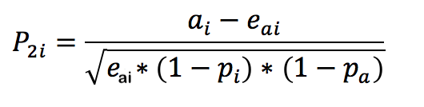

# Tecniche statistiche

Il rilevamento delle anomalie in Analysis Workspace utilizza una serie di tecniche di statistica avanzate per determinare se un’osservazione debba essere considerata come anomalia o meno.

A seconda della granularità della data applicata al rapporto, vengono usate 3 diverse tecniche statistiche per il rilevamento di anomalie su base oraria, giornaliera e settimanale/mensile. Tali tecniche sono descritte di seguito.

## Rilevamento delle anomalie con granularità giornaliera

Per i report con granularità giornaliera, l’algoritmo considera diversi fattori importanti per fornire risultati quanto più precisi possibile. In primo luogo, l’algoritmo determina il tipo di modello da applicare in base ai dati disponibili di cui seleziona una delle due classi: un modello basato su serie temporali o un modello di rilevamento di dati aberranti (filtro funzionale).

Il primo si basa sulle seguenti combinazioni per tipo di errore, tendenza e stagionalità (ETS) come descritto da [Hyndman et al. (2008)](https://link.springer.com/book/10.1007/978-3-540-71918-2). Nello specifico, l’algoritmo prova le seguenti combinazioni:

1. ANA (errore additivo, nessuna tendenza, stagionalità additiva)
1. AAA (errore additivo, tendenza additiva, stagionalità additiva)
1. MNM (errore moltiplicativo, nessuna tendenza, stagionalità moltiplicativa)
1. MNA (errore moltiplicativo, nessuna tendenza, stagionalità additiva)
1. AAN (errore additivo, tendenza additiva, nessuna stagionalità)

L’algoritmo verifica l’idoneità di ciascuna delle combinazioni selezionando quella con il miglior errore percentuale assoluto medio (MAPE). Tuttavia, se il valore MAPE del modello per serie temporale migliore è maggiore del 15%, viene applicato il filtro funzionale. In genere, i dati con un elevato grado di ripetizione (ad esempio, settimana su settimana o mese su mese) sono i più adatti a un modello di serie temporali.

Dopo la selezione del modello, l’algoritmo regola i risultati in base a festività e stagionalità anno su anno. Per le festività, l’algoritmo verifica la presenza delle seguenti festività nell’intervallo di date del rapporto:

* Memorial Day
* 4 luglio
* Giorno del Ringraziamento
* Black Friday
* Cyber Monday
* 24-26 dicembre
* Gennaio 1
* Dicembre 31

Queste festività sono state scelte da un’estesa analisi statistica su numerosi punti di dati di clienti, per individuare le ricorrenze più significative per la maggior parte delle tendenze relative ai clienti. Anche se l’elenco non è certamente esaustivo per tutti i clienti o cicli di business, l’applicazione di queste festività migliora in modo significativo le prestazioni complessive dell’algoritmo per quasi tutti i set di dati dei clienti.

Dopo aver selezionato il modello e individuato le festività nell’intervallo di date del rapporto, l’algoritmo procede come descritto di seguito:

1. Costruire il periodo di riferimento delle anomalie. Questo periodo include fino a 35 giorni prima dell’intervallo di date del rapporto e un intervallo corrispondente di 1 anno prima. e tiene conto dei giorni bisestili quando necessario e di tutte le festività applicabili che possono essersi verificate in un giorno di calendario diverso nell’anno precedente.
1. Verifica se le festività nel periodo corrente (escludendo l’anno precedente) sono anomale in base ai dati più recenti.
1. Se la festività nell’intervallo di date corrente è anomala, regola il valore previsto e l’intervallo di affidabilità della festività corrente data la festività corrispondente dell’anno prima (considerando 2 giorni prima e dopo). La correzione per la festività corrente si basa sul valore MAPE più basso di:

   1. Effetti additivi
   1. Effetti moltiplicativi
   1. Differenza anno su anno

Osserva il notevole miglioramento delle prestazioni per i giorni di Natale e Capodanno nell’esempio seguente:

## Rilevamento delle anomalie con granularità oraria

I dati orari si basano sullo stesso approccio algoritmico utilizzato per la granularità giornaliera. Tuttavia, contano su due pattern di tendenze: il ciclo di 24 ore e il ciclo weekend/feriale. Per acquisire questi due effetti stagionali, l’algoritmo orario crea due modelli distinti per weekend e giorno feriale utilizzando lo stesso approccio già descritto.

Le finestre di formazione per le tendenze orarie si basano su una finestra di lookback di 336 ore.

## Rilevamento delle anomalie con granularità settimanale e mensile

Le tendenze settimanali e mensili non presentano le stesse tendenze settimanali o giornaliere riscontrate con granularità giornaliera o oraria; per questo motivo viene utilizzato un algoritmo distinto. Ogni settimana e ogni mese, un approccio di rilevamento dei valori anomali in due fasi è noto come test GESD (Generalized Extreme Studentized Deviate). Questo test considera il numero massimo di anomalie previste combinato con l’approccio di tipo diagramma a scatola regolato (metodo non parametrico per il rilevamento di dati aberranti) per determinare il numero massimo di dati aberranti. Le due fasi sono:

1. Funzione box-plot ponderata: determina il numero massimo di anomalie per i dati di input.
1. Funzione GESD: applicata ai dati di input con il risultato della prima fase.

La fase di rilevamento delle anomalie stagionali per festività e anno su anno quindi sottrae i dati dell’anno scorso da quelli di quest’anno. Quindi esegue di nuovo l’iterazione dei dati utilizzando il processo in due fasi descritto sopra per verificare che le anomalie siano appropriate in base alla stagionalità. Ognuna di queste granularità di date usa un periodo di lookback di 15 mesi o settimane che comprende l’intervallo di date selezionato per il rapporto e un intervallo di date corrispondente di un anno prima, a scopo di formazione.

## Tecniche di statistica utilizzate nell’analisi dei contributi

L’analisi dei contributi è un potente processo di machine learning progettato per individuare i fattori che contribuiscono a un’anomalia osservata in Adobe Analytics. Questa funzione è utile per individuare aree di interesse o opportunità per ulteriore analisi, in modo molto più rapido di quanto sarebbe altrimenti possibile.

L’analisi dei contributi esegue un algoritmo in due parti per ogni singolo elemento dimensionale disponibile nel rapporto Analisi dei contributi dell’utente. L’algoritmo opera in questo ordine:

1. Per ogni dimensione, elabora il test V di Cramer. Nell’esempio di seguito, considera una tabella di contingenza con visualizzazioni di pagina per paese per periodi di due anni:

   

   Nella Tabella 1, il test V di Cramer può essere utilizzato per misurare l’associazione tra le visualizzazioni di pagina per paese per il periodo 1 (ad esempio, storico) e il periodo 2 (ad esempio, il giorno in cui si verifica l’anomalia). Un indice V di Cramer basso implica un basso livello di associazione. L’indice V di Cramer va da 0 (nessuna associazione) a 1 (associazione completa). La statistica V di Cramer può essere calcolata:

   

1. Per ogni elemento dimensione, il residuo di Pearson (PR) viene utilizzato per misurare l’associazione tra la metrica anomala e ogni elemento dimensione. Il PR segue una distribuzione normale standard, che consente all’algoritmo di confrontare i PR di due variabili casuali anche se le deviazioni non sono paragonabili. In pratica, l’errore non è noto ed è stimato con correzione a campione finita.

   Nell’esempio precedente della tabella 1, la PR, con correzione del campione finita per il paese i e il periodo di tempo 2, è data da

   

   dove

   

   (Una formula simile può essere ottenuta per il periodo di tempo 1).

   Per i risultati finali, il punteggio di ogni elemento dimensione viene quindi ponderato dall’indice del V di Cramer e riportato in scala a un numero compreso tra 0 e 1 per ottenere il punteggio di contributo.
