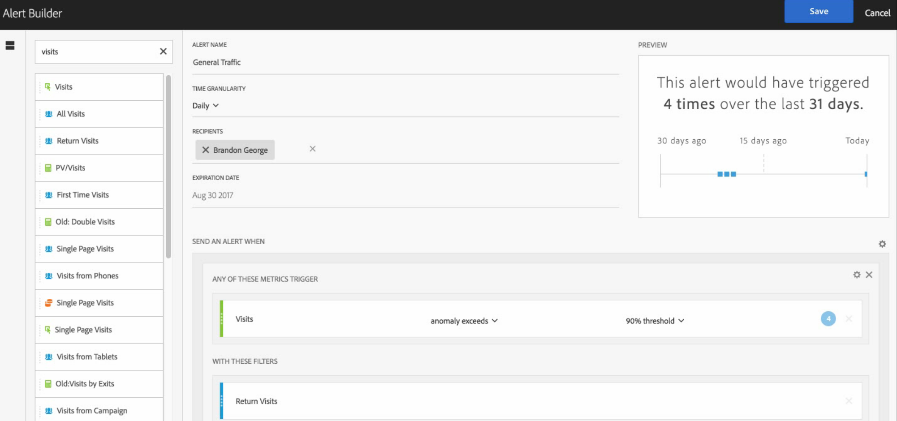

# Alert Builder (Generatore di avvisi)

>[!IMPORTANT]
>
>Gli Avvisi intelligenti sono disponibili solo per i clienti di Adobe Analytics Prime e Adobe Analytics Ultimate.

## Accedere al generatore di avvisi

Puoi accedere a Alert Builder (Generatore di avvisi) in quattro modi:

* Utilizzando la seguente scelta rapida in Analysis Workspace:

   `ctrl (or cmd) + shift + a`
* Da **[!UICONTROL Workspace]** > **[!UICONTROL Components]** > **[!UICONTROL New Alert]**.
* Selezionando uno o più elementi della tabella a forma libera, facendo clic con il pulsante destro del mouse e selezionando **[!UICONTROL Create Alert from Selection]**.
* Da un rapporto Reports &amp; Analytics, scegliendo **[!UICONTROL More]** > **[!UICONTROL Add Alert]**.

## Creare avvisi

Se hai già avuto modo di creare segmenti o metriche calcolate in Analytics, l’interfaccia di Alert Builder (Generatore di avvisi) ti risulterà familiare:

<!--Meike, I edited this table for validation -->

**Alert Name (Nome avviso)**

Inserisci un nome per l’avviso. Il nome può contenere il nome del rapporto o la soglia di metrica.

**Time Granularity (Granularità tempo)**

Specifica quando occorre controllare la metrica: ogni ora, giorno, settimana o mese.

>[!NOTE]
>
>Nelle suite per rapporti con un calendario personalizzato non è supportata la granularità mensile nel generatore di avvisi.

**Recipients (Destinatari)**

Specifica a chi deve essere inviato l’avviso. Può essere inviato a un utente o un gruppo di Analytics, a un indirizzo e-mail o a un numero telefonico.

>[!IMPORTANT]
>
>Il numero telefonico deve essere preceduto dal segno “+” e dal [prefisso del paese](https://countrycode.org/).

Il messaggio e-mail che un utente riceve dopo l’attivazione di un avviso è simile al seguente:

**Expiration Date (Data di scadenza)**

Imposta la data di scadenza dell’avviso.

**Send an Alert When... (Invia un avviso quando...)**

*... Any of These Metrics trigger (...si verifica uno di questi attivatori di metrica)*

* Trascina la metrica nell’area di lavoro per l’aggiunta degli attivatori.

   Se non tutti i componenti (metriche, dimensioni o segmenti) nell’avviso sono compatibili con la suite di rapporti selezionati, viene visualizzato un messaggio con riferimento a **“componenti non compatibili”**.
* Determina la soglia che dovrà essere superata affinché venga attivato l’avviso. Puoi impostare questo valore su una soglia e quindi su una delle seguenti condizioni:

   * anomaly exists (l’anomalia esiste)
   * anomaly is above expected (l’anomalia supera il valore previsto)
   * anomaly is below expected (l’anomalia è inferiore al valore previsto)
   * is above or equals (è superiore o uguale a)
   * is below or equals (è inferiore o uguale a)
   * changes by (cambia di)
   * Puoi impostare una soglia di 90%, 95%, 99%, 99,75% o 99,9%.

   È anche possibile utilizzare metriche calcolate.

*... With These Filters (...con questi filtri)*

* Trascina segmenti o dimensioni per aggiungere i filtri. Ad esempio, se si aggiunge un segmento “Mobile Devices Only” (Solo dispositivi mobili) la regola viene attivata solo per i dispositivi mobili.
* Per aggiungere altri segmenti si utilizza l’operatore AND.

**Aggiungere una regola**

Per aggiungere una regola AND o OR, fai clic sull’icona a forma di ingranaggio.

## Anteprima avvisi {#section_10D75BA7B77E4C5FAF58A719C082E070}

L’anteprima interattiva degli avvisi mostra la frequenza approssimativa di un avviso sulla base dell’esperienza passata.

Ad esempio, se imposti la granularità su Ogni giorno, l’anteprima indicherà che l’avviso è stato attivato x volte per una specifica metrica negli ultimi 30 o 31 giorni.

Se sono stati attivati troppi avvisi, puoi regolare la soglia in [Alert Manager](/help/components/c-alerts/alert-manager.md) (Gestione avvisi).

