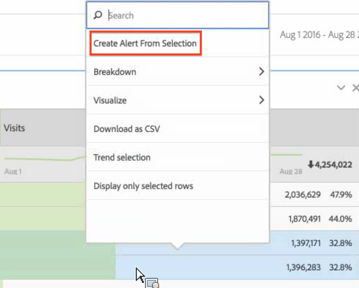

# Panoramica Avvisi intelligenti

>[!Important]
>L'utilizzo di dati con marca temporale per creare avvisi potrebbe causare l'attivazione errata degli avvisi. Consigliamo quindi di sfruttare i dati non in marca per gli avvisi intelligenti.

Il nuovo sistema intelligente di avvisi offre un controllo più granulare sugli avvisi e integra il rilevamento delle anomalie con il sistema di avvisi.

[Avvisi intelligenti su YouTube](https://www.youtube.com/watch?v=UVH9xr_2REA&list=PL2tCx83mn7GuNnQdYGOtlyCu0V5mEZ8sS&index=65) (5:34)

## Panoramica {#section_6AC8CA81DEA94E99B0F192B60D0FDF03}

Le nuove funzioni Generatore di avvisi e Gestione avvisi di Analysis Workspace sostituiscono la funzione di avvisi di Reports &amp; Analytics. La funzione Avvisi intelligenti permette di:

* Creare avvisi basati su anomalie (soglie del 90%, 95%, 99%, 99,75% e 99,9%; modifica della percentuale; superiore/inferiore).
* Visualizzare in anteprima la frequenza di attivazione degli avvisi.
* Inviare avvisi tramite e-mail o SMS con collegamenti ai progetti di Analysis Workspace generati automaticamente.
* Creare avvisi “impilati” in grado di acquisire più metriche in un singolo avviso.

I componenti del nuovo sistema di avvisi sono: Generatore di avvisi, Gestione avvisi, Anteprima avvisi e miglior accesso contestuale per la creazione di avvisi. L’interfaccia del precedente sistema di avvisi non sarà più disponibile, mentre gli avvisi veri e propri vengono trasferiti al nuovo sistema. Alcune delle precedenti funzioni per avvisi [non saranno più disponibili](https://marketing.adobe.com/resources/help/en_US/sc/user/deprecated_alerts.html).

È possibile accedere al Generatore di avvisi in quattro modi:

* Utilizzando la seguente scelta rapida in Analysis Workspace:

   `ctrl (or cmd) + shift + a`
* By going directly to the Alert Builder:  **[!UICONTROL Workspace]** &gt; **[!UICONTROL Components]** &gt; **[!UICONTROL New Alert]** .
* By selecting one or more freeform table line item/s, right-clicking and selecting **[!UICONTROL Create Alert from Selection]**. Viene aperto il Generatore di avvisi, precompilato con le metriche appropriate e i filtri applicati dalla tabella. Se necessario, puoi quindi modificare l’avviso.

   

* From within a Reports &amp; Analytics report, by going to  **[!UICONTROL More]** &gt; **[!UICONTROL Add Alert]** . Viene aperto il nuovo Generatore di avvisi, precompilato con le metriche appropriate e i filtri applicati dal rapporto. Se necessario, puoi quindi modificare l’avviso.

   

## FAQ: How alerts are calculated and triggered {#section_1F3B1DAF21784306953B49AAD4C3DCAB}

Le soglie espresse in % rappresentano le deviazioni standard. Ad esempio, 95% = 2 deviazioni standard e 99% = 3 deviazioni standard. In funzione della granularità temporale scelta, vengono utilizzati  [modelli differenti](../../../analyze/analysis-workspace/virtual-analyst/c-anomaly-detection/statistics-anomaly-detection.md#concept_0705DC91F0F44951AC2226EC846E824C) per calcolare lo scarto (ossia il numero di deviazioni standard) tra ciascun punto dati e il valore di norma. Impostando un valore di soglia basso (ad esempio 90%), si ottengono più anomalie rispetto a quando si imposta un valore superiore (99%). I valori di soglia 99,75% e 99,99% sono stati introdotti espressamente per la granularità oraria, per evitare che vengano rilevate troppe anomalie.

<table id="table_B3AA85E1DE3543DCA34966A52E3CE4AB"> 
 <thead> 
  <tr> 
   <th colname="col1" class="entry"> Domanda </th> 
   <th colname="col2" class="entry"> Risposta </th> 
  </tr> 
 </thead>
 <tbody> 
  <tr> 
   <td colname="col1"> 
<b>D: Quale intervallo di tempo passato può prendere in considerazione il processo di rilevamento delle anomalie per stabilire eventuali anomalie nei dati?</b> 
 </td> 
   <td colname="col2"> 
Il periodo di rilevamento varia in base al tipo di granularità selezionato. (Vedi <a href="../../../analyze/analysis-workspace/virtual-analyst/c-anomaly-detection/statistics-anomaly-detection.md#concept_0705DC91F0F44951AC2226EC846E824C" format="dita" scope="local"> Tecniche di statistica utilizzate in Rilevamento anomalie </a> per ulteriori informazioni. Segue un breve riepilogo: 
 
    <ul id="ul_4F8C2A41F06C498DBF5E7AE5DE803773"> 
     <li id="li_E246091A3F1E484C8444AF4052FCA784">Mensile = 15 mesi + lo stesso intervallo relativo allo scorso anno </li> 
     <li id="li_CC014FB38AE1492B9647E990C29BFB3C">Settimanale = 15 settimane + lo stesso intervallo relativo allo scorso anno </li> 
     <li id="li_2517EE2097534324BE9C1B54CD181A62">Giornaliero = 35 giorni + lo stesso intervallo relativo allo scorso anno </li> 
     <li id="li_710BC8B009354542AA4962A59A646099">Orario = 336 ore </li> 
    </ul> </td> 
  </tr> 
  <tr> 
   <td colname="col1"> 
<b>D: Per ricevere avvisi relativi esclusivamente a cali o picchi di comportamento, si può utilizzare la funzione anomalie o è necessario usare il valore assoluto?</b> 
 </td> 
   <td colname="col2"> 
L’utilizzo del valore assoluto non risolve il problema, in quanto verrebbero sempre attivati gli avvisi relativi a cali e picchi. Non è possibile limitare gli avvisi ai soli cali o soli picchi. 
 </td> 
  </tr> 
  <tr> 
   <td colname="col1"> 
<b>D: È possibile configurare gli avvisi in modo tale che si attivino solo in determinate ore del giorno (ad esempio, durante l’orario di lavoro o nelle ore non lavorative)? </b> 
 </td> 
   <td colname="col2"> 
Al momento non è possibile. 
 </td> 
  </tr> 
  <tr> 
   <td colname="col1"> 
<b>D: È possibile ottenere una tabella dei “valori previsti” che comprenda una linea tratteggiata o qualche altro indice che illustri tali valori? </b> 
 </td> 
   <td colname="col2"> 
Non in Workspace, ma è possibile nel Report Builder (guarda questo video sul <a href="https://www.youtube.com/watch?v=-a-8W6GQZnU" format="https" scope="external">Rilevamento delle anomalie nel Report Builder </a>). 
 
Tieni presente che il Report Builder si avvale di metodi di rilevamento delle anomalie meno sofisticati. Utilizza un periodo fisso di 30 giorni, un intervallo fisso del 95% ed è simile al processo di <a href="https://marketing.adobe.com/resources/help/en_US/reference/anomaly.html" format="html" scope="external">rilevamento delle anomalie di Reports &amp; Analytics </a>. 
 </td> 
  </tr> 
 </tbody> 
</table>

