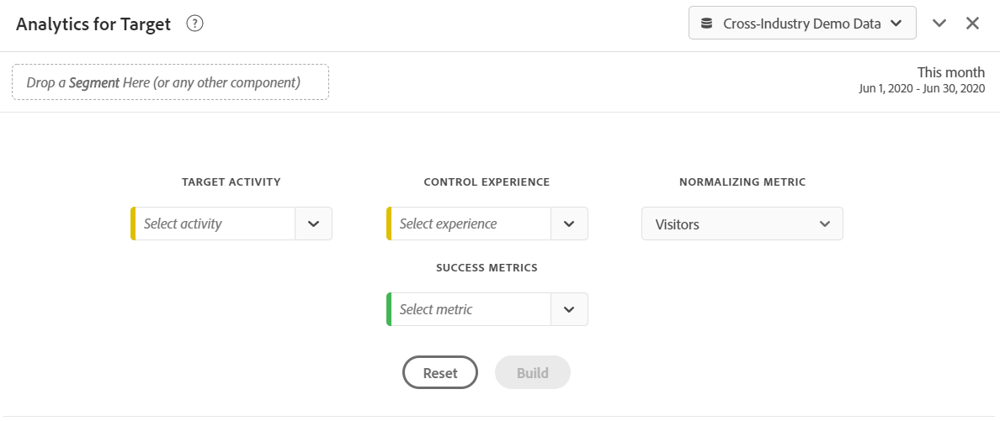

# Pannello Analytics for Target {#analyze-for-target-panel}

<!-- markdownlint-disable MD034 -->

>[!CONTEXTUALHELP]
>id="workspace_a4t_button"
>title="Analytics for Target"
>abstract="Analizza le attività ed esperienze Target in Analysis Workspace."

<!-- markdownlint-enable MD034 -->

<!-- markdownlint-disable MD034 -->

>[!CONTEXTUALHELP]
>id="workspace_a4t_panel"
>title="Pannello Analytics for Target"
>abstract="Analizza le attività ed esperienze Target in Analysis Workspace.  **Parametri ** **Attività Target**: attività Target che verrà analizzata. **Esperienza di controllo**: esperienza di controllo per l&#39;attività Target selezionata. **Normalizzazione della metrica**: visitatori, visite o impression. Questa metrica (detta anche metodologia di conteggio) diventa il denominatore del calcolo dell’incremento. Inoltre, influisce sul modo in cui i dati vengono aggregati prima dell’applicazione del calcolo del valore di affidabilità. **Metriche di successo**: fino a 3 metriche di successo standard (non calcolate) su cui analizzare l&#39;attività Target."

<!-- markdownlint-enable MD034 -->

>[!BEGINSHADEBOX]

*Questo articolo documenta il pannello Analytics for Target in **Adobe Analytics**. Consulta [Pannello Sperimentazione](https://experienceleague.adobe.com/en/docs/analytics/analyze/analysis-workspace/panels/a4t-panel) per informazioni su come confrontare diverse esperienze utente, varianti di marketing o di messaggistica nel **Customer Journey Analytics**.*

>[!ENDSHADEBOX]

Il pannello Analytics for Target consente di analizzare le attività e le esperienze Adobe Target in Analysis Workspace. Il pannello consente inoltre di visualizzare l’incremento e l’affidabilità per un massimo di 3 metriche di successo. Per accedere al pannello Analytics for Target, passa a una suite di rapporti i cui sono abilitati i componenti Analytics for Target. Quindi, seleziona l’icona del pannello all’estrema sinistra e trascina il pannello Analytics for Target nel progetto Analysis Workspace.

+++Ecco una breve panoramica video del pannello Analytics for Target:

>[!VIDEO](https://video.tv.adobe.com/v/37247/?quality=12)

+++

## Utilizzo

Per utilizzare un pannello **[!UICONTROL Analytics for Target]**:

1. Crea un pannello **[!UICONTROL Analytics for Target]**. Per informazioni su come creare un pannello, consulta [Creare un pannello](panels.md#create-a-panel).

1. Specifica l’[input](#panel-input) per il pannello.

1. Osserva l’[output](#panel-output) per il pannello.

### Input del pannello {#panel-nput}

Puoi configurare il pannello Analytics for Target utilizzando le seguenti impostazioni di input:

| Impostazione | Descrizione |
|---|---|
| **[!UICONTROL Target Activity]** | Seleziona da un elenco di attività di Target oppure trascina e rilascia un’attività dalla barra a sinistra. Nota: l’elenco è composto dagli ultimi 6 mesi di attività che hanno avuto almeno 1 hit. Se nell’elenco non viene visualizzata un’attività, potrebbe essere più vecchia di 6 mesi. Può essere comunque aggiunta dalla barra a sinistra, che ha un periodo di lookback fino a 18 mesi. |
| **[!UICONTROL Control Experience]** | Seleziona la tua esperienza di controllo. Se necessario, puoi modificarlo nell’elenco a discesa. |
| **[!UICONTROL Normalizing metric]** | Scegli tra Visitatori univoci, Visite o Impression attività. L’opzione Visitatori univoci è consigliata per la maggior parte dei casi di utilizzo dell’analisi. Questa metrica (detta anche metodologia di conteggio) diventa il denominatore del calcolo dell’incremento. Inoltre, influisce sul modo in cui i dati vengono aggregati prima dell’applicazione del calcolo del valore di affidabilità. |
| **[!UICONTROL Success metrics]** | Seleziona fino a 3 eventi di successo standard (non calcolati) dai menu a discesa, oppure trascina e rilascia le metriche dalla barra a sinistra. Ogni metrica avrà una tabella e una visualizzazione dedicate nel pannello di cui è stato effettuato il rendering. |
| C**[!UICONTROL alendar date range]** | Questo verrà compilato automaticamente in base all’intervallo di date dell’attività di Adobe Target. Puoi cambiarlo se necessario. |

### Output del pannello {#panel-output}

Il pannello Analytics for Target restituisce un set completo di dati e visualizzazioni per consentirti di comprendere meglio le prestazioni dell’attività e delle esperienze Adobe Target. Nella parte superiore del pannello viene visualizzata una riga di riepilogo per ricordarti le impostazioni del pannello selezionate. In qualsiasi momento, puoi modificare il pannello facendo clic sulla matita di modifica in alto a destra.

Per ogni metrica di successo selezionata, verrà visualizzata una tabella a forma libera e una tendenza del tasso di conversione:

Ogni tabella a forma libera mostra le seguenti colonne di metriche:

| Metrica | Descrizione |
|---|---|
| **[!UICONTROL Normalizing metrics]** | Visitatori, visite o impressioni di attività univoche. |
| **[!UICONTROL Success metric]** | La metrica selezionata nel generatore |
| **[!UICONTROL Conversion rate]** | Metrica di successo/Metrica di Normalizzazione |
| **[!UICONTROL Lift]** | Confronta il tasso di conversione per ogni esperienza rispetto all’esperienza di controllo. Nota: Incremento è una “metrica bloccata” per le esperienze Target, non può essere raggruppata o utilizzata con altre dimensioni. |
| **[!UICONTROL Lift (Lower)]** | Rappresenta l’incremento peggiore che un’esperienza diversa potrebbe avere sul controllo con un intervallo di affidabilità del 95%. Per ulteriori informazioni, vedere [Calcoli statistici](https://experienceleague.adobe.com/docs/target/using/reports/statistical-methodology/statistical-calculations.html) e [Completa calcolatore di affidabilità](https://experienceleague.adobe.com/docs/target/assets/complete_confidence_calculator.xlsx) file Excel. |
| **[!UICONTROL Lift (Mid)]** | Rappresenta l’incremento intermedio che un’esperienza diversa potrebbe avere sul controllo con un intervallo di affidabilità del 95%.  Per ulteriori informazioni, vedere [Calcoli statistici](https://experienceleague.adobe.com/docs/target/using/reports/statistical-methodology/statistical-calculations.html) e [Completa calcolatore di affidabilità](https://experienceleague.adobe.com/docs/target/assets/complete_confidence_calculator.xlsx) file Excel. |
| **[!UICONTROL Lift (Upper]**) | Rappresenta l’incremento migliore che un’esperienza diversa potrebbe avere sul controllo con un intervallo di affidabilità del 95%. Per ulteriori informazioni, vedere [Calcoli statistici](https://experienceleague.adobe.com/docs/target/using/reports/statistical-methodology/statistical-calculations.html) e [Completa calcolatore di affidabilità](https://experienceleague.adobe.com/docs/target/assets/complete_confidence_calculator.xlsx) file Excel. |
| **[!UICONTROL Confidence]** | Il test t di Student calcola il livello di affidabilità, che indica la probabilità che i risultati vengano duplicati se il test viene eseguito di nuovo. Alla metrica è stato applicato un intervallo di formattazione condizionale fisso del 75%/85%/95%. Questa formattazione può essere personalizzata, se necessario, in Column settings. Nota: Affidabilità è una “metrica bloccata” per le esperienze Target, non può essere raggruppata o utilizzata con altre dimensioni. Per ulteriori informazioni, vedere [Calcoli statistici](https://experienceleague.adobe.com/docs/target/using/reports/statistical-methodology/statistical-calculations.html) e [Completa calcolatore di affidabilità](https://experienceleague.adobe.com/docs/target/assets/complete_confidence_calculator.xlsx) file Excel. |

Come per qualsiasi pannello in Analysis Workspace, puoi continuare la tua analisi aggiungendo ulteriori tabelle e [visualizzazioni](https://experienceleague.adobe.com/docs/analytics/analyze/analysis-workspace/visualizations/freeform-analysis-visualizations.html?lang=it) che ti aiuteranno ad analizzare le tue attività Adobe Target. È inoltre possibile applicare un segmento a livello di pannello o all’interno della tabella a forma libera. Se lo si aggiunge all’interno della tabella a forma libera, è necessario sovrapporlo all’intera tabella per mantenere i calcoli relativi all’incremento e all’attendibilità. Al momento, i segmenti a livello di colonna non sono supportati.

## Domande frequenti {#FAQ}

| Domanda | Risposta |
|---|---|
| Quali tipi di attività sono supportati in Analytics for Target? | [Ulteriori informazioni](https://experienceleague.adobe.com/docs/target/using/integrate/a4t/a4t-faq/a4t-faq-activity-setup.html?lang=it) sui tipi di attività supportati. |
| Le metriche calcolate sono supportate nei calcoli di incremento e affidabilità? | No. [Ulteriori informazioni](https://experienceleague.adobe.com/docs/target/using/integrate/a4t/a4t-faq/a4t-faq-lift-and-confidence.html?lang=it) sui motivi per cui le metriche calcolate non sono supportate in incremento e affidabilità. Tuttavia, le metriche calcolate possono essere utilizzate nel reporting di Analytics for Target al di fuori di tali metriche. |
| Perché i visitatori univoci dovrebbero variare tra Target e Analytics? | [Ulteriori informazioni](https://experienceleague.adobe.com/docs/target/using/integrate/a4t/a4t-faq/a4t-faq-viewing-reports.html?lang=it) sulle discrepanze di visitatori univoci tra i prodotti. |
| Quando applico un segmento di hit per una specifica attività Target nell’analisi, perché viene restituita un’esperienza non correlata? | La dimensione di Analytics for Target è una variabile di elenco, il che significa che può contenere più attività (ed esperienze) alla volta. [Ulteriori informazioni](https://experienceleague.adobe.com/docs/target/using/integrate/a4t/a4t-faq/a4t-faq-viewing-reports.html?lang=it) |
| La metrica di affidabilità tiene conto di ordini estremi o applica una correzione Bonferroni per offerte multiple? | No. [Ulteriori informazioni](https://experienceleague.adobe.com/docs/target/using/integrate/a4t/a4t-faq/a4t-faq-lift-and-confidence.html?lang=it) su come Analytics calcola l’affidabilità. |
| È possibile utilizzare le metriche Incremento e Affidabilità con altre dimensioni o raggruppamenti? | Incremento e Affidabilità sono “metriche bloccate” per la dimensione delle esperienze di Target perché richiedono un controllo e una variante su cui eseguire il calcolo. In quanto tali, non possono essere suddivise o utilizzate con altre dimensioni. |
| Quando ricalcolano Incremento e Affidabilità? | Incremento e affidabilità vengono ricalcolati quando il pannello viene eseguito (o rieseguito), l’intervallo di date del pannello viene modificato o un segmento viene applicato al pannello o alla tabella. Quando si applica un filtro segmento alla tabella a forma libera, questo deve essere applicato a tutte le colonne; in caso contrario l’incremento e l&#39;affidabilità non verrano aggiornata correttamente. Al momento, i segmenti a livello di colonna non sono supportati. |

Per ulteriori informazioni sul reporting di Analytics for Target, visita [Reporting di Analytics for Target](https://experienceleague.adobe.com/docs/target/using/integrate/a4t/reporting.html?lang=it)
