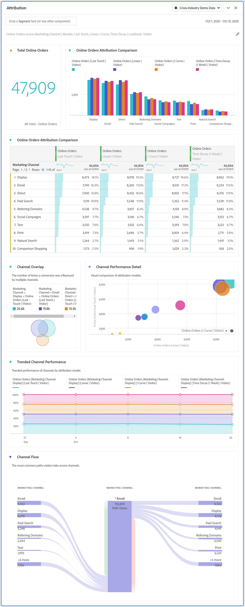

# Pannello Attribution

Il pannello [!UICONTROL Attribution] è un modo semplice per creare un’analisi confrontando vari modelli di attribuzione. È una funzione in [Attribution IQ](../attribution/overview.md) che offre un’area di lavoro dedicata per utilizzare e confrontare modelli di attribuzione.

## Creare un pannello di attribuzione

1. Fai clic sull’icona del pannello a sinistra.
1. Trascina il pannello [!UICONTROL Attribution] nel progetto Analysis Workspace.

   

1. Aggiungi una metrica che desideri attribuire e aggiungi qualsiasi dimensione secondo cui effettuare l’attribuzione. Alcuni esempi includono Marketing Channels o dimensioni personalizzate, ad esempio promozioni interne.

   

1. Seleziona i [modelli di attribuzione e l’intervallo di lookback](../attribution/models.md) che desideri confrontare.

1. Il pannello Attribution restituisce un set completo di dati e visualizzazioni che confrontano l’attribuzione per la dimensione e la metrica selezionate.

   

## Visualizzazioni di Attribution

* **Metrica totale**: il numero totale di conversioni che si sono verificate nell’intervallo di tempo di reporting. Queste sono le conversioni attribuite nella dimensione selezionata.
* **Barra** di confronto attribuzione: Confronta visivamente le conversioni attribuite in ciascuno degli elementi dimensionali dalla dimensione selezionata. Ogni colore della barra rappresenta un modello di attribuzione distinto.
* **Tabella** di confronto attribuzione: Mostra gli stessi dati del grafico a barre rappresentati in una tabella. Se si selezionano colonne o righe diverse in questa tabella, il grafico a barre e diverse altre visualizzazioni nel pannello vengono filtrate. Questa tabella funziona come qualsiasi altra tabella a forma libera in Workspace e ti consente di aggiungere componenti quali metriche, segmenti o raggruppamenti.
* **Diagramma** di sovrapposizione: Un diagramma di Venn che mostra i primi tre elementi dimensionali e la frequenza con cui partecipano congiuntamente a una conversione. Ad esempio, le dimensioni della sovrapposizione a bolla indicano quanto spesso si è verificata una conversione quando un visitatore è stato esposto a entrambi gli elementi dimensionali. Quando si selezionano altre righe nella tabella a forma libera adiacente, la visualizzazione si aggiorna in base alla selezione.
* **Dettagli** delle prestazioni: Consente di confrontare visivamente fino a tre modelli di attribuzione utilizzando un grafico a dispersione.
* **Prestazioni** con tendenze: Per impostazione predefinita, mostra la tendenza delle prestazioni di conversione per modello di attribuzione per la prima dimensione elencata nella tabella a forma libera adiacente. Puoi selezionare diverse righe di dimensioni nella tabella a forma libera per mostrare la tendenza per le dimensioni selezionate (ad esempio Ricavo totale per ogni modello di attribuzione per campagne social e Ricerca a pagamento). In alternativa, puoi selezionare le celle nelle colonne per qualsiasi combinazione di metrica e tipo di attribuzione nella tabella a forma libera per visualizzare le prestazioni con tendenze in base al valore di dimensione per i modelli di attribuzione specificati (ad esempio Ricavo totale per canale di marketing utilizzando l’attribuzione Ultimo contatto e Primo contatto).
* **Flusso**: Consente di vedere con quali canali si interagisce più comunemente e in quale ordine nel percorso di un visitatore.
