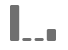

# Panoramica del pannello Attribuzione

>[!IMPORTANT] Il pannello Attribuzione è disponibile per tutti i clienti negli SKU Adobe Analytics Ultimate, Prime, Select e Foundation.

Il pannello di attribuzione è una funzione IQ  attribuzione che consente di aggiungere molti nuovi tipi di modelli di attribuzione a tabelle a forma libera, visualizzazioni e metriche calcolate. Tutti i modelli di attribuzione hanno due componenti:

* **** Modello di attribuzione: Il modello descrive la distribuzione delle conversioni agli hit di un gruppo. Ad esempio, primo tocco o ultimo tocco.
* **** Finestra di lookback attribuzione: La finestra di lookback descrive quali raggruppamenti di hit vengono considerati per ciascun modello. Ad esempio, visita o visitatore.

## Modelli di attribuzione

| Icona interfaccia | Attribuzione, modello | Definizione | Quando utilizzare |
| --- | --- | --- | --- |
|  | Ultimo contatto | Attribuisce un credito del 100% al punto di contatto che si verifica più di recente prima della conversione. | Il modello di attribuzione più semplice e comune. Viene spesso utilizzato per le conversioni con un breve ciclo di considerazione. Ultimo contatto viene comunemente utilizzato dai team che gestiscono il marketing di ricerca o che analizzano le parole chiave di ricerca interne. |
|  | Primo contatto | Attribuisce un credito del 100% al punto di contatto visualizzato per la prima volta nella finestra di lookback di attribuzione. | Un altro modello di attribuzione comune utile per analizzare i canali di marketing destinati a promuovere la conoscenza del marchio o l'acquisizione da parte dei clienti. È utilizzato frequentemente dai team di visualizzazione o social marketing, ma è anche ottimo per valutare l'efficacia delle raccomandazioni di prodotto in loco. |
|  | Stesso contatto | Attribuisce un credito del 100% all'hit in cui si è verificata la conversione. Se un punto di contatto non si verifica sullo stesso hit di una conversione, viene inserito in "None". | Un modello utile per valutare il contenuto o l'esperienza utente che è stato presentato immediatamente al momento della conversione. I team di prodotto o di progettazione spesso utilizzano questo modello per valutare l’efficacia di una pagina in cui si verifica la conversione. |
|  | Lineare | Attribuisce lo stesso merito a ogni punto di contatto che porta a una conversione. | Utile per le conversioni con cicli di riflessione più lunghi o per esperienze utente che richiedono un coinvolgimento più frequente dei clienti. Spesso viene utilizzata dai team per misurare l'efficacia delle notifiche per app mobili o con prodotti basati su iscrizione. |
|  | A forma di U | Attribuisce il 40% di credito alla prima interazione, il 40% di credito all'ultima interazione e divide il restante 20% in qualsiasi punto di contatto intermedio. Per le conversioni con un singolo punto di contatto, viene concesso un credito del 100%. Per le conversioni con due punti di contatto, il 50% di credito è concesso a entrambi. | Un ottimo modello per coloro che apprezzano le interazioni che hanno introdotto o chiuso una conversione, ma che desiderano ancora riconoscere l'assistenza alle interazioni. L'attribuzione a forma di U è comunemente utilizzata dai team che adottano un approccio più equilibrato ma desiderano dare più credito ai canali che hanno trovato o chiuso una conversione. |
|  | A forma di J | Attribuisce il 60% di credito all'ultima interazione, il 20% di credito alla prima interazione e divide il restante 20% in qualsiasi punto di contatto intermedio. Per le conversioni con un singolo punto di contatto, viene concesso un credito del 100%. Per le conversioni con due punti di contatto, il 75% di credito viene concesso all'ultima interazione, e il 25% di credito al primo. | Questo modello è ideale per coloro che danno priorità a Finder e chiusure, ma che desiderano concentrarsi sulla chiusura delle interazioni. L'attribuzione J-Shaped è spesso utilizzata da team che adottano un approccio più equilibrato e desiderano dare più credito ai canali che hanno chiuso una conversione. |
|  | J inversa | Attribuisce un credito del 60% al primo punto di contatto, un credito del 20% all'ultimo punto di contatto e divide il restante 20% a qualsiasi punto di contatto intermedio. Per le conversioni con un singolo punto di contatto, viene concesso un credito del 100%. Per le conversioni con due punti di contatto, il 75% di credito viene concesso alla prima interazione e il 25% di credito all'ultima. | Questo modello è ideale per coloro che assegnano priorità a Finder e chiusure, ma che desiderano concentrarsi sulla ricerca di interazioni. L'attribuzione inversa J viene utilizzata dai team che adottano un approccio più equilibrato e desiderano dare più credito ai canali che hanno avviato una conversione. |
|  | Personalizzato | Consente di specificare i pesi da assegnare ai punti di contatto, agli ultimi punti di contatto e a eventuali punti di contatto intermedi. I valori specificati vengono normalizzati al 100% anche se i numeri personalizzati immessi non vengono aggiunti a 100. Per le conversioni con un singolo punto di contatto, viene concesso un credito del 100%. Per le interazioni con due punti di contatto, il parametro centrale viene ignorato. Il primo e l'ultimo punto di contatto vengono quindi normalizzati al 100% e il credito viene assegnato di conseguenza. | Questo modello è perfetto per coloro che desiderano il pieno controllo sul proprio modello di attribuzione e hanno esigenze specifiche che altri modelli di attribuzione non soddisfano. |
|  | Decadimento temporale | Segue un decadimento esponenziale con un parametro di mezza durata personalizzato, dove il valore predefinito è 7 giorni. Il peso di ciascun canale dipende dalla quantità di tempo trascorsa tra l'avvio del punto di contatto e l'eventuale conversione. La formula utilizzata per determinare il credito è `2``(-t/halflife)`, dove `t` è il tempo tra un punto di contatto e una conversione. Tutti i punti di contatto vengono quindi normalizzati al 100%. | Ideale per i team che eseguono regolarmente campagne pubblicitarie video o di mercato contro eventi con data prestabilita. Più una conversione si verifica dopo un evento di marketing, meno credito viene concesso. |
|  | Partecipazione | Dà il 100% di credito a tutti i punti di contatto unici. Il numero totale di conversioni è aumentato rispetto ad altri modelli di attribuzione. La partecipazione deduplica i canali visualizzati più volte. | Ottimo per comprendere chi spesso i clienti sono esposti a una determinata interazione. Le organizzazioni di media utilizzano spesso questo modello per calcolare la velocità del contenuto. Le organizzazioni retail usano spesso questo modello per capire quali parti del sito sono fondamentali per la conversione. |

## Finestre di ricerca

Una finestra di lookback indica la quantità di tempo che una conversione deve recuperare per includere i punti di contatto. I modelli di attribuzione che attribuiscono maggiore importanza alle prime interazioni visualizzano differenze maggiori quando si visualizzano diverse finestre di lookback.

* **** Finestra di lookback della visita: Controlla di nuovo l'inizio di una visita in cui è avvenuta una conversione. Le finestre di lookback delle visite sono strette, perché non guardano oltre la visita. Le finestre di lookback delle visite rispettano la definizione di visita modificata nelle suite di rapporti virtuali.
* **** Finestra di lookback del visitatore: Controlla tutte le visite precedenti al primo mese dell'intervallo di date corrente. Le finestre di lookback dei visitatori sono ampie, in quanto possono estendere molte visite. Ad esempio, se l’intervallo di date del rapporto è compreso tra il 15 settembre e il 30 settembre, l’intervallo di date del lookback del visitatore include tra il 1° e il 30 settembre.

## Esempio 

Prendi in considerazione l'esempio seguente:

1. Il 15 settembre, un visitatore arriva sul tuo sito tramite un annuncio pubblicitario di ricerca a pagamento, poi se ne va.
2. Il 18 settembre, il visitatore ritorna al tuo sito tramite un collegamento social media ricevuto da un amico. Aggiungono diversi articoli al loro carrello, ma non acquistano nulla.
3. Il 24 settembre, il team marketing invia loro un'e-mail con un coupon per alcuni degli elementi nel carrello. Applicano il coupon, ma visitano diversi altri siti per vedere se sono disponibili altri coupon. Ne trovano un altro tramite un annuncio pubblicitario, poi alla fine fanno un acquisto per $50.

A seconda della finestra di lookback e del modello di attribuzione, i canali ricevono crediti diversi. Di seguito sono riportati alcuni esempi significativi:

* Utilizzando **il primo tocco** e una finestra **di lookback della** visita, l’attribuzione considera solo la terza visita. Tra e-mail e visualizzazione, e-mail è stato il primo, quindi email ottiene 100% di credito per l'acquisto $50.
* Utilizzando la **prima volta** e una finestra **di lookback per** i visitatori, l’attribuzione esamina tutte e tre le visite. La ricerca a pagamento è stata la prima, quindi ottiene il 100% di credito per l'acquisto di $50.
* Utilizzando una finestra **di lookback** lineare **e una** visita, il credito è diviso tra e-mail e visualizzazione. Entrambi questi canali ricevono un credito di $25.
* Utilizzando una finestra **di lookback** lineare **e** visitatore, il credito è suddiviso tra ricerca a pagamento, social, e-mail e visualizzazione. Ogni canale ottiene un credito di $12,50 per questo acquisto.
* Utilizzando una finestra **a forma di** J e una finestra **di lookback per i** visitatori, il credito è suddiviso tra ricerca a pagamento, social, e-mail e visualizzazione.
   * Il 60% di credito è dato da visualizzare, per $30.
   * Il 20% di credito è dato alla ricerca a pagamento, per $10.
   * Il restante 20% è suddiviso tra social ed e-mail, dando 5$ a ciascuno.
* Utilizzando **Time Decay** e una finestra **di lookback per** i visitatori, il credito è diviso tra ricerca a pagamento, social, e-mail e visualizzazione. Per impostazione predefinita, la durata di 7 giorni è la seguente:
   * Spazio di 0 giorni tra il punto di contatto dello schermo e la conversione. `2``(-0/7)` `= 1`
   * Spazio di 0 giorni tra punto di contatto e-mail e conversione. `2``(-0/7)` `= 1`
   * Spazio di 6 giorni tra il punto di contatto sociale e la conversione. `2``(-6/7)` `= 0.552`
   * Spazio di 9 giorni tra il punto di contatto per la ricerca a pagamento e la conversione. `2``(-9/7)` `= 0.41`
   * La normalizzazione di questi valori determina quanto segue:
      * Visualizza: 33,8%, ottenendo $16,88
      * E-mail: 33,8% ottenendo $16,88
      * Social: 18,6%, ottenendo $9,32
      * Ricerca a pagamento: 13,8%, ottenendo $6,92

> [!TIP] Anche altri eventi di conversione, come ordini o eventi personalizzati, sono suddivisi se il credito appartiene a più di un canale. Ad esempio, se due canali contribuiscono a un evento personalizzato utilizzando un modello di attribuzione lineare, entrambi i canali ottengono 0,5 dell'evento personalizzato. Queste frazioni di eventi vengono sommate tra tutte le visite, quindi arrotondate al numero intero più vicino per il reporting.

## Utilizzo dell'attribuzione con i canali di marketing

Quando i canali di marketing sono stati introdotti per la prima volta, presentavano solo le dimensioni di primo e ultimo tocco. Con questi modelli di attribuzione aggiuntivi, non sono più necessarie specifiche dimensioni di primo/ultimo tocco. Adobe fornisce dimensioni **Marketing Channel** generiche che possono essere utilizzate con il modello di attribuzione desiderato. Queste dimensioni generiche di Marketing Channels (Canali di marketing) si comportano in modo identico alle dimensioni Last Touch Channel, ma sono etichettate in modo diverso per evitare confusione quando si utilizzano canali di marketing con un modello di attribuzione diverso.

Poiché le dimensioni del canale di marketing dipendono da una definizione di visita tradizionale (come definita dalle relative regole di elaborazione), la definizione della visita non può essere modificata utilizzando le suite di rapporti virtuali.

## Utilizzo dell’attribuzione con variabili con più valori

Alcune dimensioni in Analytics possono contenere più valori su un singolo hit. Esempi comuni includono le variabili elenco e prodotti.

Quando l’attribuzione viene applicata a hit con più valori, tutti i valori dello stesso hit ricevono lo stesso credito. Poiché molti valori possono ricevere questo credito, il totale del rapporto può essere diverso da quello di ogni singolo elemento della riga. Il totale del rapporto è deduplicato, mentre ogni singolo valore di dimensione ottiene il giusto merito.

## Utilizzo dell'attribuzione con la segmentazione

L'attribuzione viene sempre eseguita prima della segmentazione e la segmentazione viene eseguita prima dell'applicazione dei filtri per report. Questo concetto si applica anche alle suite di rapporti virtuali che utilizzano i segmenti.

Ad esempio, se crei una VRS con un segmento "Display Hits" applicato, potresti vedere altri canali in una tabella utilizzando alcuni modelli di attribuzione.

