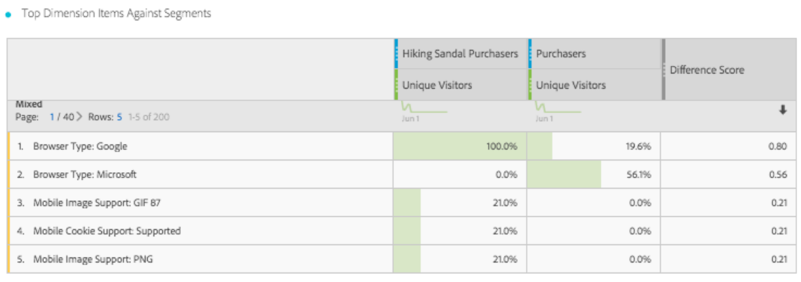

# Panoramica del pannello di confronto dei segmenti

Il pannello di confronto dei segmenti è una funzione del [Segmento IQ](../../segment-iq.md) che rileva le differenze più importanti dal punto di vista statistico tra un numero illimitato di segmenti. La funzione esegue un’analisi automatizzata di tutte le dimensioni e metriche a cui hai accesso. Rileva automaticamente le caratteristiche chiave dei segmenti di pubblico che guidano i KPI della tua azienda e ti consente di conoscere il livello di sovrapposizione dei segmenti.

## Creazione di un pannello di confronto dei segmenti

1. Accedi a [experiencecloud.adobe.com](https://experiencecloud.adobe.com) utilizzando le credenziali Adobe ID.
1. Fai clic sull’icona a 9 quadrati in alto a destra, quindi fai clic sul logo a colori di Analytics.
1. Nella barra di navigazione superiore, fai clic su Workspace.
1. Fai clic sul pulsante “Crea nuovo progetto”.
1. Nella finestra a comparsa modale, assicurati che sia selezionato “Progetto vuoto”, quindi fai clic su Crea.
1. Fai clic sul pulsante Pannelli a sinistra, quindi trascina il pannello Confronto segmenti sopra o sotto il pannello della tabella a forma libera creato automaticamente.

   

1. Seleziona i segmenti da confrontare e trascinali nel pannello.

   

   Dopo aver trascinato un segmento nel pannello, Analytics crea automaticamente un segmento [!UICONTROL 'Everyone Else'] (Tutti gli altri) che include tutti gli utenti NON inclusi nel segmento scelto. Si tratta di un segmento utilizzato di frequente nel pannello di confronto, ma è possibile rimuoverlo e confrontare un segmento diverso.

   

1. Una volta stabiliti i due segmenti da confrontare, fai clic su [!UICONTROL Build] (Genera).

   Questa azione avvia un processo di back-end che cerca le differenze statistiche tra i due segmenti selezionati e tutte le dimensioni, le metriche e gli altri segmenti. Una barra di avanzamento nella parte superiore del pannello indica il tempo rimanente per l’analisi di ogni metrica e dimensione. Le metriche, le dimensioni e i segmenti utilizzati più di frequente hanno priorità e sono analizzati per primi, in modo che i risultati più rilevanti vengano restituiti in modo tempestivo.

## Escludere componenti dal confronto

Talvolta è necessario escludere dimensioni, metriche o segmenti dal confronto di segmenti. Ad esempio, se si confronta il segmento “Utenti dispositivi mobili Stati Uniti” con “Utenti dispositivi mobili Germania”. L’inclusione di dimensioni relative alla geografia non avrebbe senso, poiché questi segmenti già implicano tali differenze.

1. Dopo aver trascinato i due segmenti desiderati nel pannello, fai clic su [!UICONTROL 'Show Advanced Options'] (Mostra opzioni avanzate).
1. Trascina i componenti da escludere nel pannello [!UICONTROL Excluded Components] (Componenti esclusi).

   

Fai clic su [!UICONTROL 'Set as default'] (Imposta come predefinito) per escludere automaticamente i componenti correnti in tutti i futuri confronti fra segmenti. Se desideri modificare i componenti esclusi, fai clic su un tipo di componente, quindi fai clic sulla X accanto a un componente per includerlo nuovamente nell’analisi. Fai clic su Clear All (Cancella tutto) per includere nuovamente tutti i componenti nel confronto dei segmenti.

## Visualizzazione di un rapporto di confronto dei segmenti

Al termine dell’analisi dei due segmenti desiderati, Adobe mostra i risultati ottenuti tramite diverse visualizzazioni:

### Dimensione e sovrapposizione

Illustra le dimensioni comparative di ciascun segmento selezionato e il livello di sovrapposizione tra di essi mediante un diagramma di Venn. Puoi passare il mouse sull’elemento visivo per vedere quanti visitatori si trovavano in ciascuna sezione di sovrapposizione o non sovrapposizione. Puoi fare clic con il pulsante destro del mouse sulla sovrapposizione per creare un nuovo segmento per un’ulteriore analisi. Se i due segmenti si escludono a vicenda, non viene visualizzata alcuna sovrapposizione tra i due cerchi (generalmente visualizzata con i segmenti che utilizzano un contenitore di hit).

### Riepiloghi sulla popolazione

A destra della visualizzazione Dimensione e sovrapposizione viene visualizzato il numero totale di visitatori univoci in ciascun segmento e nella sovrapposizione.

### Metriche principali

Visualizza le metriche più importanti dal punto di vista statistico tra i due segmenti. Ogni riga in questa tabella rappresenta una metrica differenziata, valutata in base al modo in cui si differenzia tra i vari segmenti. Un punteggio di differenza pari a 1 indica che è statisticamente significativo, mentre un punteggio di differenza pari a 0 indica che non esiste alcuna rilevanza statistica.

Questa visualizzazione è simile alle tabelle a forma libera in Analysis Workspace. Per un’analisi più approfondita su una metrica specifica, posiziona il cursore del mouse su un elemento e fai clic su “Crea elemento visivo”. Viene creata una nuova tabella per analizzare tale metrica specifica. Se una metrica è irrilevante per l’analisi, posiziona il cursore del mouse sulla riga e fai clic sulla X per rimuoverlo.

>[!NOTE] Le metriche aggiunte a questa tabella al termine del confronto dei segmenti non ricevono un punteggio di differenza.

### Metrica nel tempo per segmento

Sulla destra della tabella delle metriche si trova una visualizzazione collegata. Facendo clic su un elemento nella tabella a sinistra, questa visualizzazione viene aggiornata per mostrare la tendenza della metrica nel tempo.

### Dimensioni principali

Mostra i valori di dimensione più importanti dal punto di vista statistico per tutte le dimensioni. Ciascuna riga mostra la percentuale di ciascun segmento che possiede questo valore della dimensione. Ad esempio, questa tabella potrebbe mostrare che il 100% dei visitatori nel “Segmento A” rientrava nella dimensione “Tipo browser: Google”, mentre solo il 19,6% del “Segmento B” rientrava in questa dimensione. Un punteggio di differenza pari a 1 indica che è statisticamente significativo, mentre un punteggio di differenza pari a 0 indica che non esiste alcuna rilevanza statistica.

Questa visualizzazione è simile alle tabelle a forma libera in Analysis Workspace. Per un’analisi più approfondita su un valore di dimensione specifico, posiziona il cursore del mouse su un elemento e fai clic su “Crea elemento visivo”. Viene creata una nuova tabella per analizzare tale valore di dimensione. Se un valore di dimensione è irrilevante per l’analisi, posiziona il cursore del mouse sulla riga e fai clic sulla X per rimuoverlo.

>[!NOTE] I valori di dimensione aggiunti alla tabella al termine del confronto dei segmenti non ricevono un punteggio di differenza.

### Elementi dimensione per segmento

Sulla destra della tabella delle dimensioni si trova una visualizzazione grafico a barre collegata. Mostra tutti i valori di dimensione sotto forma di grafico a barre. Facendo clic su un elemento nella tabella a sinistra, la visualizzazione a destra viene aggiornata.

### Segmenti principali

Mostra quali altri segmenti (diversi dai due segmenti selezionati per il confronto) presentano una sovrapposizione statisticamente significativa. Ad esempio, questa tabella può mostrare che un terzo segmento, “Visitatori ripetuti”, si sovrappone notevolmente con il “Segmento A” ma non con il “Segmento B”. Un punteggio di differenza pari a 1 indica che è statisticamente significativo, mentre un punteggio di differenza pari a 0 indica che non esiste alcuna rilevanza statistica.

Questa visualizzazione è simile alle tabelle a forma libera in Analysis Workspace. Per un’analisi più approfondita su un segmento specifico, posiziona il cursore del mouse su un elemento e fai clic su “Crea elemento visivo”. Viene creata una nuova tabella per analizzare tale segmento specifico. Se un segmento è irrilevante per l’analisi, posiziona il cursore del mouse sulla riga e fai clic sulla X per rimuoverlo.

>[!NOTE] I segmenti aggiunti a questa tabella al termine del confronto dei segmenti non ricevono un punteggio di differenza.

### Sovrapposizione segmento

Sulla destra della tabella dei segmenti si trova una visualizzazione a diagramma di Venn collegata. Mostra il segmento più significativo dal punto di vista statistico applicato ai segmenti confrontati. Ad esempio, “Segmento A” + “Segmento statisticamente significativo” rispetto a “Segmento B” + “Segmento statisticamente significativo”. Facendo clic su una riga segmento nella tabella a sinistra, la visualizzazione a destra viene aggiornata.

