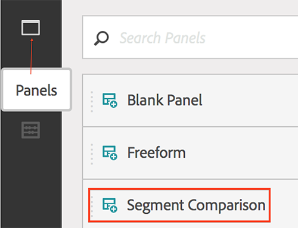
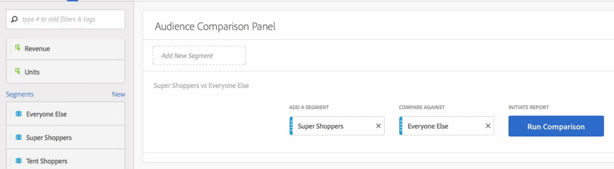
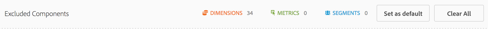
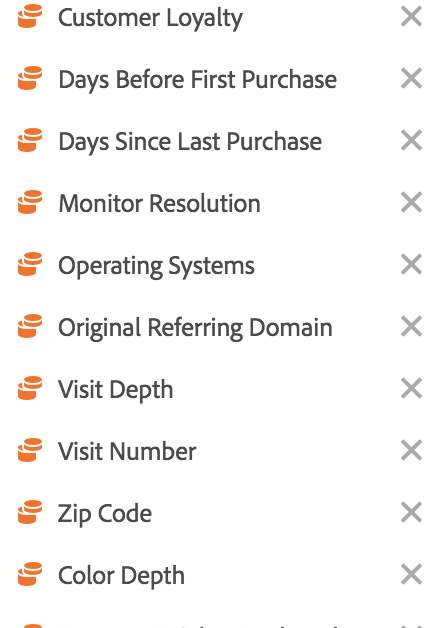

# Panoramica del pannello di confronto dei segmenti

Il pannello di confronto Segmento è una parte utensile dell’IQ  segmento che rileva le differenze più importanti dal punto di vista statistico tra un numero illimitato di segmenti. La funzione esegue un'analisi automatizzata di tutte le dimensioni e metriche a cui hai accesso. Rileva automaticamente le caratteristiche chiave dei segmenti di pubblico che guidano i KPI della tua azienda e ti permette di vedere quanto si sovrappongono i segmenti.

## Creazione di un pannello di confronto segmenti

1. Accedete a [ExperienceCloud.adobe.com](https://experiencecloud.adobe.com) utilizzando le credenziali ID Adobe.
1. Fate clic sull'icona di 9 quadrati in alto a destra, quindi fate clic sul logo Analytics colorato.
1. Nella barra di navigazione superiore, fate clic su Area di lavoro.
1. Fate clic sul pulsante "Crea nuovo progetto".
1. Nella finestra a comparsa modale, assicurarsi che sia selezionato "Progetto vuoto", quindi fare clic su Crea.
1. Fate clic sul pulsante Pannelli a sinistra, quindi trascinate il pannello Confronto segmenti sopra o sotto il pannello della tabella a forma libera creato automaticamente.

   

1. Seleziona i segmenti da confrontare e trascinali nel pannello.

   

   Dopo aver trascinato un segmento nel pannello, Analytics crea automaticamente un [!UICONTROL 'Everyone Else'] segmento che include tutti quelli NON inclusi nel segmento scelto. Si tratta di un segmento utilizzato di frequente nel pannello di confronto, ma potete rimuoverlo e confrontare un segmento di scelta diverso.

   

1. Una volta determinati i due segmenti da confrontare, fai clic su [!UICONTROL Build].

   Questa azione avvia un processo di backend che cerca le differenze statistiche tra i due segmenti selezionati e tutte le dimensioni, le metriche e gli altri segmenti. Una barra di avanzamento nella parte superiore del pannello indica il tempo rimanente fino all’analisi di ogni metrica e dimensione. Le metriche, le dimensioni e i segmenti utilizzati più di frequente hanno priorità per essere eseguiti per primi, in modo che i risultati più rilevanti vengano restituiti in modo tempestivo.

## Escludi componenti dal confronto

Talvolta è necessario escludere dimensioni, metriche o segmenti dal confronto di segmenti. Ad esempio, vuoi confrontare il segmento "Utenti mobili USA" con "Utenti mobili tedeschi". L'inclusione di dimensioni relative alla geografia non avrebbe senso, poiché questi segmenti già implicano tali differenze.

1. Dopo che i due segmenti desiderati sono nel pannello, fate clic su [!UICONTROL 'Show Advanced Options'].
1. Drag and drop components you want to exclude into the [!UICONTROL Excluded Components] panel.

   

Fai clic [!UICONTROL 'Set as default'] per escludere automaticamente i componenti correnti in tutti i confronti futuri dei segmenti. Se desiderate modificare i componenti esclusi, fate clic su un tipo di componente, quindi fate clic sulla X accanto a un componente per includerlo nuovamente nell’analisi. Fai clic su 'Cancella tutto' per includere nuovamente tutti i componenti nel confronto dei segmenti.

## Visualizzazione di un rapporto di confronto dei segmenti

Al termine dell’analisi dei due segmenti desiderati, Adobe mostra i risultati ottenuti tramite diverse visualizzazioni:

### Dimensioni e sovrapposizione

Illustra le dimensioni comparative di ciascun segmento selezionato e il livello di sovrapposizione tra di essi mediante un diagramma a venn. Puoi passare il mouse sull’elemento visivo per vedere quanti visitatori si trovavano in ciascuna sezione di sovrapposizione o non sovrapposizione. Puoi fare clic con il pulsante destro del mouse sulla sovrapposizione per creare un nuovo segmento per un’ulteriore analisi. Se i due segmenti si escludono a vicenda, non viene visualizzata alcuna sovrapposizione tra i due cerchi (generalmente visualizzata con i segmenti che utilizzano un contenitore di hit).

### Riepiloghi sulla popolazione

A destra della visualizzazione Dimensione e sovrapposizione, viene visualizzato il numero totale di visitatori univoci in ciascun segmento e nella sovrapposizione.

### Metriche principali

Visualizza le metriche più importanti dal punto di vista statistico tra i due segmenti. Ogni riga in questa tabella rappresenta una metrica differenziata, valutata in base al modo in cui si differenzia tra i vari segmenti. Un punteggio di differenza pari a 1 indica che è statisticamente significativo, mentre un punteggio di differenza pari a 0 indica che non esiste alcuna rilevanza statistica.

Questa visualizzazione è simile alle tabelle a forma libera in Analysis Workspace. Se desiderate un'analisi più approfondita su una metrica specifica, passate il puntatore del mouse su un elemento e fate clic su "Crea elemento visivo". Viene creata una nuova tabella per analizzare tale metrica specifica. Se una metrica è irrilevante per l'analisi, posiziona il puntatore del mouse sull'elemento di riga e fai clic sulla X per rimuoverlo.

> [!NOTE] Le metriche aggiunte a questa tabella al termine del confronto dei segmenti non ricevono un punteggio di differenza.

### Metrica nel tempo per segmento

Sulla destra della tabella delle metriche si trova una visualizzazione collegata. Puoi fare clic su un elemento nella tabella a sinistra, e questa visualizzazione viene aggiornata per mostrare la tendenza della metrica nel tempo.

### Dimensioni principali

Mostra i valori di dimensione più importanti dal punto di vista statistico per tutte le dimensioni. Ogni riga mostra la percentuale di ciascun segmento che mostra questo valore di dimensione. Ad esempio, questa tabella potrebbe mostrare che il 100% dei visitatori nel 'segmento A' aveva l'elemento dimensione 'Tipo browser: Google, mentre solo il 19,6% del "segmento B" aveva questa dimensione. Un punteggio di differenza pari a 1 indica che è statisticamente significativo, mentre un punteggio di differenza pari a 0 indica che non esiste alcuna rilevanza statistica.

Questa visualizzazione è simile alle tabelle a forma libera in Analysis Workspace. Se si desidera eseguire un'analisi più approfondita su un valore di dimensione specifico, passare il mouse su un elemento di riga e fare clic su "Crea elemento visivo". Viene creata una nuova tabella per analizzare il valore specifico della dimensione. Se un valore di dimensione è irrilevante per l'analisi, posizionate il puntatore del mouse sull'elemento di riga e fate clic sulla X per rimuoverlo.

> [!NOTE] I valori di dimensione aggiunti alla tabella al termine del confronto dei segmenti non ricevono un punteggio di differenza.

### Elementi dimensione per segmento

A destra della tabella delle dimensioni è presente una visualizzazione a barre collegata. Mostra tutti i valori di dimensione visualizzati in un grafico a barre. Facendo clic su un elemento nella tabella a sinistra, la visualizzazione a destra viene aggiornata.

### Segmenti principali

Mostra quali altri segmenti (diversi dai due segmenti selezionati per il confronto) presentano una sovrapposizione statisticamente significativa. Ad esempio, questa tabella può mostrare che un terzo segmento, 'Ripeti visitatori', si sovrappone notevolmente con 'Segmento A' ma non con 'Segmento B'. Un punteggio di differenza pari a 1 indica che è statisticamente significativo, mentre un punteggio di differenza pari a 0 indica che non esiste alcuna rilevanza statistica.

Questa visualizzazione è simile alle tabelle a forma libera in Analysis Workspace. Se si desidera eseguire un'analisi più approfondita su un segmento specifico, passare il mouse su un elemento di riga e fare clic su "Crea elemento visivo". Viene creata una nuova tabella per analizzare tale segmento specifico. Se un segmento è irrilevante per l'analisi, posizionate il puntatore del mouse sull'elemento di riga e fate clic sulla X per rimuoverlo.

> [!NOTE] I segmenti aggiunti alla tabella al termine del confronto dei segmenti non ricevono un punteggio di differenza.

### Sovrapposizione segmento

A destra della tabella dei segmenti è presente una visualizzazione del diagramma venn collegata. Mostra il segmento più significativo dal punto di vista statistico applicato ai segmenti confrontati. Ad esempio, 'Segmento A' + 'Segmento statisticamente significativo' rispetto a "Segmento B" + "segmento statisticamente significativo". Facendo clic su un elemento della linea del segmento nella tabella a sinistra, il diagramma venn si aggiorna a destra.

