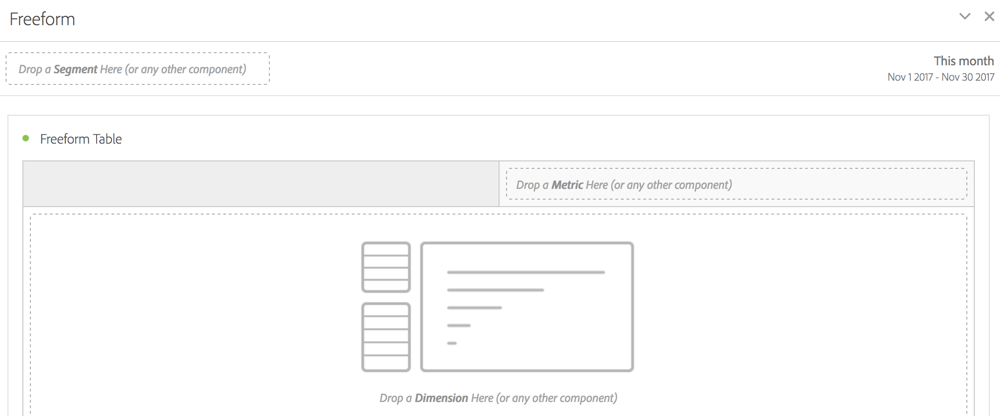

# Pannello a forma libera

>[!BEGINSHADEBOX]

_Questo articolo documenta il pannello a forma libera in_  _&#x200B;**Adobe Analytics**._ _Consulta [Pannello a forma libera](https://experienceleague.adobe.com/it/docs/analytics/analyze/analysis-workspace/panels/freeform-panel) per la_  _&#x200B;**versione del Customer Journey Analytics** di questo articolo._

>[!ENDSHADEBOX]

Un **[!UICONTROL Freeform panel]** è un pannello vuoto con una visualizzazione [Tabella a forma libera](/help/analyze/analysis-workspace/visualizations/freeform-table/freeform-table.md) come stato iniziale predefinito.

## Utilizzo

Per utilizzare un **[!UICONTROL Freeform panel]**:

1. Crea un **[!UICONTROL Freeform panel]**. Per informazioni su come creare un pannello, consulta [Creare un pannello](panels.md#create-a-panel).

   

1. Consulta la [guida ai componenti di Analytics](/help/components/home.md) su come aggiungere componenti al pannello a forma libera e alla visualizzazione [Tabella a forma libera](/help/analyze/analysis-workspace/visualizations/freeform-table/freeform-table.md).

>[!MORELIKETHIS]
>
>[Creare un pannello](/help/analyze/analysis-workspace/c-panels/panels.md#create-a-panel)
>[Guida ai componenti di Analytics](/help/components/home.md)
>[Visualizzazione tabelle a forma libera](/help/analyze/analysis-workspace/visualizations/freeform-table/freeform-table.md)
>
