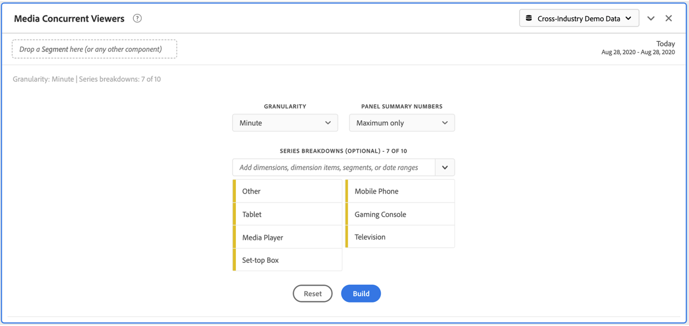

# Pannello Visualizzatori simultanei

I clienti di Media Analytics possono analizzare i visualizzatori simultanei per capire dove si è verificata la concorrenza di picco o dove si sono verificati dei rilanci, per fornire informazioni utili sulla qualità dei contenuti e sul livello di coinvolgimento dei visualizzatori, nonché per risolvere eventuali problemi o pianificare il volume o la scala.

In  Analysis Workspace, per visualizzatori simultanei si intende il numero di visitatori univoci che visualizzano i flussi multimediali in un particolare momento, indipendentemente dal numero di sessioni.

Il pannello Visualizzatori simultanei di contenuti multimediali consente di analizzare nel tempo i visualizzatori simultanei, con dettagli sul picco di concorrenza e sulla possibilità di suddividere e confrontare i contenuti.  Per accedere al pannello Visualizzatori simultanei, passate a una suite di rapporti con i componenti di Media Analytics abilitati. Fate clic sull’icona del pannello a sinistra, quindi trascinate il pannello nel progetto Analysis Workspace .

## Input del pannello {#Input}

Per configurare il pannello Visualizzatori simultanei, effettuate le seguenti operazioni:

| Impostazione | Descrizione |
|---|---|
| Intervallo date del pannello | L’intervallo di date predefinito del pannello è Oggi.  È possibile modificarlo per visualizzare uno o più mesi alla volta.    Questa visualizzazione è limitata a 1440 righe di dati (ad esempio, 24 ore con granularità a livello di minuto).  Se un intervallo di date e una combinazione di granularità danno luogo a più di 1440 righe, la granularità viene aggiornata automaticamente per contenere l’intero intervallo di date. |
| Granularity (Granularità) | L’impostazione predefinita della granularità è Minuto.    Questa visualizzazione è limitata a 1440 righe di dati (ad esempio, 24 ore con granularità a livello di minuto).  Se un intervallo di date e una combinazione di granularità danno luogo a più di 1440 righe, la granularità viene aggiornata automaticamente per contenere l’intero intervallo di date. |
| Numeri di riepilogo del pannello | Per visualizzare i dettagli di data o ora per i visualizzatori simultanei, è disponibile un numero di riepilogo. Il campo Massimo mostra i dettagli per la concorrenza dei picchi. Il valore Minimo mostra i dettagli della mangiatoia.  L’impostazione predefinita del pannello è Massimo, ma potete modificarla per visualizzare Minimo o Massimo e Minimo.  Se si utilizzano le suddivisioni, per ciascuna di esse viene visualizzato un numero di riepilogo. |
| Suddivisione della serie | Facoltativamente, puoi suddividere la visualizzazione per segmenti, dimensioni, elementi dimensionali o intervalli di date.   - È possibile visualizzare fino a 10 righe alla volta. Le suddivisioni sono limitate a un solo livello.  - Quando si trascina una dimensione, gli elementi dimensionali principali vengono selezionati automaticamente in base all&#39;intervallo di date del pannello selezionato.  - Per confrontare gli intervalli di date, trascina 2 o più intervalli di date nel filtro di suddivisione delle serie. |

### Vista predefinita

### Vista di suddivisione della serie

## Output del pannello {#Output}

Il pannello Visualizzatori simultanei di contenuti multimediali restituisce un grafico a linee e numeri di riepilogo con i dettagli relativi al numero massimo e/o minimo di visualizzatori simultanei.  Nella parte superiore del pannello viene visualizzata una riga di riepilogo per ricordarti le impostazioni del pannello selezionate.

In qualsiasi momento, potete modificare e ricreare il pannello facendo clic sulla matita di modifica in alto a destra.

Se è stata selezionata un’analisi approfondita delle serie, per ciascuno di essi viene visualizzata una linea del grafico a linee e un numero di riepilogo:

### Origine dati

L’unica metrica che può essere utilizzata in questo pannello è Visualizzatori simultanei:

| Metrica | Descrizione |
|---|---|
| Visualizzatori simultanei | Numero di visitatori unici che visualizzano i flussi multimediali in un particolare momento, indipendentemente dal numero di sessioni.  Questa funzione è diversa dalla generazione di rapporti per visualizzatori simultanei nella sezione Rapporti, che utilizza sessioni attive simultanee.  L’utilizzo di account di visitatori univoci per la rimozione di ‘picchi’ indesiderati nei limiti dello spettacolo (dove le sessioni terminano e iniziano allo stesso tempo). |

In questa visualizzazione non è disponibile una tabella a forma libera.  Per visualizzare l&#39;origine dati, puoi fare clic con il pulsante destro del mouse sul grafico a linee e scaricare come file .csv.  Le suddivisioni della serie saranno incluse.

## Domande frequenti {#FAQ}

| Domanda | Risposta |
|---|---|
| Dov&#39;è la tabella a forma libera? Come posso visualizzare l&#39;origine dati? | La tabella a forma libera non è disponibile in questa visualizzazione.  Puoi scaricare l’origine dati facendo clic con il pulsante destro del mouse sul grafico a linee e scaricando il file CSV. |
| Perché la mia granularità è cambiata? | Questa visualizzazione è limitata a 1440 righe di dati (ad esempio, 24 ore con granularità a livello di minuto).  Se un intervallo di date e una combinazione di granularità danno luogo a più di 1440 righe, la granularità verrà aggiornata automaticamente per contenere l’intero intervallo di date.  Quando si passa da un intervallo di date più grande a uno più piccolo, la granularità viene aggiornata al dettaglio più basso consentito dopo la modifica dell&#39;intervallo di date. Per visualizzare una granularità maggiore, modificate il pannello e ricreate. |
| Come si confrontano i nomi dei video, i segmenti, i tipi di contenuto e così via? | Per confrontarli in una singola visualizzazione, trascina segmenti, dimensioni o elementi dimensionali specifici nel filtro di suddivisione delle serie.  La visualizzazione è limitata a 10 analisi approfondite.  Per visualizzare più di 10, è necessario utilizzare più pannelli. |
| Come si confrontano gli intervalli di date? | Per confrontare gli intervalli di date in una singola visualizzazione, utilizza le suddivisioni delle serie trascinando due o più intervalli di date.  Questi intervalli di date ignoreranno l’intervallo di date del pannello. |
| Come si modifica il tipo di visualizzazione? | Questo pannello consente solo la visualizzazione della linea per le serie temporali. |
| Posso eseguire il rilevamento delle anomalie? | No.  Il rilevamento delle anomalie non è disponibile per questo pannello. |
| Perché utilizzare visitatori univoci invece di sessioni attive? | L’utilizzo di visitatori univoci consente di rimuovere picchi indesiderati dai limiti dello spettacolo (le sessioni terminano e iniziano allo stesso tempo). |
| Cosa significa avere visualizzatori simultanei con una granularità maggiore del minuto? | Con una granularità maggiore di un minuto, i visualizzatori simultanei sono la somma di visualizzatori simultanei univoci per tutti i minuti entro tale intervallo di tempo.  Ad esempio, a livello di ora i visualizzatori simultanei con granularità è la somma di visualizzatori simultanei univoci per tutti i minuti dell’ora. |
| Cosa succede se voglio vedere più di un giorno alla granularità dei minuti? | Per accedere ai dati con granularità a livello di minuto fino a un mese alla volta, potete utilizzare le API di Analytics 2.0. Per ulteriori informazioni, consultate [Ottenere i dati del rapporto JSON per visualizzatori simultanei con le API](https://docs.adobe.com/content/help/en/media-analytics/using/media-reports/media-default-reports/get-concurrent-json20.html)Analytics 2.0. |
| Nel pannello dell’area di lavoro vengono visualizzate le stesse informazioni del rapporto Visualizzatori simultanei? | No.  In  Analysis Workspace, per visualizzatori simultanei si intende il numero di visitatori univoci che visualizzano il flusso multimediale in un momento specifico, indipendentemente dal numero di sessioni.  Questa funzione è diversa dalla generazione di rapporti per visualizzatori simultanei nella sezione Rapporti, che utilizza sessioni attive simultanee.  L’utilizzo di account di visitatori univoci consente di rimuovere picchi indesiderati dai bordi delle presentazioni, dove le sessioni terminano e iniziano allo stesso tempo. |

<!-- For more information about Media Concurrent Viewers, visit [MA doc page]( https://url). -->
