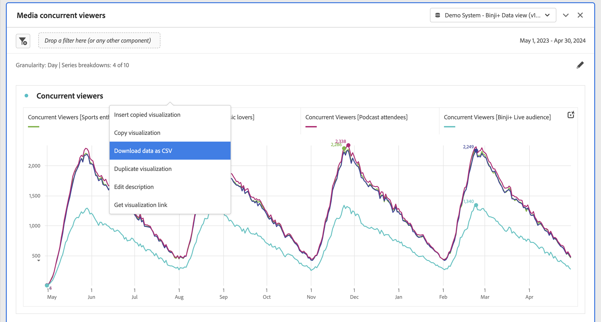

# Pannello Visualizzatori simultanei di contenuti multimediali

I clienti di Media Analytics possono analizzare i visualizzatori simultanei per capire dove si è verificato il picco di concorrenza o dove si è verificato un calo, per fornire informazioni utili sulla qualità dei contenuti e sul coinvolgimento dei visualizzatori e per risolvere eventuali problemi o pianificare il volume o la scala.

In Analysis Workspace, per visualizzatori simultanei si intende il numero di visitatori unici che visualizzano i flussi multimediali in un determinato momento, indipendentemente dal numero di sessioni.

Il pannello Visualizzatori simultanei di contenuti multimediali consente di analizzare i visualizzatori simultanei nel tempo, con dettagli sul picco di concorrenza e sulla possibilità di suddividerli e confrontarli.  Per accedere al pannello Visualizzatori simultanei di contenuti multimediali, passa a una suite di rapporti con i componenti Media Analytics abilitati. Quindi, fai clic sull’icona del pannello all’estrema sinistra e trascina il pannello nel progetto Analysis Workspace.

## Input del pannello {#Input}

Puoi configurare il pannello Visualizzatori simultanei di contenuti multimediali utilizzando le seguenti impostazioni di input:

| Impostazione | Descrizione |
|---|---|
| Intervallo date del pannello | L’intervallo di date predefinito del pannello è Oggi.  È possibile modificarlo per visualizzare uno o più mesi alla volta.    Questa visualizzazione è limitata a 1440 righe di dati (ad esempio, 24 ore con granularità al minuto).  Se un intervallo di date e una combinazione di granularità generano più di 1440 righe, la granularità viene aggiornata automaticamente per contenere l’intervallo di date completo. |
| Granularity (Granularità) | L’impostazione predefinita della granularità è Minuto.    Questa visualizzazione è limitata a 1440 righe di dati (ad esempio, 24 ore con granularità al minuto).  Se un intervallo di date e una combinazione di granularità generano più di 1440 righe, la granularità viene aggiornata automaticamente per contenere l’intervallo di date completo. |
| Numeri di riepilogo del pannello | Per visualizzare i dettagli di data o ora per i visualizzatori simultanei, è disponibile un numero di riepilogo. Il valore Massimo mostra i dettagli della concorrenza di picco. Il Minimo mostra i dettagli della mangiatoia.  L’impostazione predefinita del pannello mostra solo Massimo, ma puoi modificarla in Minimo o Massimo e Minimo.  Se utilizzi le suddivisioni, per ciascuna viene visualizzato un numero di riepilogo. |
| Disaggregazione per serie | Facoltativamente, puoi suddividere la visualizzazione per segmenti, dimensioni, elementi dimensionali o intervalli di date.   - È possibile visualizzare fino a 10 righe alla volta. Le suddivisioni sono limitate a un singolo livello.  - Quando si trascina una dimensione, gli elementi dimensionali principali vengono selezionati automaticamente in base all’intervallo di date del pannello selezionato.  - Per confrontare intervalli di date, trascina 2 o più intervalli di date nel filtro di suddivisione delle serie. |

### Vista predefinita

### Vista a discesa delle serie

## Output del pannello {#Output}

Il pannello Visualizzatori simultanei di contenuti multimediali restituisce un grafico a linee e numeri di riepilogo per includere i dettagli del numero massimo e/o minimo di visualizzatori simultanei.  Nella parte superiore del pannello viene visualizzata una riga di riepilogo per ricordarti le impostazioni del pannello selezionate.

Puoi modificare e ricreare il pannello in qualsiasi momento facendo clic sulla matita di modifica in alto a destra.

Se hai selezionato il raggruppamento di serie, viene visualizzata una riga del grafico a linee e un numero di riepilogo per ciascuna:

### Origine dati

L’unica metrica che può essere utilizzata in questo pannello è Visualizzatori simultanei:

| Metrica | Descrizione |
|---|---|
| Visualizzatori simultanei | Numero di visitatori unici che visualizzano i flussi multimediali in un determinato momento, indipendentemente dal numero di sessioni.  È diverso dal reporting Visualizzatore simultaneo nella sezione Rapporti , che utilizza sessioni attive simultanee.  L’utilizzo di visitatori univoci consente di rimuovere i &quot;picchi&quot; indesiderati a mostra i limiti (dove le sessioni terminano e iniziano contemporaneamente). |

In questa visualizzazione non è disponibile una tabella a forma libera.  Per visualizzare l’origine dati, fai clic con il pulsante destro del mouse sul grafico a linee e scarica come file .csv .  Saranno incluse le suddivisioni della serie.

## Domande frequenti {#FAQ}

| Domanda | Risposta |
|---|---|
| Dov’è la tabella a forma libera? Come posso visualizzare l&#39;origine dati? | La tabella a forma libera non è disponibile in questa visualizzazione.  Puoi scaricare l’origine dati facendo clic con il pulsante destro del mouse sul grafico a linee e scaricando il file CSV. |
| Perché la mia granularità è cambiata? | Questa visualizzazione è limitata a 1440 righe di dati (ad esempio, 24 ore con granularità al minuto).  Se un intervallo di date e una combinazione di granularità danno luogo a più di 1440 righe, la granularità viene aggiornata automaticamente per adattarsi all’intervallo di date completo.  Quando passi da un intervallo di date più ampio a uno più piccolo, la granularità viene aggiornata al dettaglio più basso consentito dopo la modifica dell’intervallo di date. Per visualizzare una granularità maggiore, modifica il pannello e ricompila. |
| Come si confrontano nomi video, segmenti, tipi di contenuto, ecc.? | Per confrontare questi elementi in una singola visualizzazione, trascina segmenti, dimensioni o elementi dimensionali specifici nel filtro di suddivisione della serie.  La visualizzazione è limitata a 10 raggruppamenti.  Per visualizzare più di 10 pannelli, è necessario utilizzare più pannelli. |
| Come si confrontano gli intervalli di date? | Per confrontare intervalli di date in una singola visualizzazione, utilizza le suddivisioni delle serie trascinando 2 o più intervalli di date.  Questi intervalli di date sovrascriveranno l’intervallo di date del pannello. |
| Come posso modificare il tipo di visualizzazione? | Questo pannello consente solo la visualizzazione delle linee per le serie temporali. |
| Posso eseguire il rilevamento delle anomalie? | No.  Il rilevamento delle anomalie non è disponibile per questo pannello. |
| Perché utilizzare visitatori univoci invece di sessioni attive? | L’utilizzo di visitatori univoci consente di rimuovere i picchi indesiderati dai limiti della visualizzazione (dove le sessioni terminano e iniziano contemporaneamente). |
| Cosa significa avere visualizzatori simultanei con granularità maggiore del minuto? | Con una granularità maggiore di un minuto, i visualizzatori simultanei sono la somma di visualizzatori simultanei univoci per tutti i minuti entro tale intervallo di tempo.  Ad esempio, per i visualizzatori simultanei con granularità a livello di ora, la somma di visualizzatori simultanei univoci per tutti i minuti dell’ora. |
| Cosa succede se voglio vedere più di un giorno con granularità al minuto? | Per accedere ai dati con granularità al minuto fino a un mese alla volta, puoi utilizzare le API di Analytics 2.0. Per ulteriori informazioni, consulta [Ottenere i dati del rapporto JSON per visualizzatori simultanei con le API di Analytics 2.0](https://docs.adobe.com/content/help/en/media-analytics/using/media-reports/media-default-reports/get-concurrent-json20.html). |
| Il pannello dell’area di lavoro mostra le stesse informazioni del rapporto Visualizzatori simultanei? | No.  In Analysis Workspace, per visualizzatori simultanei si intende il numero di visitatori unici che visualizzano il flusso multimediale in un momento specifico, indipendentemente dal numero di sessioni.  È diverso dal reporting Visualizzatore simultaneo nella sezione Rapporti , che utilizza sessioni attive simultanee.  L’utilizzo di visitatori univoci consente di rimuovere picchi indesiderati dai limiti della visualizzazione, in cui le sessioni terminano e iniziano contemporaneamente. |

<!-- For more information about Media Concurrent Viewers, visit [MA doc page]( https://url). -->
