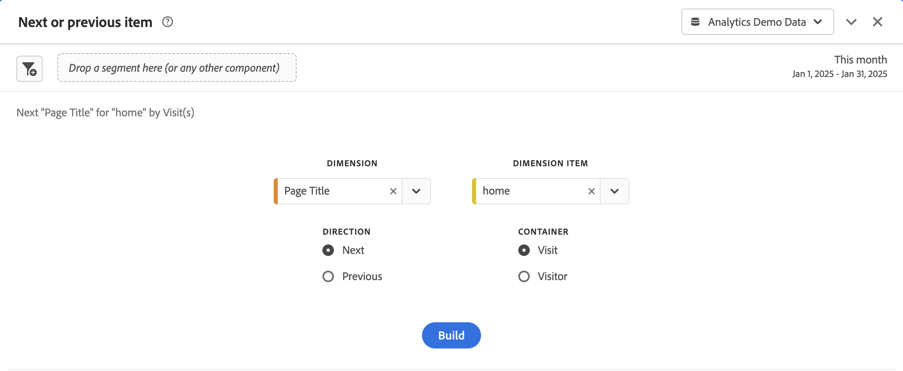
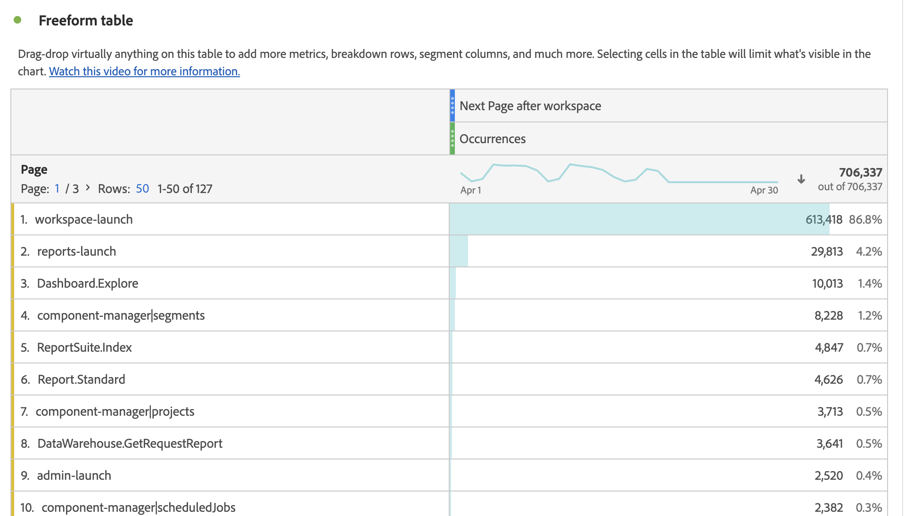

# Pannello elemento successivo o precedente {#next-or-previous-item-panel}

<!-- markdownlint-disable MD034 -->

>[!CONTEXTUALHELP]
>id="workspace_nextorpreviousitem_button"
>title="Elemento successivo o precedente"
>abstract="Crea un pannello per comprendere le dimensioni da cui in precedenza provenivano le persone o la dimensione dove andranno successivamente."

<!-- markdownlint-disable MD034 -->

<!-- markdownlint-disable MD034 -->

>[!CONTEXTUALHELP]
>id="workspace_nextorpreviousitem_panel"
>title="Elemento successivo o precedente"
>abstract="Analizza i luoghi più comuni da cui in precedenza venivano i visitatori o dove andranno successivamente.  **Dimensione**: seleziona una dimensione. Ad esempio **Pagina**. **Elemento dimensionale**: seleziona un elemento dimensionale specifico. Ad esempio, **Homepage**. **Direzione**: seleziona **Avanti** per visualizzare gli elementi dimensione immediatamente successivi all’elemento dimensionale selezionato. Seleziona **Precedente** per visualizzare gli elementi dimensionali che conducono all’elemento dimensionale selezionato. **Contenitore**: seleziona **Sessione** per visualizzare gli elementi dimensione precedente/successiva nella stessa sessione oppure **Persona** per visualizzare l’elemento dimensione precedente/successivo per la stessa persona."

<!-- markdownlint-enable MD034 -->

>[!BEGINSHADEBOX]

_Questo articolo documenta il pannello Elemento successivo o precedente in_  _**Adobe Analytics**._ _Consulta [Pannello elemento successivo o precedente](https://experienceleague.adobe.com/en/docs/analytics/analyze/analysis-workspace/panels/next-previous)) per la_  versione _**Customer Journey Analytics** di questo articolo._

>[!ENDSHADEBOX]

Il pannello **[!UICONTROL Next or previous item]** contiene diverse tabelle e visualizzazioni per identificare l&#39;elemento dimensione successivo o precedente per una dimensione specifica. Ad esempio, puoi scoprire a quali pagine i clienti accedono più spesso dopo aver visitato la home page.

## Utilizzo

Per usare un pannello **[!UICONTROL Next or previous item]**:

1. Crea un pannello **[!UICONTROL Next or previous item]**. Per informazioni su come creare un pannello, consulta [Creare un pannello](panels.md#create-a-panel).

1. Specifica l’[input](#panel-input) per il pannello.

1. Osserva l’[output](#panel-output) per il pannello.

### Input del pannello

È possibile configurare il pannello [!UICONTROL Next or previous item] utilizzando le seguenti impostazioni di input:

| Input | Descrizione |
| --- | --- |
| **[!UICONTROL Dimension]** | Seleziona la dimensione per la quale desideri esplorare gli elementi successivi o precedenti. |
| **[!UICONTROL Dimension item]** | Seleziona l’elemento dimensione specifico al centro dell’interrogazione successiva/precedente. |
| **[!UICONTROL Direction]** | Specificare se si sta cercando l&#39;elemento di dimensione [!UICONTROL Next] o [!UICONTROL Previous]. |
| **[!UICONTROL Container]** | Selezionare il contenitore [!UICONTROL Session] o [!UICONTROL Person] (impostazione predefinita) per determinare l&#39;ambito della richiesta di informazioni. |

{style="table-layout:auto"}

Seleziona **[!UICONTROL Build]** per creare il pannello.

### Output del pannello

Il pannello [!UICONTROL Next or previous item] restituisce un set completo di dati e visualizzazioni per consentirti di comprendere meglio le occorrenze che seguono o precedono specifici elementi dimensionali.

| Visualizzazione | Descrizione |
| --- | --- |
| **[!UICONTROL Horizontal bar]** | Elenca gli elementi successivi (o precedenti) in base all’elemento dimensione selezionato. Passando il puntatore del mouse su una singola barra viene evidenziato l’elemento corrispondente nella tabella a forma libera. |
| **[!UICONTROL Summary number]** | Numero di riepilogo di alto livello di tutte le occorrenze successive o precedenti degli elementi dimensione per il mese corrente (finora). |
| **[!UICONTROL Freeform table]** | Elenca gli elementi successivi (o precedenti) in base all’elemento dimensione selezionato, in formato tabella. Ad esempio, si trattava delle pagine più popolari (per occorrenze) a cui gli utenti accedevano dopo (o prima) la pagina Home o l’area di lavoro. |

{style="table-layout:auto"}

>[!MORELIKETHIS]
>
>[Creare un pannello](/help//analyze/analysis-workspace/c-panels/panels.md#create-a-panel)
>

<!--
# Next or previous item panel

This panel contains a number of tables and visualizations to easily identify the next or previous dimension item for a specific dimension. For example, you might want to explore which pages customers went to most often after they visited the Home page.

## Access the panel

You can access the panel from within [!UICONTROL Reports] or within [!UICONTROL Workspace].

| Access point | Description |
| --- | --- |
| [!UICONTROL Reports] | <ul><li>The panel is already dropped into a project.</li><li>The left rail is collapsed.</li><li>If you selected [!UICONTROL Next page], default settings have already been applied, such as [!UICONTROL Page] for [!UICONTROL Dimension], and the top page as the [!UICONTROL Dimension Item], [!UICONTROL Next] for [!UICONTROL Direction] and [!UICONTROL Visit] for [!UICONTROL Container]. You can modify all these settings.</li></ul>|
| Workspace | Create a new project and select the Panel icon in the left rail. Then drag the [!UICONTROL Next or previous item] panel above the Freeform table. Notice that the [!UICONTROL Dimension] and [!UICONTROL Dimension Item] fields are left blank. Select a dimension from the drop-down list. [!UICONTROL Dimension items] are populated based on the [!UICONTROL dimension] you chose. The top dimension item gets added, but you can select a different item. The defaults are Next and Visitor. Again, you can modify these as well.
 |

{style="table-layout:auto"}

## Panel Inputs {#Input}

You can configure the [!UICONTROL Next or previous item] panel panel using these input settings:

| Setting | Description |
| --- | --- |
| Segment (or other component) drop zone | You can drag and drop segments or other components to further filter your panel results. |
| Dimension | The dimension for which you want to explore next or previous items. |
| Dimension Item | The specific item at the center of your next/previous inquiry. |
| Direction | Specify whether you are looking for the [!UICONTROL Next] or the [!UICONTROL Previous] dimension item. |
| Container | [!UICONTROL Visit] or [!UICONTROL Visitor] (default) determine the scope of your inquiry. |

{style="table-layout:auto"}

Click **[!UICONTROL Build]** to build the panel.

## Panel output {#output}

The [!UICONTROL Next or previous item] panel returns a rich set of data and visualizations to help you better understand what occurrences follow or precede specific dimension items.

| Visualization | Description |
| --- | --- |
| Horizontal bar | Lists the next (or previous) items based on the dimension item you chose. Hovering over an individual bar highlights the corresponding item in the Freeform table. |
| Summary number | High-level summary number of all next or previous dimension item occurrences for the current month (so far.) |
| Freeform table | Lists the next (or previous) items based on the dimension item you chose, in a table format. For example, which were the most popular pages (by occurrences) that people went to after (or before) the home page or the workspace page. |

{style="table-layout:auto"}

-->