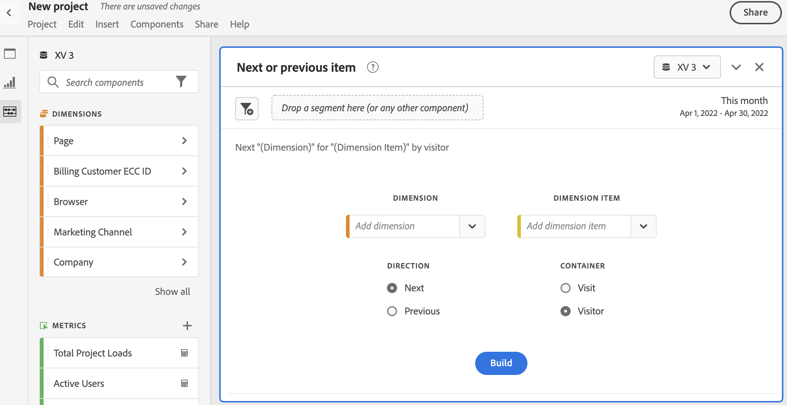
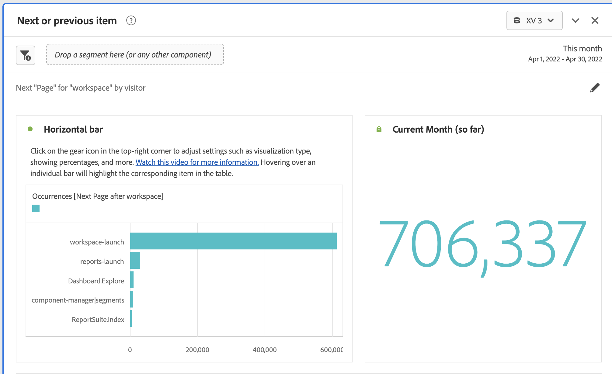

# Pannello elemento successivo o precedente

La [!UICONTROL Next or previous item] pannello avviato come rapporto in Reports &amp; Analytics, in [!UICONTROL Reports] > [!UICONTROL Most popular] > [!UICONTROL Next page/Previous page]. Questo pannello Workspace contiene diverse tabelle e visualizzazioni per identificare facilmente l’elemento dimensionale successivo o precedente per una dimensione specifica. Ad esempio, potresti voler esplorare le pagine in cui sono stati visitati più spesso i clienti dopo aver visitato la home page.

## Accedere al pannello

Puoi accedere al pannello da [!UICONTROL Reports] o [!UICONTROL Workspace].

| Punto di accesso | Descrizione |
| --- | --- |
| [!UICONTROL Reports] | <ul><li>Il pannello è già stato rilasciato in un progetto.</li><li>La barra a sinistra viene ridotta.</li><li>Se hai selezionato [!UICONTROL Next page], le impostazioni predefinite sono già state applicate, ad esempio [!UICONTROL Page] per [!UICONTROL Dimension]e nella pagina superiore come [!UICONTROL Dimension Item], [!UICONTROL Next] per [!UICONTROL Direction] e [!UICONTROL Visit] per [!UICONTROL Container]. Puoi modificare tutte queste impostazioni.</li></ul> |
| Workspace | Crea un nuovo progetto e seleziona l’icona Pannello nella barra a sinistra. Quindi trascina la [!UICONTROL Next or previous item] sopra la tabella a forma libera. Tieni presente che [!UICONTROL Dimension] e [!UICONTROL Dimension Item] i campi vengono lasciati vuoti. Seleziona una dimensione dall’elenco a discesa. [!UICONTROL Dimension items] vengono compilati in base ai [!UICONTROL dimension] ha scelto. Viene aggiunto l’elemento di dimensione superiore, ma puoi selezionare un altro elemento. Le impostazioni predefinite sono Successivo e Visitatore. Anche in questo caso, puoi modificarli.
 |

{style=&quot;table-layout:auto&quot;}

## Input del pannello {#Input}

Puoi configurare le [!UICONTROL Next or previous item] pannello con le seguenti impostazioni di input:

| Impostazione | Descrizione |
| --- | --- |
| Zona di rilascio del segmento (o altro componente) | Puoi trascinare segmenti o altri componenti per filtrare ulteriormente i risultati del pannello. |
| Dimensione | La dimensione per la quale desideri esplorare gli elementi successivi o precedenti. |
| Elemento Dimension | Elemento specifico al centro della richiesta successiva/precedente. |
| Direzione | Specifica se stai cercando il [!UICONTROL Next] o [!UICONTROL Previous] elemento dimensione. |
| Contenitore | [!UICONTROL Visit] o [!UICONTROL Visitor] (Impostazione predefinita) determina l&#39;ambito della richiesta. |

{style=&quot;table-layout:auto&quot;}

Fai clic su **[!UICONTROL Build]** per creare il pannello .

## Output del pannello {#output}

La [!UICONTROL Next or previous item] Il pannello restituisce un set completo di dati e visualizzazioni per consentirti di comprendere meglio quali occorrenze seguono o precedono specifici elementi dimensionali.

| Visualizzazione | Descrizione |
| --- | --- |
| Barre orizzontali | Elenca gli elementi successivi (o precedenti) in base all’elemento dimensione scelto. Passando il puntatore del mouse su una singola barra, viene evidenziato l’elemento corrispondente nella tabella a forma libera. |
| Numero di riepilogo | Numero di riepilogo di alto livello di tutte le occorrenze successive o precedenti dell’elemento dimensione per il mese corrente (finora). |
| Tabella a forma libera | Elenca gli elementi successivi (o precedenti) in base all’elemento dimensione scelto, in un formato tabella. Ad esempio, le pagine più popolari (per occorrenze) a cui gli utenti hanno seguito (o prima) la pagina principale o la pagina dell’area di lavoro. |

{style=&quot;table-layout:auto&quot;}
