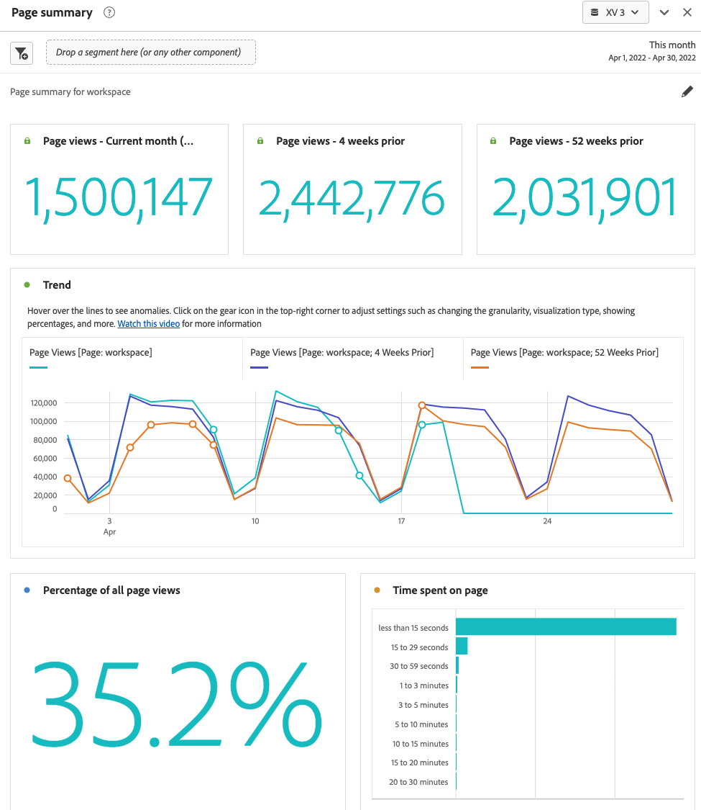

# Pannello Riepilogo pagina {#page-summary}

<!-- markdownlint-disable MD034 -->

>[!CONTEXTUALHELP]
>id="workspace_pagesummary_button"
>title="Riepilogo pagina"
>abstract="Rivedi rapidamente alcune delle metriche di alto livello e il movimento da e verso una pagina specifica."

<!-- markdownlint-enable MD034 -->

<!-- markdownlint-disable MD034 -->

>[!CONTEXTUALHELP]
>id="workspace_pagesummary_panel"
>title="Pannello Riepilogo pagina"
>abstract="Rivedi rapidamente alcune delle metriche di alto livello e il movimento da e verso una pagina specifica.  **Parametri ** **Aggiungi un elemento dimensione pagina**: apri la barra dei componenti, individua la dimensione Pagina ed espandila facendo clic sulla carota per visualizzare gli elementi dimensione. Quindi, trascina e rilascia nel generatore la pagina specifica di cui desideri conoscere il funzionamento. Dopo aver trascinato e rilasciato l’elemento dimensione, il rapporto si popolerà automaticamente con le informazioni chiave sulla pagina."

<!-- markdownlint-enable MD034 -->

Questo pannello consente di esplorare facilmente le statistiche chiave relative a pagine specifiche.

## Accedere al pannello

Puoi accedere al pannello da [!UICONTROL Reports] o da [!UICONTROL Workspace].

| Punto di accesso | Descrizione |
| --- | --- |
| [!UICONTROL Reports] | <ul><li>Il pannello è già stato rilasciato in un progetto.</li><li>La barra a sinistra è compressa.</li><li>È supportata solo la dimensione Pagina.</li><li>È già stata applicata un&#39;impostazione predefinita, in questo caso la pagina visitata più in alto per la dimensione [!UICONTROL Page]. Puoi modificare questa impostazione.</li></ul> |
| Workspace | Crea un nuovo progetto e seleziona l’icona Pannello nella barra a sinistra. Trascina il pannello [!UICONTROL Page summary] sopra la tabella a forma libera. Il campo Pagina [!UICONTROL Dimension Item] viene lasciato vuoto. Seleziona un elemento dimensione dall’elenco a discesa. |

## Input del pannello {#Input}

È possibile configurare il pannello [!UICONTROL Page summary] utilizzando le seguenti impostazioni di input:

| Impostazione | Descrizione |
| --- | --- |
| Zona di rilascio del segmento (o di un altro componente) | Puoi trascinare segmenti o altri componenti per filtrare ulteriormente i risultati del pannello. |
| Elemento dimensione pagina | Dall’elenco a discesa, seleziona l’elemento dimensione Pagina di cui desideri esplorare le statistiche chiave. |

{style="table-layout:auto"}

Fare clic su **[!UICONTROL Build]** per creare il pannello.

## Output del pannello {#output}

Il pannello [!UICONTROL Page summary] restituisce un set completo di dati e visualizzazioni di metriche per consentirti di comprendere meglio le statistiche relative a pagine specifiche.

| Metrica/Visualizzazione | Descrizione |
| --- | --- |
| [!UICONTROL Page views] - Mese corrente, finora | Numero di visualizzazioni di pagina per questa pagina per il mese corrente. |
| [!UICONTROL Page views] - 4 settimane prima | Numero di visualizzazioni di pagina per questa pagina nell&#39;ultimo mese. |
| [!UICONTROL Page views] - 52 settimane prima | Numero di visualizzazioni di pagina per questa pagina nell&#39;ultimo anno. |
| [!UICONTROL Trend] | Un grafico con tendenze di visualizzazione della pagina per questo mese, 4 settimane prima e 52 settimane prima. |
| [!UICONTROL Percentage of all page views] | Un numero di riepilogo per la percentuale di tutte le visualizzazioni di pagina che hanno visitato questa pagina. |
| [!UICONTROL Time spent on page] | Un grafico a barre orizzontale che elenca il tempo trascorso su questa pagina. |
| [!UICONTROL Single page visits] | Un numero di riepilogo che elenca il numero di visualizzazioni di pagina in cui questa era l’unica pagina visitata. |
| [!UICONTROL Reloads] | La metrica [!UICONTROL Reloads] mostra il numero di volte in cui un elemento dimensione era presente durante un ricaricamento. Un visitatore che aggiorna il browser è il modo più comune per attivare un ricaricamento. |
| [!UICONTROL Entries] | La metrica [!UICONTROL Entries] mostra il numero di volte in cui un dato elemento dimensione viene acquisito come primo valore in una visita. |
| [!UICONTROL Exits] | La metrica [!UICONTROL Exits] mostra il numero di volte in cui un dato elemento dimensione viene acquisito come ultimo valore in una visita. |
| [!UICONTROL Flow] | Un diagramma di flusso con la pagina selezionata come punto focale. È possibile eseguire un drill-through dei dati come in qualsiasi [diagramma di flusso](/help/analyze/analysis-workspace/visualizations/c-flow/create-flow.md). |

{style="table-layout:auto"}

