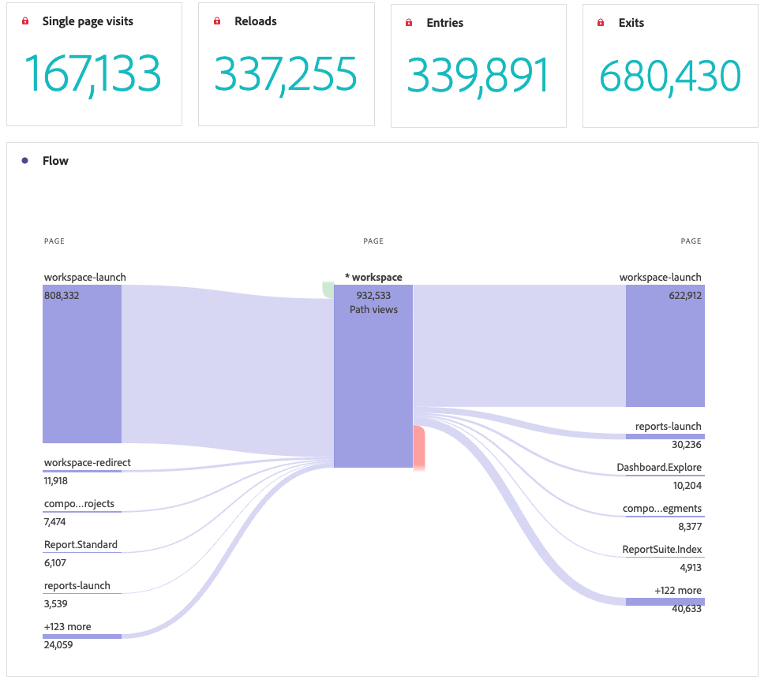

# Pannello Riepilogo pagina

La [!UICONTROL Page summary] pannello avviato come rapporto in Reports &amp; Analytics, in Reports > Engagement > Page analysis > Page summary (Rapporti > Coinvolgimento > Analisi pagina > Riepilogo pagina). È ora disponibile anche un pannello Workspace . Questo pannello consente di esplorare facilmente le statistiche chiave su pagine specifiche.

## Accedere al pannello

Puoi accedere al pannello da [!UICONTROL Reports] o [!UICONTROL Workspace].

| Punto di accesso | Descrizione |
| --- | --- |
| [!UICONTROL Reports] | <ul><li>Il pannello è già stato rilasciato in un progetto.</li><li>La barra a sinistra viene ridotta.</li><li>È supportata solo la dimensione Pagina .</li><li>È già stata applicata un’impostazione predefinita, in questo caso la pagina più visitata per[!UICONTROL Page] dimensione. Puoi modificare questa impostazione.</li></ul> |
| Workspace | Crea un nuovo progetto e seleziona l’icona Pannello nella barra a sinistra. Trascina [!UICONTROL Page summary] sopra la tabella a forma libera. Osserva che la pagina [!UICONTROL Dimension Item] Il campo è lasciato vuoto. Seleziona un elemento dimensione dall’elenco a discesa. |

## Ingressi del pannello {#Input}

Puoi configurare le [!UICONTROL Page summary] mediante le seguenti impostazioni di input:

| Impostazione | Descrizione |
| --- | --- |
| Zona di rilascio del segmento (o altro componente) | Puoi trascinare segmenti o altri componenti per filtrare ulteriormente i risultati del pannello. |
| Elemento dimensione pagina | Dall’elenco a discesa, seleziona l’elemento Dimensione pagina di cui desideri esplorare le statistiche chiave. |

{style=&quot;table-layout:auto&quot;}

Fai clic su **[!UICONTROL Build]** per creare il pannello .

## Output del pannello {#output}

La [!UICONTROL Page summary] restituisce un set completo di dati e visualizzazioni di metriche per consentirti di comprendere meglio le statistiche su pagine specifiche.

| Metrica/Visualizzazione | Descrizione |
| --- | --- |
| [!UICONTROL Page views] - Mese corrente, finora | Numero di visualizzazioni di pagina per la pagina per il mese corrente. |
| [!UICONTROL Page views] - 4 settimane prima | Numero di visualizzazioni di pagina per la pagina nell’ultimo mese. |
| [!UICONTROL Page views] - 52 settimane prima | Numero di visualizzazioni di pagina per la pagina nell’ultimo anno. |
| [!UICONTROL Trend] | Grafico di visualizzazione della pagina con tendenze per questo mese, 4 settimane prima e 52 settimane prima. |
| [!UICONTROL Percentage of all page views] | Numero di riepilogo per la percentuale di tutte le visualizzazioni di pagina passate a questa pagina. |
| [!UICONTROL Time spent on page] | Grafico a barre orizzontale che elenca il tempo trascorso su questa pagina. |
| [!UICONTROL Single page visits] | Un numero di riepilogo che elenca il numero di visualizzazioni di pagina in cui si trovava l’unica pagina visitata. |
| [!UICONTROL Reloads] | La [!UICONTROL Reloads] mostra il numero di volte in cui un elemento dimensione era presente durante un ricaricamento. Un visitatore che aggiorna il proprio browser è il modo più comune per attivare un ricaricamento. |
| [!UICONTROL Entries] | La [!UICONTROL Entries] mostra il numero di volte in cui un dato elemento dimensione viene acquisito come primo valore in una visita. |
| [!UICONTROL Exits] | La [!UICONTROL Exits] mostra il numero di volte in cui un dato elemento dimensione viene acquisito come ultimo valore in una visita. |
| [!UICONTROL Flow] | Diagramma di flusso con la pagina selezionata come punto focale. Puoi approfondire i dati come in qualsiasi [Diagramma di flusso](/help/analyze/analysis-workspace/visualizations/c-flow/create-flow.md). |

{style=&quot;table-layout:auto&quot;}

