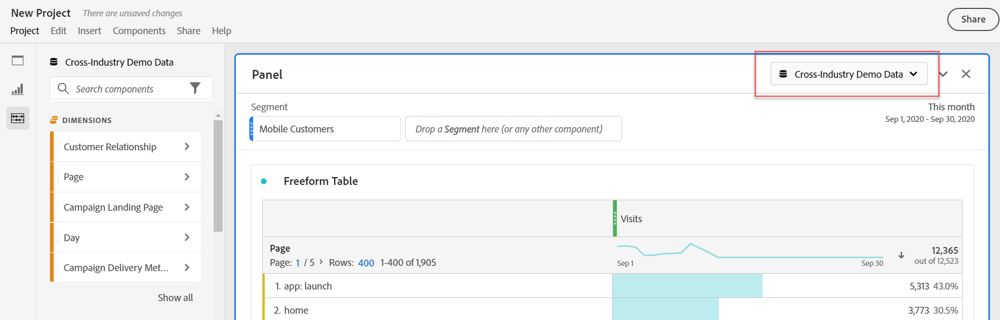

# Panoramica dei pannelli

A [!UICONTROL panel] is a collection of tables and visualizations. È possibile accedere ai pannelli dall’icona in alto a sinistra in Workspace. I pannelli sono utili per organizzare i progetti in base a periodi di tempo, suite di rapporti o casi di utilizzo dell’analisi. In  Analysis Workspace sono disponibili i seguenti tipi di pannelli:

| Nome pannello | Descrizione |
|---|---|
| [Pannello vuoto](blank-panel.md) | Scegli tra i pannelli e le visualizzazioni disponibili per avviare l&#39;analisi. |
| [Pannello Quick Insights](quickinsight.md) | Crea rapidamente una tabella a forma libera e una relativa visualizzazione per analizzare e individuare più rapidamente le informazioni. |
| [Pannello Analytics for Target](a4t-panel.md) | Analizzare le attività e le esperienze Target in  Analysis Workspace. |
| [Pannello Attribution](attribution.md) | Confronta e visualizza rapidamente qualsiasi numero di modelli di attribuzione utilizzando qualsiasi dimensione e metrica di conversione. |
| [Pannello Freeform](freeform-panel.md) | Esegui confronti illimitati e suddivisioni, quindi aggiungi visualizzazioni per raccontare una storia ricca di dati. |
| [Pannello Visualizzatori simultanei](media-concurrent-viewers.md) | Analizzare i visualizzatori simultanei nel tempo, con dettagli sul picco di concorrenza e la possibilità di suddividere e confrontare. |
| [Pannello Segment Comparison](c-segment-comparison/segment-comparison.md) | Confronta rapidamente due segmenti tra tutti i punti dati per individuare automaticamente le differenze rilevanti. |

[!UICONTROL Quick Insights], [!UICONTROL Blank] e [!UICONTROL Freeform] i pannelli sono luoghi ideali per iniziare l&#39;analisi, prestandosi al tempo stesso ad analisi [!UICONTROL Analytics for Target][!UICONTROL Attribution IQ][!UICONTROL Media Concurrent Viewers] e [!UICONTROL Segment Comparison] ad analisi più avanzate. Nei progetti è disponibile un pulsante `"+"` che consente di aggiungere pannelli vuoti in qualsiasi momento.

The default starting panel is the [!UICONTROL Freeform] panel, but you can make the [blank panel](/help/analyze/analysis-workspace/c-panels/blank-panel.md) your default as well.

## Suite di rapporti per pannello {#report-suite}

Le tabelle e le visualizzazioni all’interno di un pannello derivano dai dati [!UICONTROL report suite] selezionati in alto a destra nel pannello. La suite per report determina anche i componenti disponibili nella barra a sinistra. All&#39;interno di un progetto, potete utilizzare una o [più suite](https://docs.adobe.com/content/help/it-IT/analytics/analyze/analysis-workspace/build-workspace-project/multiple-report-suites.html) di rapporti a seconda dei casi di utilizzo dell&#39;analisi.

## Calendario del pannello {#calendar}

Il calendario del pannello controlla l’intervallo di rapporti per tabelle e visualizzazioni all’interno di un pannello.

Nota: Se all’interno di una tabella, una visualizzazione o un’area di rilascio di un pannello viene utilizzato un componente Intervallo date (viola), questo sostituisce il calendario del pannello.

## Area di rilascio del pannello {#dropzone}

La zona di rilascio del pannello consente di applicare filtri a segmenti e a discesa a tutte le tabelle e le visualizzazioni all’interno di un pannello. Potete applicare uno o più filtri a un pannello. Per modificare il titolo sopra ogni filtro, fai clic sulla matita di modifica oppure fai clic con il pulsante destro del mouse per rimuoverla completamente.

### Filtri segmento

Trascinate e rilasciate qualsiasi segmento dalla barra a sinistra nella zona di rilascio del pannello per iniziare a filtrare il pannello.

### Filtri per segmenti ad hoc

È inoltre possibile trascinare componenti non di segmento direttamente nella zona di rilascio per creare segmenti **** ad hoc, risparmiando tempo e fatica nell’andare al Generatore di segmenti. I segmenti creati in questo modo vengono automaticamente definiti come segmenti a livello di hit. Per modificare questa definizione, fai clic sull’icona delle informazioni (i) accanto al segmento, quindi sull’icona di modifica a forma di matita e modificala nel Generatore di segmenti.

I segmenti ad hoc sono locali per il progetto e non vengono visualizzati nella barra a sinistra se non li rendi pubblici.

### Filtri a discesa {#dropdown-filter}

Oltre ai filtri per segmenti, i filtri **a** discesa consentono di interagire con i dati in modo controllato. Ad esempio, potete aggiungere un filtro a discesa per i tipi di dispositivi mobili in modo da segmentare il pannello per Tablet, Cellulare o Desktop.

I filtri a discesa possono essere utilizzati per consolidare più progetti in un unico progetto. Ad esempio, se disponete di molte versioni dello stesso progetto con diversi segmenti Paese applicati, potete consolidare tutte le versioni in un unico progetto e aggiungere un filtro a discesa Paese.

**Creazione e utilizzo di filtri a discesa:**

1. Per creare un filtro a discesa utilizzando [!UICONTROL Dimension items], ad esempio, valori all’interno della [!UICONTROL Marketing Channel] dimensione, fai clic sull’icona freccia destra accanto alla dimensione nella barra a sinistra. Vengono visualizzati tutti gli elementi disponibili. Selezionate uno o più componenti dalla barra a sinistra e rilasciateli nella zona di rilascio del pannello **tenendo premuto il tasto** Maiusc. Questo trasformerà i componenti in un filtro a discesa, anziché in un singolo segmento.
1. Per creare un filtro a discesa utilizzando un altro componente come metriche, segmenti o intervalli di date, seleziona da un tipo di componente nella barra a sinistra e rilascia nella zona a discesa del pannello **tenendo premuto il tasto** Maiusc.
1. Selezionate una delle opzioni dal menu a discesa per modificare i dati nel pannello. You can also choose to not filter any of the panel data by selecting **[!UICONTROL No filter]**.

[Guardate il video](https://docs.adobe.com/content/help/en/analytics-learn/tutorials/analysis-workspace/using-panels/using-panels-to-organize-your-analysis-workspace-projects.html) per ulteriori informazioni sull’aggiunta di filtri a discesa al progetto.
