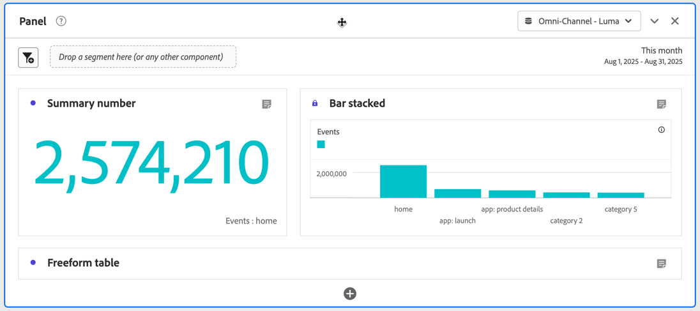

# Panoramica dei pannelli

Un [!UICONTROL panel] è una raccolta di tabelle e visualizzazioni. Puoi accedere ai pannelli dall’icona in alto a sinistra in Workspace o da un [pannello vuoto](/help/analyze/analysis-workspace/c-panels/blank-panel.md). I pannelli sono utili per organizzare i progetti in base a specifici periodi di tempo, suite di rapporti o casi di utilizzo di analisi.

## Tipi di pannello

In Analysis Workspace sono disponibili i seguenti tipi di pannello per [!UICONTROL Adobe Analytics]:

| Nome pannello | Descrizione |
| --- | --- |
| [Pannello vuoto](/help/analyze/analysis-workspace/c-panels/blank-panel.md) | Per iniziare a eseguire analisi, scegli tra i pannelli e le visualizzazioni disponibili. |
| [Attribuzione](attribution.md) | Confronta e visualizza rapidamente più modelli di attribuzione utilizzando qualsiasi dimensione e metrica di conversione. |
| [Analytics for Target](a4t-panel.md) | Analizza le attività ed esperienze Target in Analysis Workspace. |
| [A forma libera](freeform-panel.md) | Esegui confronti illimitati e raggruppamenti, quindi aggiungi visualizzazioni per raccontare una storia ricca di dati. |
| [Pubblico medio per minuto del file multimediale](average-minute-audience-panel.md) | Analizza il pubblico medio per minuto di una parte del contenuto specifico o in un periodo di tempo personalizzato. |
| [Visualizzatori simultanei di contenuti multimediali](media-concurrent-viewers.md) | Analizza i visualizzatori simultanei nel tempo, con dettagli sui picchi di concorrenza e con la possibilità di suddividerli e confrontarli. |
| [Tempo trascorso su contenuti multimediali](/help/analyze/analysis-workspace/c-panels/media-playback-time-spent.md) | L’analisi del tempo di riproduzione trascorso consente di comprendere dove si è verificato il picco di concorrenza o dove si è verificato il calo. |
| [Elemento successivo o precedente](next-previous.md) | Mostra le pagine successive o precedenti a cui si accede. |
| [Quick Insights](quickinsight.md) | Crea rapidamente una tabella a forma libera e una relativa visualizzazione per analizzare e individuare più rapidamente le informazioni. |
| [Riepilogo pagina](page-summary.md) | Esplora le statistiche chiave su pagine specifiche. |
| [Confronto segmenti](/help/analyze/analysis-workspace/c-panels/c-segment-comparison/segment-comparison.md) | Confronta rapidamente due segmenti su tutti i punti dati per trovare automaticamente differenze rilevanti. |

I pannelli [!UICONTROL Quick insights], [!UICONTROL Blank] e [!UICONTROL Freeform] sono ideali per iniziare con le attività di analisi, mentre [!UICONTROL Attribution] si presta ad analisi più avanzate. Nella parte inferiore dell’area di lavoro è disponibile un , che consente di aggiungere pannelli vuoti in qualsiasi momento.

Il pannello iniziale predefinito è [!UICONTROL Freeform], ma puoi impostare come predefinito il [Pannello vuoto](/help/analyze/analysis-workspace/c-panels/blank-panel.md) o [Quick Insights](/help/analyze/analysis-workspace/c-panels/quickinsight.md). Consulta [Preferenze Progetti e Analisi](/help/analyze/analysis-workspace/user-preferences.md#projects--analyses-preferences).

## Creare un pannello

Per creare un pannello:

* Trascina un pannello dal pannello a sinistra **[!UICONTROL Panels]** nell’area di lavoro.
* Seleziona un pannello dal [Pannello vuoto](blank-panel.md).
* Utilizza il menu **[!UICONTROL Insert]** in Workspace e seleziona il tuo pannello. In alternativa, puoi utilizzare una delle [scelte rapide da tastiera](../build-workspace-project/fa-shortcut-keys.md) per inserire un pannello.

  

Puoi:

* Seleziona  **all’interno** di un pannello per aggiungere un’altra visualizzazione. Viene visualizzato un riquadro a comparsa che consente di selezionare una visualizzazione.

  

  | Seleziona... | Per creare una visualizzazione... |
  |---|---|
  |  | [Tabella a forma libera](/help/analyze/analysis-workspace/visualizations/freeform-table/freeform-table.md) |
  |  | [Linee](/help/analyze/analysis-workspace/visualizations/line.md) |
  |  | [Barre](/help//analyze/analysis-workspace/visualizations/bar.md) |
  |  | [Numero di riepilogo](/help/analyze/analysis-workspace/visualizations/summary-number-change.md) |
  |  | [Testo](/help/analyze/analysis-workspace/visualizations/text.md) |
  |  | [Fallout](/help/analyze/analysis-workspace/visualizations/fallout/fallout-flow.md) |
  |  | [Flusso](/help/analyze/analysis-workspace/visualizations/c-flow/flow.md) |
  |  | [Area sovrapposta](/help/analyze/analysis-workspace/visualizations/area.md) |
  |  | [Tabella coorte](/help/analyze/analysis-workspace/visualizations/cohort-table/t-cohort.md) |
  |  | [Bullet](/help/analyze/analysis-workspace/visualizations/bullet-graph.md) |
  |  | [Anello](/help/analyze/analysis-workspace/visualizations/donut.md) |
  |  | [Variazione di riepilogo](/help/analyze/analysis-workspace/visualizations/summary-number-change.md) |
  |  | [Istogramma](/help/analyze/analysis-workspace/visualizations/histogram.md) |
  |  | [A dispersione](/help/analyze/analysis-workspace/visualizations/scatterplot.md) |
  |  | [Venn](/help/analyze/analysis-workspace/visualizations/venn.md) |
  |  | [Mappa ad albero](/help/analyze/analysis-workspace/visualizations/treemap.md) |

* Seleziona  **all&#39;esterno** dell’ultimo pannello nell’area di lavoro per aggiungere un altro [pannello vuoto](blank-panel.md).

## Gestire un pannello

Puoi gestire un pannello nei modi seguenti:

* Per comprimere un pannello, seleziona .
* Per visualizzare un pannello compresso, seleziona .
* Per eliminare un pannello, seleziona . Per annullare, seleziona **[!UICONTROL Edit]** > **[!UICONTROL Undo]** (**[!UICONTROL *Comando+Z *]**|**[!UICONTROL * CTRL+Z *]**).
* Per spostare un pannello, trascinalo ogni volta che è visibile un elemento . In genere quando passi il puntatore sull’intestazione.

## Suite di rapporti

Ogni pannello è associato a una [suite di rapporti](/help/admin/tools/manage-rs/report-suites-admin.md), identificata da  **[!UICONTROL *nome della suite di rapporti *]**&#x200B;nel menu a discesa in alto a destra del pannello.

Quando crei un nuovo pannello, la suite di rapporti predefinita si basa sulla suite di rapporti dell’ultimo pannello su cui hai lavorato nel progetto Analysis Workspace.

All&#39;interno di un progetto, puoi utilizzare una o [molte suite di rapporti](/help/analyze/analysis-workspace/build-workspace-project/multiple-report-suites.md) a seconda dei casi di utilizzo dell&#39;analisi.

L’elenco delle suite di rapporti è ordinato in base alla rilevanza, che Adobe definisce in base a quanto recentemente e con quale frequenza l’utente corrente ha utilizzato la suite, e alla frequenza con cui questa viene utilizzata all’interno dell’organizzazione.

>[!IMPORTANT]
>
>La suite di rapporti selezionata determina le dimensioni, le metriche e i segmenti disponibili per la creazione di visualizzazioni in un pannello.
>
>
>Quando cambi suite di rapporti per un pannello, alcuni componenti potrebbero non essere disponibili in quella nuova suite di rapporti. Questa modifica può impedire il corretto rendering della visualizzazione. Potresti visualizzare avvisi come:
>
>* Questo pannello contiene componenti non abilitati nella suite di rapporti selezionata. Modifica la suite di rapporti o abilita i componenti richiesti nella suite di rapporti.
>* Impossibile eseguire il rendering della visualizzazione: controlla le colonne e le righe per assicurarti che contengano componenti validi.
>

## Calendario

Il calendario del pannello controlla l’intervallo della date di reporting per tabelle e visualizzazioni all’interno di un pannello.

>[!NOTE]
>
>Se un componente Intervallo di date del  viene utilizzato all’interno di una visualizzazione o di un pannello (ad esempio, come segmento), tale componente sostituisce il calendario del pannello.
>

1. Seleziona un intervallo di date selezionando prima la data di inizio e quindi la data di fine.
In alternativa, puoi selezionare **[!UICONTROL Preset]** dal menu a discesa [!UICONTROL *Seleziona un predefinito*].

1. Facoltativamente, seleziona **[!UICONTROL Show advanced settings]** per:

   * Specificare **[!UICONTROL Start time]** e **[!UICONTROL End time]** diversi da `12:00 AM` (`0:00`) e `11:59 PM` (`23:59`) predefiniti. Gli orari di fine includono sempre 59 secondi. Per un intervallo di date che si estende su più giorni, l’ora di inizio si applica al primo giorno dell’intervallo di date e l’ora di fine si applica all’ultimo giorno dell’intervallo di date. Utilizza **[!UICONTROL (Reset time values)]** per ripristinare le impostazioni predefinite dell’ora di inizio e di fine.
   * **[!UICONTROL Make date range components relative to panel calendar]**. Se disattivato, i componenti dell’intervallo di date utilizzati nel pannello sono relativi all’ora corrente. Se questa opzione è abilitata, i componenti dell’intervallo di date utilizzati nel pannello sono relativi al calendario del pannello.
   * **[!UICONTROL Use rolling dates]**. Se abilitati, gli intervalli di date predefiniti come **[!UICONTROL Last 7 full days]** vengono aggiornati in modo dinamico in base all’avanzamento della data e dell’ora corrente. Se disattivate, tali predefiniti non vengono aggiornati una volta applicati.

     

     È possibile selezionare il testo tra parentesi (ad esempio **[!UICONTROL fixed start - rolling daily]**) per estendere il pannello e specificare i dettagli per **[!UICONTROL Start]** e **[!UICONTROL End]**.

      1. Seleziona **[!UICONTROL Start of]**, **[!UICONTROL End of]**, or **[!UICONTROL Fixed day]**.
      1. Dopo aver selezionato **[!UICONTROL Start of]** o **[!UICONTROL End of]**, è possibile creare un’espressione completa. Ad esempio: **[!UICONTROL End of]** **[!UICONTROL current year]** **[!UICONTROL plus]** `1` **[!UICONTROL day]**. Seleziona il valore appropriato per ogni singola parte dell’espressione.
         * Seleziona un valore corrente. Ad esempio **[!UICONTROL current year]**.
         * Seleziona un valore per il calcolo aggiuntivo. Ad esempio: **[!UICONTROL plus]**.
         * Dopo aver specificato un calcolo aggiuntivo, specifica un valore. Ad esempio `1`.
         * Dopo aver specificato il calcolo aggiuntivo, seleziona il periodo di tempo da utilizzare per il calcolo. Ad esempio **[!UICONTROL day]**.

     Seleziona **[!UICONTROL Hide details]** per nascondere i dettagli del calcolo delle date continue.

1. Seleziona **[!UICONTROL Apply]** per applicare l’intervallo di date al pannello da cui è stato richiamato il calendario.
Seleziona **[!UICONTROL Apply to all panels]** per applicare l’intervallo di date a tutti i pannelli nel progetto Workspace.

## Zona di rilascio {#dropzone}

La zona di rilascio del pannello consente di applicare segmenti e segmenti a discesa a tutte le tabelle e visualizzazioni all’interno di un pannello. Puoi applicare uno o più segmenti a un pannello.

### Segmenti

Per iniziare a segmentare il pannello, trascina un segmento dal pannello a sinistra fino alla zona di rilascio del pannello. Ripeti questa procedura per aggiungere altri segmenti al pannello. I segmenti vengono visualizzati uno accanto all’altro nella parte superiore del pannello.

#### Segmenti rapidi

Puoi anche trascinare componenti diversi da segmenti direttamente nella zona di rilascio, per creare segmenti rapidi in modo più rapido e senza dover passare al [Generatore di segmenti](/help/components/segmentation/segmentation-workflow/seg-build.md). I segmenti creati in questo modo vengono automaticamente definiti come segmenti a livello di evento. È possibile modificare rapidamente questa definizione selezionando  accanto al nome del segmento.

<!-- For more information, see [Quick segments](/help/components/segmentation/). -->

### Segmenti a discesa

>[!BEGINSHADEBOX]

Per un video demo, vedi  [Segmenti a discesa](https://video.tv.adobe.com/v/329414?quality=12&learn=on&captions=ita){target="_blank"}.

>[!ENDSHADEBOX]

#### Segmenti a discesa statici

I segmenti a discesa statici consentono di interagire con i dati in modo controllato. Ad esempio, puoi aggiungere un segmento a discesa per i tipi di dispositivi mobili, in modo da segmentare il pannello per tablet, telefono cellulare o desktop.

I segmenti a discesa statici possono essere utilizzati anche per consolidare più progetti in un unico progetto. Ad esempio, se hai creato più versioni dello stesso progetto assegnando a ciascuna un segmento Paese diverso, puoi consolidarle tutte in un unico progetto e aggiungere un segmento a discesa Paese.

##### Creare segmenti a discesa statici

* Per i segmenti a discesa che utilizzano elementi dimensionali, seleziona una singola dimensione dal pannello a sinistra e rilasciala nella zona di rilascio del pannello tenendo premuto ⇧ (*Maiusc*). Questa azione crea un segmento a discesa con tutti gli elementi dimensionali associati a tale dimensione.

  Oppure, se desideri che il segmento a discesa includa solo elementi dimensionali specifici associati a una dimensione, seleziona l’icona a forma di freccia verso destra accanto alla dimensione desiderata nel pannello di sinistra. Questa azione espone tutti gli elementi dimensionali disponibili. Seleziona più elementi dimensionali da questo elenco utilizzando ⇧ +  (*Maiusc* + *Seleziona*) o ^ +  (*controllo* + *Seleziona*), quindi rilasciali nell’area di rilascio del pannello **mentre tieni premuto** ⇧.

* Per i segmenti a discesa che utilizzano un singolo tipo di componente (ad esempio, solo dimensioni, solo segmenti o solo metriche), seleziona più elementi dello stesso tipo nel pannello a sinistra utilizzando ⇧ +  o ^ + . Quindi rilascia gli elementi nella zona di rilascio del pannello **mentre tieni premuto** ⇧.

  Viene creato un segmento a discesa singolo con i componenti selezionati.

* Per i segmenti a discesa che utilizzano un mix di componenti (ad esempio 2 metriche e 3 segmenti), seleziona più componenti utilizzando ⇧ +  o ^ + . Rilascia la selezione nella zona di rilascio del pannello **mentre tieni premuto** ⇧. In questo contesto, tutti i tipi di componente vengono trattati come segmenti a discesa separati. Ad esempio, se nella selezione includi sia metriche che elementi dimensionali, vengono creati due segmenti a discesa separati: uno include gli elementi dimensionali e l’altro include le metriche.

Un segmento a discesa fornisce le seguenti opzioni del menu di scelta rapida:

* **[!UICONTROL Delete drop-down]**: rimuove il segmento a discesa dal pannello.
* **[!UICONTROL Delete label]**: rimuove il testo mostrato sopra un segmento a discesa. Per modificare l’etichetta, passaci sopra il puntatore e seleziona .
* **[!UICONTROL Add label]**: quando aggiungi un segmento a discesa a un progetto, un’etichetta viene impostata automaticamente sul nome del componente. Se elimini l’etichetta, puoi aggiungerla nuovamente con questa opzione.
* **[!UICONTROL Require selection]**: richiede che nel pannello sia impostato un segmento.

##### Utilizzare segmenti a discesa statici

Per segmentare il pannello, gli utenti possono utilizzare il menu dei segmenti a discesa in uno dei seguenti modi:

* Applicare un singolo segmento al pannello selezionandolo dal segmento a discesa.

* Applicare più segmenti al pannello selezionandone più di uno dal segmento a discesa. Il pannello viene segmentato per includere uno qualsiasi dei segmenti selezionato.

#### Segmenti a discesa dinamici

I segmenti a discesa dinamici consentono di determinare i valori disponibili in base ai dati all’interno dell’intervallo di reporting del pannello e ai valori in altri segmenti a discesa. Ad esempio, puoi creare due menu a discesa dinamici utilizzando una dimensione Paesi e una dimensione Città. Quando selezioni un paese dall’elenco a discesa **[!UICONTROL Countries]**, l’elenco a discesa **[!UICONTROL Cities]** si adatta in modo dinamico per mostrare solo le città all’interno di quel paese.

Lo stesso concetto si applica a tutte le dimensioni: sono visibili solo gli elementi dimensionali che compaiono nell’intervallo di date del pannello e i segmenti selezionati. Gli elementi dimensionali selezionati nei segmenti a discesa statici influiscono sui valori disponibili nei segmenti a discesa dinamici. Tuttavia, ciò non vale per il contrario: gli elementi dimensionali selezionati nei segmenti a discesa dinamici non influiscono sui valori disponibili nei segmenti a discesa statici.

La selezione manuale degli elementi dimensionali è disponibile se prevedi che un certo elemento dimensionale verrà raccolto in futuro. È inoltre possibile cancellare un segmento a discesa dinamico in modo che non contenga un valore, consentendo ad altri segmenti a discesa dinamici di contenere più valori. Seleziona **[!UICONTROL Reset all]** per cancellare la selezione da tutti i segmenti a discesa di quel pannello.

Per creare un segmento a discesa dinamico:

* Trascina una singola dimensione nella zona di rilascio del pannello **mentre tieni premuto** ⇧.

Tieni presente che i segmenti a discesa dinamici non sono disponibili per metriche, segmenti o intervalli di date.

Un segmento a discesa dinamico fornisce le stesse opzioni del menu di scelta rapida dei segmenti a discesa statici.

## Menu di scelta rapida

Ulteriori funzionalità per un pannello sono disponibili tramite il menu di scelta rapida (clic con il pulsante destro del mouse) sull’intestazione del pannello.

Sono disponibili le seguenti opzioni:

| Opzione | Descrizione |
| --- | --- |
| **[!UICONTROL Insert copied panel]** | Consente di incollare un pannello copiato in un’altra posizione all’interno del progetto o in un progetto diverso. |
| **[!UICONTROL Insert copied visualization]** | Consente di incollare un pannello copiato in un’altra posizione all’interno del pannello, del progetto o in un progetto diverso. |
| **[!UICONTROL Apply Report Suite to all panels]** | Applica la suite di rapporti per questo pannello a tutti gli altri pannelli del progetto. |
| **[!UICONTROL Copy panel]** | Copia un pannello, in modo da poterlo inserire in un’altra posizione all’interno di un progetto o in un progetto diverso. |
| **[!UICONTROL Duplicate panel]** | Crea un duplicato esatto del pannello corrente, che potrai quindi modificare. |
| **[!UICONTROL Collapse all panels]** | Comprimi tutti i pannelli del progetto. |
| **[!UICONTROL Expand all panels]** | Espandi tutti i pannelli del progetto. |
| **[!UICONTROL Collapse all visualizations in panel]** | Comprimi tutte le visualizzazioni nel pannello corrente. |
| **[!UICONTROL Expand all visualizations in panel]** | Espandi tutte le visualizzazioni nel pannello corrente. |
| **[!UICONTROL Edit Description]** | Aggiungi (o modifica) un testo descrittivo per il pannello. |
| **[!UICONTROL Get Panel Link]** | Indirizza un utente a uno specifico pannello all’interno di un progetto. Quando selezioni il collegamento, al destinatario verrà richiesto di effettuare l’accesso prima di essere indirizzato al pannello esatto a cui è collegato. |

## Configurazione

Alcuni pannelli (come [!UICONTROL Attribution], [!UICONTROL Experimentation], [!UICONTROL Media average minute audience] e altri) dispongono di una finestra di dialogo per la configurazione che consente di creare la visualizzazione. Utilizza  nella parte superiore del pannello per accedere e modificare la configurazione.

<!--
## Panel types

The following panel types are available in Analysis Workspace:

| Panel name | Description |
| --- | --- |
| [Blank panel](blank-panel.md) | Choose from available panels and visualizations to start your analysis. |
| [Quick Insights panel](quickinsight.md) | Quickly build a freeform table and an accompanying visualization in order to analyze and uncover insights faster. |
| [Analytics for Target panel](a4t-panel.md) | Analyze Target activities and experiences in Analysis Workspace. |
| [Attribution panel](attribution.md) | Quickly compare and visualize any number of attribution models using any dimension and conversion metric. |
| [Freeform panel](freeform-panel.md) | Perform unlimited comparisons and breakdowns, then add visualizations to tell a rich data story. |
| [Media Average Minute Audience panel](average-minute-audience-panel.md) | Analyze average minute audience over time, with details on peak views and the ability to break down and compare. |
| [Media Concurrent Viewers panel](media-concurrent-viewers.md) | Analyze concurrent viewers over time, with details on peak concurrency and the ability to break down and compare. |
| [Media Playback Timespent panel](/help/analyze/analysis-workspace/c-panels/media-playback-time-spent.md) | Analyze concurrent viewers over time, with details on peak concurrency and the ability to break down and compare. |
| [Segment Comparison panel](c-segment-comparison/segment-comparison.md) | Quickly compare two segments across all data points to automatically find relevant differences. |

[!UICONTROL Quick Insights], [!UICONTROL Blank] and [!UICONTROL Freeform] panels are great places to start your analysis, while [!UICONTROL Analytics for Target], [!UICONTROL Attribution], [!UICONTROL Media Concurrent Viewers] and [!UICONTROL Segment Comparison] lend themselves to more advanced analyses. A `"+"` button is available in projects so you can add blank panels at any time.

The default starting panel is the [!UICONTROL Freeform] panel, but you can make the [blank panel](/help/analyze/analysis-workspace/c-panels/blank-panel.md) your default as well.

## Report suite {#report-suite}

Tables and visualizations within a panel derive data from the [!UICONTROL report suite] selected in the top right of the panel. The report suite also determines what components are available in the left rail. Within a project, you can use one or [many report suites](/help/analyze/analysis-workspace/build-workspace-project/multiple-report-suites.md) depending on your analysis use cases. To apply a single report suite to all panels in a project, **right-click panel header > Apply report suite to all panels**.

The list of report suites is sorted on relevancy, which Adobe defines based on how recently and frequently the suite has been used by the current user, and how frequently the suite is used within the organization.

## Calendar {#calendar}

The panel calendar controls the reporting range for tables and visualizations within a panel.

>[!NOTE]
>If a (purple) date range component is used within a table, visualization or panel drop zone, it overrides the panel calendar.

You can apply a minute-level date range under the advanced settings of your panel calendar. If you are reporting on a date range that spans many days, start time applies to the first day and end time applies to the last day in your range.

## Drop zone {#dropzone}

The panel drop zone enables you to apply segment and drop-down filters to all tables and visualizations within a panel. You can apply one or many filters to a panel. 

### Segment filters

Drag and drop any segments from the left rail into the panel drop zone to begin filtering your panel. Repeat this process to add additional filters to the panel. Filters appear side by side at the top of the panel.

### Ad hoc segment filters

Non-segment components can also be dragged directly into the drop zone to create ad hoc segments, saving you the time and effort of going to the Segment Builder. Segments created in this way are automatically defined as hit-level segments. This definition can be modified by clicking the information icon (i) next to the segment, then the pencil-shaped edit icon and editing it in the Segment Builder.

Ad hoc segments are a type of quick segment, and are local to the project. They do not show up in the left rail unless you make them public.

For more information, see [Quick segments](/help/analyze/analysis-workspace/components/segments/quick-segments.md).

### Static drop-down segments

Static drop-down segments enable you to interact with the data in a controlled way. For example, you can add a drop-down segment for Mobile Device Types so that you can segment the panel by Tablet, Mobile Phone, or Desktop.

Static drop-down segments can also be used to consolidate many projects into one. For example, if you have many versions of the same project with different Country segments applied, you can consolidate all versions into a single project and add a Country drop-down segment.

#### Create static drop-down segments

* For drop-down segments using dimension items, select a single dimension from the left rail and drop it into the panel dropzone **while holding `[Shift]`**. This creates a drop-down segment with all the dimension items that are associated with that dimension. 

  Or, if you want the drop-down segment to include only specific dimension items that are associated with a dimension, click the right arrow icon next to the desired dimension in the left rail. This action exposes all available dimension items. Select multiple dimension items from this list using `[Shift + Click]` or `[Ctrl + Click]`, then drop them into the panel dropzone **while holding** `[Shift]`.

* For drop-down segments using a single component type (for example, only dimensions, or only segments, or only metrics), select multiple items of the same type in the left rail using `[Shift + Click]` or `[Ctrl + Click]`, then drop them into the panel dropzone **while holding `[Shift]`**.

  A single drop-down segment is created with components that you selected.

* For drop-down segments using a mix of component types (such as 2 metrics and 3 filters), select multiple components using `[Shift + Click]` or `[Ctrl + Click]`. Drop the selection into the panel dropzone **while holding `[Shift]`**. In this context, all component types are treated as separate drop-down segments. For example, if you include both metrics and dimension items in your selection, two separate drop-down segments are created: one drop-down segments includes dimension items, and the other includes metrics.

  

Right-clicking a drop-down segment provides the following options:

* **[!UICONTROL Delete drop-down]**: Removes the drop-down segment from the panel. 
* **[!UICONTROL Delete label]**: Remove the text above a drop-down segment. To modify the label, select the pencil icon.
* **[!UICONTROL Add label]**: When you add a drop-down segment to a project, a label is automatically set to the component name. If you delete the label, you can add it again with this option.
* **[!UICONTROL Require selection]**: Requires that a segment is set on the panel. 

[Watch the video](https://experienceleague.adobe.com/docs/analytics-learn/tutorials/analysis-workspace/using-panels/using-panels-to-organize-your-analysis-workspace-projects.html?lang=it) to learn more about how to add drop-down filters to your project.

#### Use static drop-down segments

Use the drop-down segments menu in any of the following ways in order to filter the panel:
     
* Apply a single segment to the panel by selecting the segment from the drop-down menu.

* Apply multiple segments to the panel by selecting more than one segment from the drop-down menu. The panel is filtered to include any of the selected segments. 

  To remove a segment from the list, select it again in the drop-down menu.

  

### Dynamic drop-down segments

Dynamic drop-down segments allow you to determine available values based on data within the panel's reporting range and values in other drop-down segments. For example, you can create two dynamic drop-downs using the [Countries](/help/components/dimensions/countries.md) dimension and [Cities](/help/components/dimensions/cities.md) dimension. When you select a country from the [!UICONTROL Countries] drop-down list, the [!UICONTROL Cities] drop-down list dynamically adjusts to only show cities within that country.

This same concept applies to all dimensions; only dimension items that appear within the panel's date range and selected segments are visible. Dimension items selected in static drop-down segments affect available values in dynamic drop-down segments. However, the inverse is not true; Dimension items selected in dynamic drop-down segments do not affect available values in static drop-down segments.

Manual selection of dimension items is available if you anticipate a certain dimension item to be collected in the future. You can also clear a dynamic drop-down segment so that it does not contain a value, allowing other dynamic drop-down segments to contain more values. Select **[!UICONTROL Reset all]** to clear the selection from all drop-down segments for that panel.

To create a dynamic drop-down segment:

* Drag and drop a single dimension into the panel dropzone **while holding `[Shift]`**.
* Dynamic drop-down segments are not available for metrics, segments, or date ranges.
* Right-click a drop-down segment and select **[!UICONTROL Delete dropdown]** to delete it.

Right-clicking a dynamic drop-down filter provides the same options as static drop-down filters.

## Right-click menu {#right-click}

Additional functionality for a panel is available by right-clicking on the panel header.

The following settings are available:

| Setting | Description |
| --- | --- |
| Insert Copied Panel/Visualization|Lets you paste ("insert") a copied panel or visualization to another place within the project, or into a different project.|
| Copy Panel | Lets you right-click and copy a panel, so that you can insert it to another place within the project, or into a different project.|
| Apply Report Suite to all panels | Lets you apply the active panel report suite to all panels in the project.|
| Duplicate Panel | Makes an exact duplicate of the current panel, which you can then modify. |
| Collapse/Expand all Panels | Collapses and expands all project panels. |
| Collapse/Expand all Visualizations in Panel | Collapses and expands all visualizations in the current panel. |
| Edit Description | Add (or edit) a text description for the panel. |
| Get Panel Link | Lets you direct someone to a specific panel within a project. When the link is clicked, the recipient will be required to login before being directed to the exact panel linked to. |

-->
