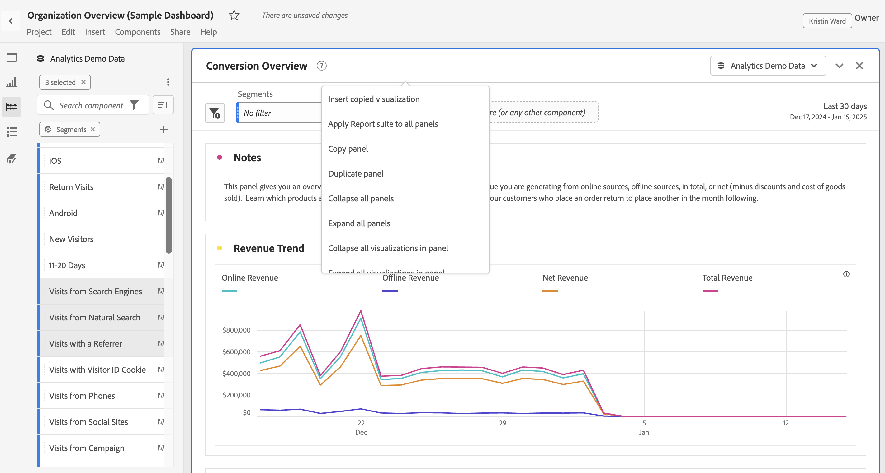

# Panoramica dei pannelli

Un [!UICONTROL panel] è un insieme di tabelle e visualizzazioni. Puoi accedere ai pannelli dall’icona in alto a sinistra in Workspace o da un [pannello vuoto](blank-panel.md). I pannelli sono utili per organizzare i progetti in base a specifici periodi di tempo, suite di rapporti o casi di utilizzo di analisi. In Analysis Workspace sono disponibili i seguenti tipi di pannelli:

| Nome pannello | Descrizione |
| --- | --- |
| [Pannello vuoto](blank-panel.md) | Scegli tra i pannelli e le visualizzazioni disponibili per avviare l’analisi. |
| [Pannello Quick Insights](quickinsight.md) | Crea rapidamente una tabella a forma libera e una relativa visualizzazione per analizzare e individuare più rapidamente le informazioni. |
| [Pannello Analytics for Target](a4t-panel.md) | Analizzare attività ed esperienze Target in Analysis Workspace. |
| [Pannello Attribution](attribution.md) | Confronta e visualizza rapidamente qualsiasi numero di modelli di attribuzione utilizzando qualsiasi dimensione e metrica di conversione. |
| [Pannello Freeform](freeform-panel.md) | Esegui confronti illimitati e suddivisioni, quindi aggiungi visualizzazioni per raccontare una storia ricca di dati. |
| [Pannello Visualizzatori simultanei di contenuti multimediali](media-concurrent-viewers.md) | Analizzare i visualizzatori simultanei nel tempo, con dettagli sulla concorrenza dei picchi e sulla possibilità di suddividerli e confrontarli. |
| [Pannello Segment Comparison](c-segment-comparison/segment-comparison.md) | Confronta rapidamente due segmenti su tutti i punti dati per trovare automaticamente differenze rilevanti. |

[!UICONTROL Quick Insights],  [!UICONTROL Blank] e  [!UICONTROL Freeform] i pannelli sono luoghi ideali per avviare l’analisi, mentre  [!UICONTROL Analytics for Target],  [!UICONTROL Attribution IQ],  [!UICONTROL Media Concurrent Viewers] e  [!UICONTROL Segment Comparison] prestarsi ad analisi più avanzate. Nei progetti è disponibile un pulsante `"+"` che consente di aggiungere pannelli vuoti in qualsiasi momento.

Il pannello iniziale predefinito è il pannello [!UICONTROL Freeform], ma puoi impostare come predefinito anche il pannello [vuoto](/help/analyze/analysis-workspace/c-panels/blank-panel.md) .

## Suite di rapporti {#report-suite}

Le tabelle e le visualizzazioni all’interno di un pannello derivano i dati da [!UICONTROL report suite] selezionati in alto a destra nel pannello. La suite di rapporti determina anche i componenti disponibili nella barra a sinistra. All’interno di un progetto, puoi utilizzare una o [molte suite di rapporti](https://docs.adobe.com/content/help/it-IT/analytics/analyze/analysis-workspace/build-workspace-project/multiple-report-suites.html) a seconda dei casi di utilizzo dell’analisi. Per applicare una singola suite di rapporti a tutti i pannelli di un progetto, **fai clic con il pulsante destro del mouse sull’intestazione del pannello > Applica suite di rapporti a tutti i pannelli**.

L’elenco delle suite di rapporti è ordinato in base alla rilevanza, che ad Adobe definisce in base a quanto recentemente e con quale frequenza l’utente corrente ha utilizzato la suite e alla frequenza con cui questa viene utilizzata all’interno dell’organizzazione.

## Calendario {#calendar}

Il calendario del pannello controlla l’intervallo di reporting per tabelle e visualizzazioni all’interno di un pannello.

Nota: Se un componente intervallo di date (viola) viene utilizzato all’interno di una zona di rilascio di una tabella, una visualizzazione o un pannello, questo sovrascriverà il calendario del pannello.

## Zona di rilascio {#dropzone}

La zona di rilascio del pannello consente di applicare filtri a segmenti e filtri a discesa a tutte le tabelle e visualizzazioni all’interno di un pannello. Puoi applicare uno o più filtri a un pannello. Per modificare il titolo sopra ogni filtro, fai clic sulla matita di modifica oppure fai clic con il pulsante destro del mouse per rimuoverlo completamente.

### Filtri dei segmenti

Trascina e rilascia qualsiasi segmento dalla barra a sinistra nella zona di rilascio del pannello per iniziare a filtrare il pannello.

### Filtri di segmenti ad hoc

Puoi anche trascinare i componenti non dei segmenti direttamente nella zona di rilascio per creare segmenti ad hoc, risparmiando tempo e fatica nell’andare al Generatore di segmenti. I segmenti creati in questo modo vengono automaticamente definiti come segmenti a livello di hit. Per modificare questa definizione, fai clic sull’icona delle informazioni (i) accanto al segmento, quindi sull’icona di modifica a forma di matita e modificala nel Generatore di segmenti.

I segmenti ad hoc sono locali per il progetto e non verranno visualizzati nella barra a sinistra se non li rendi pubblici.

### Filtri a discesa {#dropdown-filter}

Oltre ai filtri dei segmenti, i filtri a discesa consentono di interagire con i dati in modo controllato. Ad esempio, puoi aggiungere un filtro a discesa per i tipi di dispositivi mobili in modo da segmentare il pannello in base a Tablet, Telefono cellulare o Desktop.

I filtri a discesa possono essere utilizzati per consolidare più progetti in un unico insieme. Ad esempio, se disponi di più versioni dello stesso progetto con diversi segmenti Paese applicati, puoi consolidare tutte le versioni in un unico progetto e aggiungere un filtro a discesa Paese .

Per creare filtri a discesa:

1. Per creare un filtro a discesa utilizzando [!UICONTROL Dimension items], ad esempio valori all’interno della dimensione [!UICONTROL Marketing Channel], fai clic sull’icona a forma di freccia destra accanto alla dimensione nella barra a sinistra. Verranno esposti tutti gli elementi disponibili. Seleziona uno o più elementi componenti dalla barra a sinistra e rilasciali nella zona di rilascio del pannello **tenendo premuto il tasto Maiusc**. Questo trasforma i componenti in un filtro a discesa, anziché in un singolo segmento.
1. Per creare un filtro a discesa utilizzando un altro componente, ad esempio metriche, segmenti o intervalli di date, selezionalo da un tipo di componente nella barra a sinistra e rilascialo nella zona di rilascio del pannello **tenendo premuto il tasto Maiusc**.
1. Seleziona una delle opzioni dal menu a discesa per modificare i dati nel pannello . Puoi anche scegliere di non filtrare nessuno dei dati del pannello selezionando **[!UICONTROL No filter]**.

[Guarda il ](https://docs.adobe.com/content/help/en/analytics-learn/tutorials/analysis-workspace/using-panels/using-panels-to-organize-your-analysis-workspace-projects.html) video per ulteriori informazioni su come aggiungere filtri a discesa al progetto.

## Menu di scelta rapida {#right-click}

Ulteriori funzionalità per un pannello sono disponibili facendo clic con il pulsante destro del mouse sull’intestazione del pannello.

Sono disponibili le seguenti impostazioni:

| Impostazione | Descrizione |
| --- | --- |
| Inserisci pannello copiato/visualizzazione | Consente di incollare (&quot;inserire&quot;) un pannello o una visualizzazione copiati in un’altra posizione all’interno del progetto o in un progetto completamente diverso. |
| Pannello Copia | Consente di fare clic con il pulsante destro del mouse e copiare un pannello in modo da poterlo inserire in un’altra posizione all’interno del progetto o in un progetto completamente diverso. |
| Applica suite di rapporti a tutti i pannelli | Consente di applicare la suite di rapporti del pannello attivo a tutti i pannelli del progetto. |
| Pannello duplicato | Crea un duplicato esatto del pannello corrente, che potrai quindi modificare. |
| Comprimi/espandi tutti i pannelli | Comprime ed espande tutti i pannelli del progetto. |
| Comprimi/espandi tutte le visualizzazioni nel pannello | Comprime ed espande tutte le visualizzazioni nel pannello corrente. |
| Modifica descrizione | Aggiungi (o modifica) una descrizione di testo per il pannello. |
| Ottieni collegamento pannello | Consente di indirizzare un utente a uno specifico pannello in un progetto. Quando fai clic sul collegamento, al destinatario verrà richiesto di effettuare l’accesso prima di essere indirizzato al pannello esatto a cui è collegato. |
