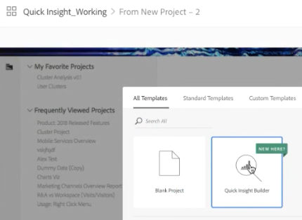

# Pannello Approfondimenti rapidi

>[!IMPORTANT]
>
>**[!UICONTROL Quick Insights]** al momento il test del pannello è limitato. [Ulteriori informazioni](https://docs.adobe.com/content/help/it-IT/analytics/landing/an-releases.html)

[!UICONTROL Quick Insights] fornisce indicazioni per i non analisti e i nuovi utenti [!UICONTROL Analysis Workspace] per imparare a rispondere alle domande aziendali in modo rapido e semplice. È anche un ottimo strumento per gli utenti avanzati che desiderano rispondere rapidamente a una semplice domanda senza dover costruire personalmente una tabella.

Quando inizi a utilizzare questo [!UICONTROL Analysis Workspace], potresti chiederti quali visualizzazioni sarebbero più utili, quali dimensioni e metriche potrebbero facilitare le informazioni, dove trascinare e rilasciare elementi, dove creare un segmento, ecc.

A tal fine, e in base all&#39;utilizzo dei componenti dati da parte della propria azienda in [!UICONTROL Analysis Workspace], [!UICONTROL Quick Insights] sfrutta un algoritmo che ti presenterà le dimensioni, le metriche, i segmenti e gli intervalli di date più comuni utilizzati dalla tua azienda. Di fatto, vedrai quote, metriche e segmenti contrassegnati come [!UICONTROL Popular] nell&#39;elenco a discesa, come mostrato di seguito:

[!UICONTROL Quick Insights] aiuta

* Crea correttamente una tabella di dati e una relativa visualizzazione in [!UICONTROL Analysis Workspace].
* Impara la terminologia e il vocabolario per componenti e pezzi di [!UICONTROL Analysis Workspace]base.
* Suddivisioni semplici di dimensioni, aggiunta di metriche multiple o confronto semplice dei segmenti all&#39;interno di un [!UICONTROL Freeform table].
* Modifica o prova vari tipi di visualizzazione per trovare lo strumento di ricerca per la tua analisi in modo rapido e intuitivo.

## Terminologia chiave di base

Di seguito sono riportati alcuni dei termini di base con cui hai bisogno di avere familiarità. Ogni tabella di dati è composta da 2 o più blocchi (componenti) utilizzati per raccontare la storia dei dati.

| Blocco predefinito (componente) | Definizione |
|---|---|
| [!UICONTROL Dimension] | Le dimensioni sono descrizioni o caratteristiche dei dati delle metriche che possono essere visualizzati, suddivisi e confrontati in un progetto. Sono valori non numerici e date che si suddividono in elementi dimensione. Ad esempio, &quot;browser&quot; o &quot;pagina&quot; sono dimensioni. |
| [!UICONTROL Dimension item] | Gli elementi dimensione sono valori singoli per una dimensione. Ad esempio, gli elementi dimensionali per la dimensione del browser sarebbero &quot;Chrome&quot;, &quot;Firefox&quot;, &quot;Edge&quot;, ecc. |
| [!UICONTROL Metric] | Le metriche sono informazioni quantitative sull&#39;attività del visitatore, come visualizzazioni, click-through, ricariche, tempo medio trascorso, unità, ordini, ricavi e così via. |
| [!UICONTROL Visualization] | Workspace offre [diverse visualizzazioni](/help/analyze/analysis-workspace/visualizations/freeform-analysis-visualizations.md) per creare rappresentazioni visive dei dati, ad esempio grafici a barre, grafici ad anello, istogrammi, grafici a linee, mappe, grafici a dispersione e altri elementi. |
| [!UICONTROL Dimension Breakdown] | Una suddivisione delle dimensioni è un modo per suddividere letteralmente una dimensione per altre dimensioni. Nel nostro esempio, potresti suddividere gli Stati Uniti per dispositivi mobili per ottenere le visite dei dispositivi mobili per stato, oppure potresti suddividere i dispositivi mobili per tipo di dispositivo mobile, per regioni, per campagne interne, ecc. |
| [!UICONTROL Segment] | I segmenti consentono di identificare sottoinsiemi di visitatori in base a caratteristiche o interazioni con siti Web. Ad esempio, puoi creare [!UICONTROL Visitor] segmenti in base agli attributi: tipo di browser, dispositivo, numero di visite, paese, genere o in base alle interazioni: campagne, ricerca di parole chiave, motore di ricerca o in base a uscite e voci: visitatori da Facebook, una pagina di destinazione definita, un dominio di riferimento o basati su variabili personalizzate: campo modulo, categorie definite, ID cliente. |

## Guida introduttiva a Approfondimenti rapidi

1. Effettuate l&#39;accesso ad Adobe Analytics utilizzando le credenziali fornite.
1. Vai a [!UICONTROL Workspace] e fai clic **[!UICONTROL Create New Project]** e fai clic su **[!UICONTROL Quick Insights]**. Potete inoltre accedere a questo pannello dal **[!UICONTROL Panel]** menu nella barra a sinistra.

   

   

1. Quando iniziate, seguite la breve esercitazione che illustra alcune delle [!UICONTROL Quick Insights panel] nozioni di base. Oppure, fate clic per **[!UICONTROL Skip Tutorial]**.
1. Seleziona i blocchi di generazione (o componenti): dimensioni (arancione), metriche (verde), segmenti (blu) o intervalli di date (viola) È necessario selezionare almeno una dimensione e una metrica affinché una tabella possa essere generata automaticamente.

   

   Sono disponibili tre modi per selezionare i blocchi di generazione:
   * Trascinali e rilasciali dalla barra a sinistra.
   * Se sai cosa stai cercando: Inizia a digitare e [!UICONTROL Quick Insights] riempirà gli spazi vuoti.
   * Fare clic sull&#39;elenco a discesa ed effettuare una ricerca nell&#39;elenco.

1. Dopo aver aggiunto almeno una dimensione e una metrica, verrà creato quanto segue:

   * Tabella a forma libera con la dimensione (qui, Stati Uniti) verticale e la metrica (qui, Visite) orizzontalmente nella parte superiore. Consulta questa tabella:
   

   * Una visualizzazione associata, in questo caso un grafico a [barre](/help/analyze/analysis-workspace/visualizations/bar.md). La visualizzazione generata si basa sul tipo di dati aggiunto alla tabella. Per impostazione predefinita, qualsiasi dato basato su un&#39;ora (ad esempio [!UICONTROL Visits] per giorno/mese) corrisponde a un [!UICONTROL Line] grafico. Per impostazione predefinita, qualsiasi dato non basato sul tempo (come [!UICONTROL Visits] per [!UICONTROL Device]) corrisponde a un [!UICONTROL Bar] grafico. Puoi modificare il tipo di visualizzazione facendo clic sulla freccia a discesa accanto al tipo di visualizzazione.

1. (Facoltativo) Per approfondire le dimensioni e vedere gli elementi dimensionali, fai clic sulla freccia destra > accanto alla quota.

1. Provate ad aggiungere altri miglioramenti come descritto di seguito in &quot;Ulteriori suggerimenti&quot;.

1. Salva il progetto facendo clic su **[!UICONTROL Project > Save]**.

## Altri suggerimenti

Altri utili suggerimenti compariranno nel pannello, alcuni [!UICONTROL Quick Insights Builder]a seconda dell’ultima azione.

* Innanzitutto, completate l&#39; **[!UICONTROL More tips]** esercitazione: Accedere tramite la Guida (?) accanto al [!UICONTROL Quick Insights] titolo. Questa esercitazione viene visualizzata 24 ore dopo la creazione di un progetto con almeno una dimensione e una metrica.

   

* **Suddivisione per**: Puoi utilizzare fino a 3 livelli di analisi approfondite sulle dimensioni per espandere i dati effettivamente necessari.

   

* **Aggiungi altre metriche**: Puoi aggiungere fino a 2 ulteriori metriche utilizzando l&#39;operatore AND per aggiungerle alla tabella.

   

* **Aggiungi altri segmenti**: Puoi aggiungere fino a 2 segmenti utilizzando gli operatori AND o OR per aggiungerli alla tabella. Osserva cosa succede alla tabella quando aggiungi Utenti mobili O Visitatori fedeli. Si trovano l&#39;uno accanto all&#39;altro, sopra le metriche. Se hai aggiunto Utenti mobili e Visitatori fedeli, vedrai i risultati di entrambi i segmenti insieme e saranno sovrapposti l’uno all’altro nella tabella.

   

## Limitazioni note

Se tentate di modificare direttamente all’interno della tabella, il [!UICONTROL Quick Insights] pannello non sarà sincronizzato. Per ripristinare le [!UICONTROL Quick Insights] impostazioni precedenti, fate clic **[!UICONTROL Resync Builder]** in alto a destra nel pannello.

Viene visualizzato un avviso prima di aggiungere qualsiasi elemento direttamente alla tabella:

In caso contrario, la creazione diretta della tabella ora si comporta come una tabella a forma libera tradizionale, senza le funzioni utili per i nuovi utenti.

