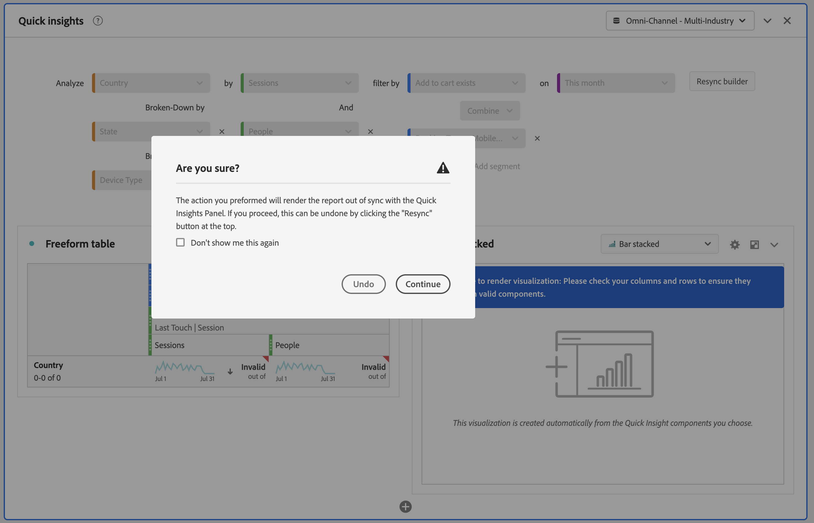
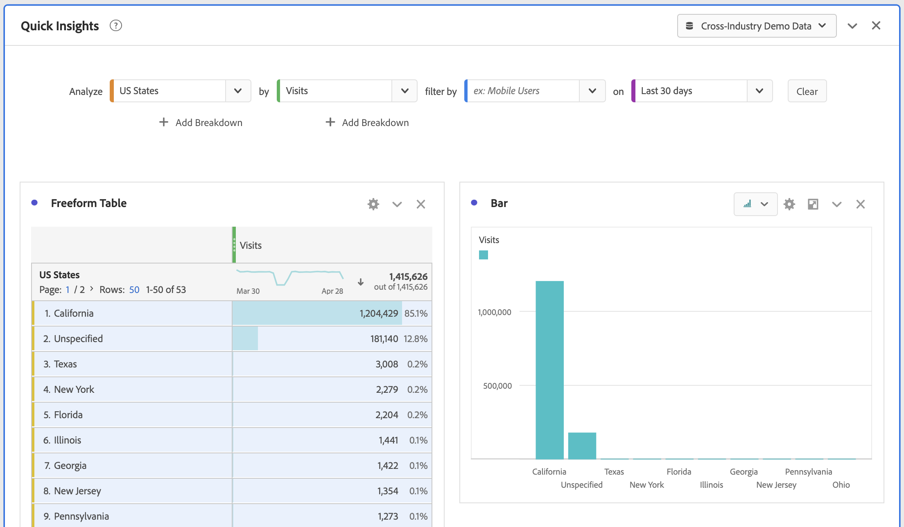

# Pannello Quick Insights {#quick-insights-panel}

<!-- markdownlint-disable MD034 -->

>[!CONTEXTUALHELP]
>id="workspace_quickinsights_button"
>title="Quick Insights"
>abstract="Crea un pannello per generare rapidamente una tabella a forma libera e una relativa visualizzazione per analizzare e individuare più rapidamente le informazioni."

<!-- markdownlint-enable MD034 -->

>[!BEGINSHADEBOX]

_Questo articolo documenta il pannello Quick Insights in_  _&#x200B;**Adobe Analytics**._ _Consulta [Pannello Quick Insights](https://experienceleague.adobe.com/it/docs/analytics/analyze/analysis-workspace/panels/quickinsight)) per_  _&#x200B;**Customer Journey Analytics** versione di questo articolo._

>[!ENDSHADEBOX]

[!UICONTROL Quick Insights] fornisce indicazioni ai non analisti e ai nuovi utenti di [!UICONTROL Analysis Workspace] affinché scoprano come rispondere alle domande aziendali in modo rapido e semplice. È anche un ottimo strumento per gli utenti avanzati che desiderano rispondere rapidamente a una semplice domanda senza dover creare personalmente una tabella.

Quando inizi a utilizzare [!UICONTROL Analysis Workspace], potresti chiederti:

* quali visualizzazioni sarebbero più utili,
* quali dimensioni e metriche potrebbero facilitare le informazioni approfondite,
* dove trascinare gli elementi,
* dove creare un filtro,
* e altro ancora.

Per risolvere queste domande, [!UICONTROL Quick insights] utilizza un algoritmo che ti presenta le dimensioni, le metriche, i segmenti e gli intervalli di date più comuni utilizzati dalla tua azienda. Questo algoritmo si basa sull’utilizzo dei componenti dei dati in [!UICONTROL Analysis Workspace] da parte della tua azienda. Vedrai infatti dimensioni, metriche e segmenti con tag [!UICONTROL POPULAR] nell&#39;elenco a discesa, come mostrato di seguito:

[!UICONTROL Quick Insights] ti aiuta a:

* Creare correttamente una tabella di dati e una relativa visualizzazione in [!UICONTROL Analysis Workspace].
* Imparare la terminologia e il vocabolario dei componenti ed elementi di base di [!UICONTROL Analysis Workspace].
* Effettuare semplici raggruppamenti di dimensioni, aggiungere metriche multiple o confrontare facilmente segmenti all’interno di una [!UICONTROL Freeform table].
* Modificare o provare vari tipi di visualizzazione per trovare lo strumento di ricerca per la tua analisi in modo rapido e intuitivo.

## Terminologia chiave di base

Di seguito sono riportati alcuni dei termini di base con cui è necessario che tu abbia familiarità. Ogni tabella di dati è composta da 2 o più blocchi (componenti) utilizzati per spiegare la storia dei dati.

| Blocco predefinito (componente) | Definizione |
|---|---|
| **[!UICONTROL Dimension]** | Le dimensioni sono descrizioni o caratteristiche dei dati di metriche che possono essere visualizzate, raggruppate e confrontate in un progetto. Sono valori non numerici e date raggruppati in elementi dimensionali. Ad esempio, un *browser* o una *pagina* è una dimensione. |
| **[!UICONTROL Dimension item]** | Gli elementi dimensionali sono valori singoli per una dimensione. Ad esempio, gli elementi dimensionali per la dimensione del browser sarebbero *Chrome*, *Firefox*, *Edge* oppure altri. |
| **[!UICONTROL Metric]** | Le metriche corrispondono a informazioni quantitative sull’attività del visitatore come visualizzazioni, click-through, ricaricamenti delle pagine, tempo medio trascorso, unità, ordini, ricavi e così via. |
| **[!UICONTROL Visualization]** | Workspace offre [diverse visualizzazioni](/help/analyze/analysis-workspace/visualizations/freeform-analysis-visualizations.md) per creare rappresentazioni visive dei dati. Ad esempio grafici a barre, grafici ad anello, istogrammi, grafici a linee, mappe, grafici di dispersione e altri. |
| **[!UICONTROL Dimension Breakdown]** | Un raggruppamento di dimensioni è un modo per raggruppare una dimensione secondo altre dimensioni. Ad esempio, puoi raggruppare gli Stati Uniti per dispositivi mobili per ottenere le visite da parte di dispositivi mobili per stato. Oppure puoi raggruppare i dispositivi mobili per tipo di dispositivo mobile, per aree geografiche, per campagne interne e altro ancora. |
| **[!UICONTROL Segments]** | I segmenti ti consentono di identificare sottoinsiemi di visitatori in base a caratteristiche o interazioni con siti web. Ad esempio, puoi creare segmenti [!UICONTROL Visitor] in base a <li>attributi: tipo di browser, dispositivo, numero di visite, paese, genere o</li><li>interazioni: campagne, ricerca di parole chiave, motore di ricerca o</li><li>uscite ed entrate: visitatori da Facebook, da una pagina di destinazione definita, da un dominio di riferimento o</li><li> variabili personalizzate: campo modulo, categorie definite, ID cliente. |

## Utilizzo

Per usare un pannello **[!UICONTROL Quick insights]**:

1. Crea un pannello **[!UICONTROL Quick insights]**. Per informazioni su come creare un pannello, consulta [Creare un pannello](panels.md#create-a-panel).

1. Quando utilizzi un pannello **[!UICONTROL Quick insights]** per la prima volta, potrebbe essere utile consultare il breve [!UICONTROL Intro tutorial] che insegna alcune delle nozioni di base. Seleziona  accanto al titolo del pannello Quick Insights e seleziona **[!UICONTROL Intro tutorial]** dal popup.

1. Specifica l’[input](#panel-input) per il pannello.

1. Osserva l’[output](#panel-output) per il pannello.

### Input del pannello

Seleziona i blocchi:

* **[!UICONTROL Analyze]**: specifica una dimensione (arancione)
* **[!UICONTROL by]**: specifica una metrica (verde)
* **[!UICONTROL filter by]**: specifica un segmento (blu)
* **[!UICONTROL on]**: specifica un intervallo di date (viola).

Per il corretto funzionamento della visualizzazione, devi selezionare almeno una dimensione e una metrica.

Puoi specificare i blocchi in tre modi:

* Trascina i componenti dal pannello a sinistra.
* Inizia a digitare in uno dei campi del blocco. Quando viene trovato un input, il campo del blocco viene compilato automaticamente con i valori possibili.
* Specifica un elenco a discesa del blocco (ad esempio **[!UICONTROL Country]** in **[!UICONTROL Analyze]**) e cerca nell’elenco dei valori possibili (utilizzando ) il valore da utilizzare (ad esempio **[!UICONTROL Country code]**).

Seleziona **[!UICONTROL Clear]** per cancellare tutti i campi di input.

### Output del pannello

1. Dopo aver aggiunto almeno una dimensione e una metrica, puoi visualizzare i risultati.

   

   * Tabella a forma libera con dimensione ([!UICONTROL Country Site]) e metrica ([!UICONTROL Visits]), segmentata da [!UICONTROL Visits] da [!UICONTROL Search Engines] per [!UICONTROL Last 12 months].

   * Una visualizzazione associata, in questo caso un [grafico a barre](/help/analyze/analysis-workspace/visualizations/bar.md). La visualizzazione generata si basa sul tipo di dati che hai aggiunto alla tabella. Per impostazione predefinita, qualsiasi dato basato sul tempo (ad esempio [!UICONTROL Visits] al giorno/mese) viene visualizzato in un grafico a [!UICONTROL Line]. Per impostazione predefinita, qualsiasi dato non basato sul tempo (ad esempio [!UICONTROL Visits] per [!UICONTROL Device]) viene visualizzato in un grafico a [!UICONTROL Bar]. Puoi modificare il tipo di visualizzazione facendo clic sulla freccia dell’elenco a discesa accanto al tipo di visualizzazione.

1. Prova ad aggiungere altri miglioramenti come descritto di seguito in [Ulteriori suggerimenti](#more-tips)

1. Puoi salvare il progetto utilizzando **[!UICONTROL Project > Save]**.

## Ulteriori suggerimenti

Altri utili pop-up di suggerimenti in [!UICONTROL Quick Insights Builder], alcuni dipendono dall’ultima azione eseguita.

* Innanzitutto, potresti voler completare il tutorial **[!UICONTROL More tips]**. Questo tutorial viene visualizzato 24 ore dopo la creazione di un progetto con almeno una dimensione e una metrica. Seleziona  accanto al titolo del pannello Quick Insights (Insight rapidi) e seleziona **[!UICONTROL More tips]** dal riquadro a comparsa.

  

* Puoi analizzare più dimensioni e metriche, combinare o confrontare segmenti e specificare un intervallo di date:

  

   * **[!UICONTROL Analyze]** **[!UICONTROL Broken-Down by]** dimensioni: puoi utilizzare fino a 3 livelli di raggruppamenti delle dimensioni per esaminare i dati che ti servono. Vedere ➊, ➋ e ➌.

   * Aggiungi altre metriche **[!UICONTROL by]**: puoi aggiungere fino a 2 ulteriori metriche. Vedere ➍ e ➎.

   * **[!UICONTROL filter by]**: puoi aggiungere fino a 2 ulteriori segmenti. Ad esempio, aggiungi il segmento Prenotazioni e combinalo con i segmenti Prenotazioni frequenti e Nuovi viaggiatori per confrontarli. Vedere ➏, ➐ e ➑.

   * on: puoi specificare l’intervallo di date. Vedere ➒.

## Limitazioni note

Se tenti di apportare modifiche direttamente nella tabella, il pannello [!UICONTROL Quick Insights] potrebbe non essere più sincronizzato. Seleziona **[!UICONTROL Resync Builder]** in alto a destra nel pannello per ripristinare le impostazioni [!UICONTROL Quick Insights] precedenti.

Prima di aggiungere qualsiasi elemento direttamente alla tabella, viene visualizzato un avviso:

In caso contrario, la creazione diretta farà sì che la tabella si comporti come una tabella a forma libera tradizionale, senza le funzioni utili per i nuovi utenti.

>[!MORELIKETHIS]
>
>[Creare un pannello](/help/analyze/analysis-workspace/c-panels/panels.md#create-a-panel)
>
<!--
# Quick Insights panel

[!UICONTROL Quick Insights] provides guidance for non-analysts and new users of [!UICONTROL Analysis Workspace] to learn how to answer business questions quickly and easily. It is also a great tool for advanced users who want to answer a simple question quickly without having to build a table themselves.

When you first start using this [!UICONTROL Analysis Workspace], you might wonder what visualizations would be most useful, which dimensions and metrics might facilitate insights, where to drag and drop items, where to create a segment, etc. 

To help with this, and based on your own company's usage of data components in [!UICONTROL Analysis Workspace], [!UICONTROL Quick Insights] leverages an algorithm that will present you with the most popular dimensions, metrics, segments, and date ranges your company uses. In fact, you will see dimensions, metrics, and segments tagged as [!UICONTROL Popular] in the drop-down list, as shown here:

[!UICONTROL Quick Insights] helps you

* Properly build a data table and an accompanying visualization in [!UICONTROL Analysis Workspace].
* Learn the terminology and vocabulary for basic components and pieces of [!UICONTROL Analysis Workspace].
* Do simple breakdowns of dimensions, add multiple metrics, or compare segments easily within a [!UICONTROL Freeform table].
* Change or try out various visualization types to find the find tool for your analysis quickly and intuitively.

Here is a video overview of the [!UICONTROL Quick Insights] panel:

>[!VIDEO](https://video.tv.adobe.com/v/326704/?quality=12&captions=ita)

## Basic key terminology

Following are some of the basic terms you need to be familiar with. Each data table consists of 2 or more building blocks (components) that you utilize to tell your data story.

|Building block (Component)|Definition|
|---|---|
|[!UICONTROL Dimension]|Dimensions are descriptions or characteristics of metric data that can be viewed, broken down, and compared in a project. They are non-numeric values and dates that break down into dimension items. For example, "browser", or "page" are dimensions.|
|[!UICONTROL Dimension item]|Dimension items are individual values for a dimension. For example, dimension items for the browser dimension would be "Chrome", "Firefox", "Edge", etc.|
|[!UICONTROL Metric]|Metrics are quantitative information about visitor activity, such as views, click-throughs, reloads, average time spent, units, orders, revenue, and so on.|
|[!UICONTROL Visualization]|Workspace offers [a number of visualizations](/help/analyze/analysis-workspace/visualizations/freeform-analysis-visualizations.md) to build visual representations of your data, such as bar charts, donut charts, histograms, line charts, maps, scatterplots, and others.|
|[!UICONTROL Dimension Breakdown]|A dimension breakdown is a way to literally break down a dimension by other dimensions. In our example, you could break down US States by Mobile Devices to get the mobile device visits per state, or you could break Mobile Devices down by Mobile Device types, by Regions, by Internal Campaigns, etc..|
|[!UICONTROL Segment]|Segments let you identify subsets of visitors based on characteristics or website interactions. For example, you can build [!UICONTROL Visitor] segments based on attributes: browser type, device, number of visits, country, gender, or based on interactions: campaigns, keyword search, search engine, or based on exits and entries: visitors from Facebook, a defined landing page, referring domain, or based on custom variables: form field, defined categories, customer ID.  |

## Get started with Quick Insights

1. Log in to Adobe Analytics using the credentials you have been provided with.
1. Go to [!UICONTROL Workspace] and click **[!UICONTROL Create New Project]** and then click **[!UICONTROL Quick Insights]**. (You can also access this panel from the **[!UICONTROL Panel]** menu in the left rail.)

    

    

1. When you first start out, go through the short tutorial that teaches you some of the [!UICONTROL Quick Insights panel] basics. Or, click to **[!UICONTROL Skip Tutorial]**.
1. Select your building blocks (also known as components): dimensions (orange), metrics (green), segments (blue), or date ranges (purple) You have to select at least one dimension and one metric for a table to be built automatically. 

    

    You have three ways of selecting the building blocks:
    * Drag and drop them from the left rail.
    * If you know what you are looking for: Start typing and [!UICONTROL Quick Insights] will fill in the blanks for you.
    * Click on the drop-down and search the list.

1. When you have added at least one dimension and one metric, the following will be created for you:

    * A Freeform table with the dimension (here, US States) vertically and the metric (here, Visits) horizontally at the top. Check out this table: 

    

    * An accompanying visualization, in this case a [bar chart](/help/analyze/analysis-workspace/visualizations/bar.md). The visualization that is generated is based on the type of data you added to the table. Any time-based data (such as [!UICONTROL Visits] per Day/Month) defaults to a [!UICONTROL Line] chart. Any non-time-based data (such as [!UICONTROL Visits] per [!UICONTROL Device]) defaults to a [!UICONTROL Bar] chart. You can change the type of visualization by clicking on the drop-down arrow next to the visualization type.

1. (Optional) Drill down on dimensions and see dimension items by clicking the > right-arrow next to the dimension.

1. Try adding some more refinements as described below under "More tips."

1. Save your project by clicking **[!UICONTROL Project > Save]**.

## More tips

Other useful hints will pop up in the [!UICONTROL Quick Insights Builder], some of them depending on your last action.

* First, complete the **[!UICONTROL More tips]** tutorial: Access it via the Help (?) icon next to the [!UICONTROL Quick Insights] title. This tutorial shows up 24 hours after you have created a project with at least one dimension and one metric.

    

* **Breakdown by**: You can use up to 3 levels of breakdowns on dimensions to drill down to the data you really need.

    

* **Add more metrics**: You can add up to 2 more metrics by using the AND operator to add them the table.

    

* **Add more segments**: You can add up to 2 more segments by using the AND or OR operators to add them the table. Look at what happens to the table when you add Mobile Users OR Loyal Visitors. They are next to each other, above the metrics. If you added Mobile Users AND Loyal Visitors, you would see results from both segments together, and they would be stacked on top of each other in the table.

    

## Known limitations

If you try to edit directly within the table, it will cause the [!UICONTROL Quick Insights] panel to become out of sync. You can restore it to the previous [!UICONTROL Quick Insights] settings by clicking **[!UICONTROL Resync Builder]** at the top right of the panel.

 

You will get a warning before adding anything directly to the table:

 

Otherwise, building directly will cause the table to now behave as a traditional Freeform table, without the helpful features for new users.

-->