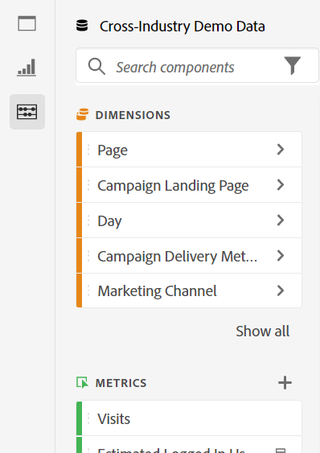
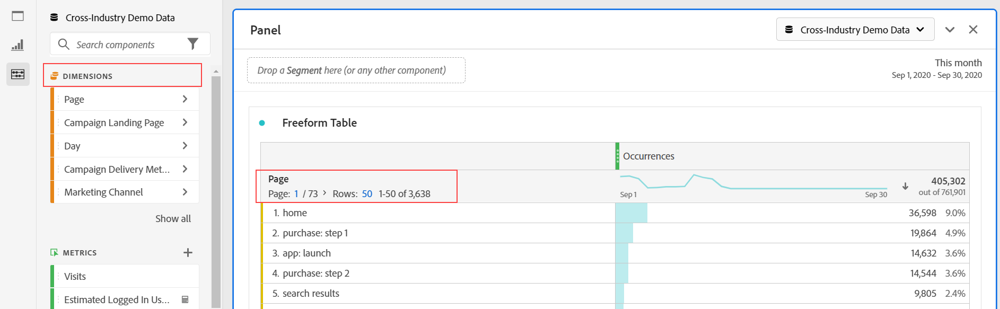
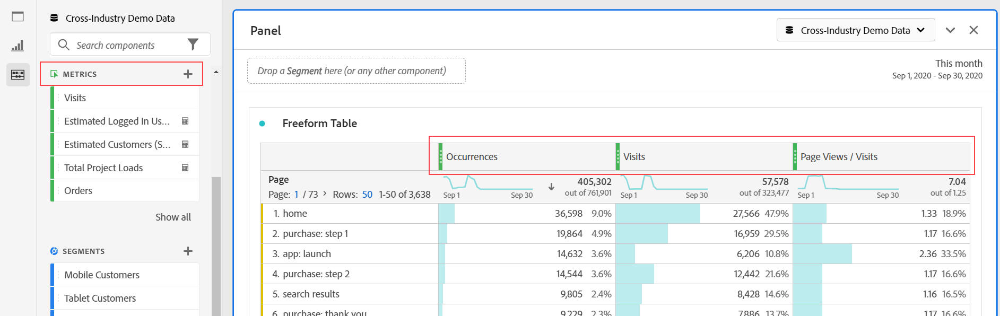
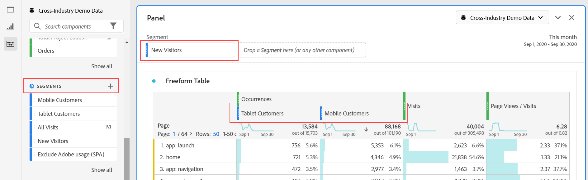
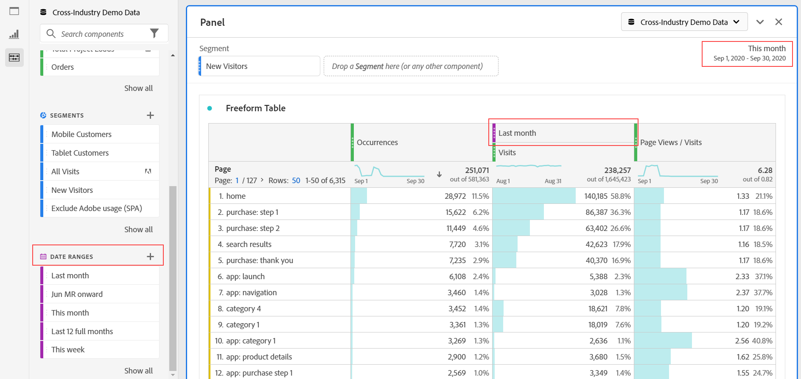

# Panoramica dei componenti

I componenti in  Analysis Workspace sono dimensioni, metriche, segmenti e intervalli di date che puoi trascinare su un progetto.

To access the Components menu, click the **[!UICONTROL Components]** icon in the left rail. Puoi passare da [Pannelli](https://docs.adobe.com/content/help/en/analytics/analyze/analysis-workspace/panels/panels.html), [Visualizzazioni](https://docs.adobe.com/content/help/it-IT/analytics/analyze/analysis-workspace/visualizations/freeform-analysis-visualizations.html)e Componenti dalle icone della barra a sinistra o utilizzando [i tasti di scelta rapida](/help/analyze/analysis-workspace/build-workspace-project/fa-shortcut-keys.md).

Potete anche regolare le impostazioni [di densità di](https://docs.adobe.com/content/help/it-IT/analytics/analyze/analysis-workspace/build-workspace-project/view-density.html) visualizzazione per il progetto per visualizzare più valori contemporaneamente nella barra a sinistra andando **[!UICONTROL Project > Project Info & Settings > View Density]**.

## Dimensioni {#dimensions}

[**Gli Dimension**](https://docs.adobe.com/content/help/en/analytics/components/dimensions/overview.html) sono attributi di testo che descrivono il comportamento dei visitatori e possono essere visualizzati, suddivisi e confrontati nell’analisi. Si trovano nella barra dei componenti a sinistra (sezione arancione) e vengono in genere applicati come righe di una tabella.

Examples of dimensions include [!UICONTROL Page Name], [!UICONTROL Marketing Channels], [!UICONTROL Device Type], and [!UICONTROL Products]. Gli Dimension vengono forniti  Adobe e vengono acquisiti tramite l&#39;implementazione personalizzata ( eVar, Prop, classificazioni, ecc.).

Ogni dimensione contiene anche elementi **** dimensionali al suo interno. Per trovare gli elementi di Dimension nella barra a sinistra del componente, fai clic sulla freccia a destra accanto al nome di una dimensione (gli elementi sono gialli).

Esempi di elementi dimensionali includono [!UICONTROL Homepage] (all’interno della [!UICONTROL Page] dimensione), [!UICONTROL Paid Search] (all’interno della [!UICONTROL Marketing Channel] dimensione), [!UICONTROL Tablet] (all’interno della [!UICONTROL Mobile Device Type] dimensione) e così via.

## Metriche {#metrics}

[**Le metriche**](https://docs.adobe.com/content/help/en/analytics/components/metrics/overview.html) sono misure quantitative sul comportamento dei visitatori. Si trovano nella barra a sinistra del componente (sezione verde) e vengono in genere applicati come colonne di una tabella.

Esempi di metriche includono [!UICONTROL Page views, [!UICONTROL Visits], [!UICONTROL Orders], [!UICONTROL Average Time spent]e [!UICONTROL Revenue/Order]. Le metriche vengono fornite dal Adobe , acquisite tramite l&#39;implementazione personalizzata ([!UICONTROL Success events]) o create mediante il generatore di metriche [calcolate](https://docs.adobe.com/content/help/it-IT/analytics/components/calculated-metrics/calcmetric-workflow/cm-build-metrics.html).

## Segmenti {#segments}

[**I segmenti**](https://docs.adobe.com/content/help/en/analytics/analyze/analysis-workspace/components/t-freeform-project-segment.html) sono filtri per l&#39;audience applicati all&#39;analisi. Si trovano nella barra a sinistra del componente (sezione blu) e vengono in genere applicati nella parte superiore di un pannello o sopra le colonne di metriche in una tabella.

Esempi di segmenti includono [!UICONTROL Mobile Device Visitors], [!UICONTROL Visits from Email]e [!UICONTROL Authenticated Hits]. I segmenti vengono forniti da  Adobe, creati nella zona di rilascio del [pannello](https://docs.adobe.com/content/help/en/analytics/analyze/analysis-workspace/panels/panels.html)o creati mediante il generatore [di](https://docs.adobe.com/content/help/it-IT/analytics/components/segmentation/segmentation-workflow/seg-build.html)segmenti.

## Intervalli di date {#date-ranges}

[**Gli intervalli**](https://docs.adobe.com/content/help/it-IT/analytics/analyze/analysis-workspace/components/calendar-date-ranges/calendar.html) di date sono l’intervallo di date in cui viene eseguita l’analisi. Si trovano nella barra a sinistra dei componenti (sezione viola) e vengono in genere applicati nel calendario di ciascun pannello.

Esempi di intervalli di date includono luglio 2019 [!UICONTROL Last 4 weeks], e [!UICONTROL This month]. Gli intervalli di date sono forniti da  Adobe, applicati nel calendario [del](https://docs.adobe.com/content/help/en/analytics/analyze/analysis-workspace/panels/panels.html)pannello o creati utilizzando il generatore di intervalli di [date](https://docs.adobe.com/content/help/en/analytics/analyze/analysis-workspace/components/calendar-date-ranges/custom-date-ranges.html).

## Azioni dei componenti {#actions}

Puoi gestire i componenti (singolarmente o selezionando più componenti) direttamente nella barra a sinistra. Fai clic con il pulsante destro del mouse su un componente o fai clic sull’icona del punto Azione nella parte superiore dell’elenco dei componenti.

| Azione del componente | Descrizione |
|--- |--- |
| Tag | Organizzare o gestire i componenti tramite l’applicazione di tag. Potete quindi eseguire la ricerca per tag nella barra a sinistra facendo clic sul filtro o digitando #. I tag fungono anche da filtri nei gestori dei componenti. |
| Preferito | Aggiungere il componente all’elenco dei preferiti. Come per i tag, potete eseguire ricerche per Preferiti nella barra a sinistra e filtrarle per mezzo di tali tag nei gestori dei componenti. |
| Approva | Contrassegna i componenti come Approvati per segnalare agli utenti che il componente è approvato dall’organizzazione. Come per i tag, potete effettuare ricerche per Approvato nella barra a sinistra e filtrarle nei gestori dei componenti. |
| Condividi | Condivisione di componenti con gli utenti dell’organizzazione. Questa opzione è disponibile solo per i componenti personalizzati, come segmenti o metriche calcolate. |
| Elimina | Eliminare componenti non più necessari. Questa opzione è disponibile solo per i componenti personalizzati, come segmenti o metriche calcolate. |

I componenti personalizzati possono essere gestiti anche tramite i rispettivi gestori di componenti. Ad esempio, [Segment Manager](/help/components/segmentation/segmentation-workflow/seg-manage.md).
