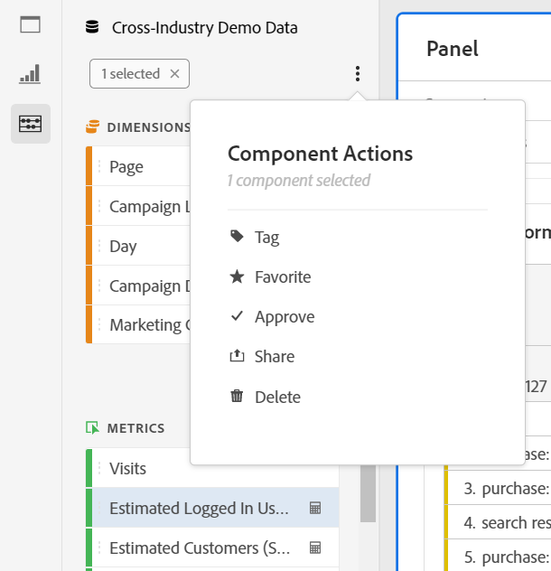

# Panoramica dei componenti

I componenti in Analysis Workspace sono metriche, dimensioni, segmenti e intervalli temporali da trascinare su un progetto.

Per accedere al menu Componenti, fai clic sull’icona **[!UICONTROL Components]** nella barra a sinistra. Puoi passare da [Pannelli](https://experienceleague.adobe.com/docs/analytics/analyze/analysis-workspace/panels/panels.html?lang=it), [Visualizzazioni](https://experienceleague.adobe.com/docs/analytics/analyze/analysis-workspace/visualizations/freeform-analysis-visualizations.html?lang=it) e Componenti dalle icone della barra a sinistra oppure utilizzando [tasti di scelta rapida](/help/analyze/analysis-workspace/build-workspace-project/fa-shortcut-keys.md).

È inoltre possibile regolare le [impostazioni di densità di visualizzazione](https://experienceleague.adobe.com/docs/analytics/analyze/analysis-workspace/build-workspace-project/view-density.html?lang=it) per consentire al progetto di visualizzare più valori contemporaneamente nella barra a sinistra, da **[!UICONTROL Project > Project Info & Settings > View Density]**.

## Dimensioni {#dimensions}

Le [**dimensioni**](https://experienceleague.adobe.com/docs/analytics/components/dimensions/overview.html?lang=it) sono attributi di testo che descrivono il comportamento del visitatore e possono essere visualizzate, suddivise e confrontate nell’analisi. Si trovano nella barra dei componenti a sinistra (sezione arancione) e vengono in genere applicate come righe di una tabella.

Esempi di dimensioni includono [!UICONTROL Page Name], [!UICONTROL Marketing Channels], [!UICONTROL Device Type] e [!UICONTROL Products]. Le dimensioni sono fornite da Adobe e vengono acquisite tramite l’implementazione personalizzata (eVar, Prop, classificazioni, ecc.).

Ogni dimensione contiene anche **elementi dimensionali** al suo interno. Per trovare gli elementi dimensionali nella barra dei componenti a sinistra, fai clic sulla freccia destra accanto al nome di una dimensione (gli elementi sono in giallo).

Esempi di elementi dimensionali includono [!UICONTROL Homepage] (nella dimensione [!UICONTROL Page]), [!UICONTROL Paid Search] (nella dimensione [!UICONTROL Marketing Channel]), [!UICONTROL Tablet] (nella dimensione [!UICONTROL Mobile Device Type]) e così via.

## Metriche {#metrics}

Le [**metriche**](https://experienceleague.adobe.com/docs/analytics/components/metrics/overview.html?lang=it) sono misure quantitative sul comportamento dei visitatori. Si trovano nella barra dei componenti a sinistra (sezione verde) e vengono in genere applicate come colonne di una tabella.

Esempi di metriche includono [!UICONTROL Page views], [!UICONTROL Visits], [!UICONTROL Orders], [!UICONTROL Average Time spent] e [!UICONTROL Revenue/Order]. Le metriche vengono fornite per Adobe, acquisite tramite l’implementazione personalizzata ([!UICONTROL Success events]) o create utilizzando il [Generatore di metriche calcolate](https://experienceleague.adobe.com/docs/analytics/components/calculated-metrics/calcmetric-workflow/cm-build-metrics.html?lang=it).

## Segmenti {#segments}

I [**segmenti**](https://experienceleague.adobe.com/docs/analytics/analyze/analysis-workspace/components/segments/t-freeform-project-segment.html?lang=it) sono filtri di pubblico applicati all’analisi. Si trovano nella barra dei componenti a sinistra (sezione blu) e sono in genere applicati nella parte superiore di un pannello o sopra le colonne di metrica in una tabella.

Esempi di segmenti includono [!UICONTROL Mobile Device Visitors], [!UICONTROL Visits from Email] e [!UICONTROL Authenticated Hits]. I segmenti vengono forniti da Adobe oppure possono essere creati nella [zona di rilascio del pannello](https://experienceleague.adobe.com/docs/analytics/analyze/analysis-workspace/panels/panels.html?lang=it) o mediante il [Generatore di segmenti](https://experienceleague.adobe.com/docs/analytics/components/segmentation/segmentation-workflow/seg-build.html?lang=it).

## Intervalli di date {#date-ranges}

Gli [**intervalli di date**](https://experienceleague.adobe.com/docs/analytics/analyze/analysis-workspace/components/calendar-date-ranges/calendar.html?lang=it) sono l’intervallo di date in cui esegui l’analisi. Si trovano nella barra dei componenti a sinistra (sezione viola) e vengono in genere applicati nel calendario di ciascun pannello.

Puoi rendere i componenti dell’intervallo di date relativi al calendario del pannello. Per ulteriori informazioni, consulta [Informazioni sugli intervalli di date del pannello relativo](/help/analyze/analysis-workspace/components/calendar-date-ranges/calendar.md#relative-panel-dates).

Esempi di intervalli di date includono luglio 2019, [!UICONTROL Last 4 weeks] e [!UICONTROL This month]. Gli intervalli di date sono forniti da Adobe, possono essere applicati nel [calendario del pannello](https://experienceleague.adobe.com/docs/analytics/analyze/analysis-workspace/panels/panels.html?lang=it) o creati mediante il [Generatore di intervalli di date](https://experienceleague.adobe.com/docs/analytics/analyze/analysis-workspace/components/calendar-date-ranges/custom-date-ranges.html?lang=it).

## Gestire i componenti {#actions}

Puoi gestire i componenti direttamente nella barra a sinistra.

1. Fai clic con il pulsante destro del mouse su un componente.

   Oppure

   Seleziona un componente, quindi fai clic su **Azione** (3 punti) nella parte superiore dell’elenco dei componenti.

   >[!TIP]
   >
   >   È possibile selezionare più componenti tenendo premuto Maiusc oppure tenendo premuto Comando (su Mac) o Ctrl (su Windows).

   

   | Azione componente | Descrizione |
   |--- |--- |
   | [!UICONTROL **Tag**] | Organizzare o gestire i componenti tramite l’applicazione di tag. Per eseguire la ricerca per tag nella barra a sinistra, fai clic sul filtro o digita #. I tag fungono anche da filtri nei gestori dei componenti. |
   | [!UICONTROL **Preferito**] | Aggiungere il componente all’elenco dei preferiti. Come per i tag, puoi cercare i Preferiti nella barra a sinistra e filtrarli nei gestori dei componenti. |
   | [!UICONTROL **Approvazione**] | Contrassegna i componenti come approvati per segnalare agli utenti che sono approvati dall’organizzazione. Come per i tag, puoi eseguire ricerche per compomenti approvati nella barra a sinistra e filtrarli nei gestori dei componenti. |
   | [!UICONTROL **Condividi**] | Condividi i componenti con gli utenti della tua organizzazione. Questa opzione è disponibile solo per i componenti personalizzati, ad esempio segmenti o metriche calcolate. |
   | [!UICONTROL **Eliminazione**] | Elimina i componenti non più necessari. Questa opzione è disponibile solo per i componenti personalizzati, ad esempio segmenti o metriche calcolate. |

I componenti personalizzati possono essere gestiti anche tramite i rispettivi gestori di componenti. Ad esempio, il [Gestore segmenti](/help/components/segmentation/segmentation-workflow/seg-manage.md).

## Cercare, filtrare e ordinare l’elenco dei componenti

Puoi cercare, filtrare e ordinare l’elenco dei componenti nella barra a sinistra di Analysis Workspace per individuare rapidamente un particolare componente.

### Cercare nell’elenco dei componenti

1. Seleziona la **Componenti** icona  nella barra a sinistra.

2. Nel campo di ricerca, inizia a digitare il nome del componente che desideri utilizzare nel progetto.

   Il tipo di componente può essere identificato sia dal colore che dall’icona. **Dimension**  sono arancioni, **Segmenti**  sono blu, **Intervalli di date**  sono viola, e **Metriche**  sono verdi. L’icona Adobe indica un modello di metrica calcolata o un modello di segmento, e l’icona della calcolatrice  indica una metrica calcolata creata da un amministratore Analytics della tua organizzazione.

3. Seleziona il componente quando viene visualizzato nell’elenco a discesa.

### Filtrare l’elenco dei componenti

1. Seleziona la **Componenti** icona  nella barra a sinistra.

2. Seleziona la **Filtro** icona .

   Oppure

   Digitare il cancelletto (#) nel campo di ricerca.

3. Seleziona una delle seguenti opzioni filtro per filtrare l’elenco dei componenti:

   | Opzione | Funzione |
   |---------|----------|
   | [!UICONTROL **Approvato**] | Mostra solo i componenti contrassegnati come approvati da un amministratore. |
   | [!UICONTROL **Preferiti**] | Mostra solo i componenti inclusi nell’elenco dei Preferiti. Per informazioni sull’aggiunta di componenti all’elenco dei preferiti, consulta [Panoramica dei componenti](/help/analyze/analysis-workspace/components/analysis-workspace-components.md). |
   | [!UICONTROL **Dimensioni**] | Mostra solo i componenti che sono Dimensioni. |
   | [!UICONTROL **Metriche**] | Mostra solo i componenti che sono Metriche. |
   | [!UICONTROL **Segmenti**] | Mostra solo i componenti che sono Segmenti. <!--this is Filters in Customer Jourey Analytics--> |
   | [!UICONTROL **Intervalli di date**] | Mostra solo i componenti che sono Intervalli di date. |
   | [!UICONTROL **Mostra tutti**] | Mostra tutti i componenti. Questa opzione è disponibile solo per gli amministratori. |
   | [!UICONTROL **Non approvato**] | Mostra solo i componenti non ancora contrassegnati come approvati da un amministratore. In qualità di amministratore, questo è utile per identificare i componenti che richiedono la revisione e l’approvazione. Questa opzione è disponibile solo per gli amministratori. |

4. (Facoltativo) Per affinare ulteriormente l’elenco, puoi ordinare l’elenco dei componenti come descritto in [Ordinare l’elenco dei componenti](#sort-the-component-list).

### Ordinare l’elenco dei componenti

{{release-limited-testing-section}}

1. (Facoltativo) Applica i filtri all’elenco dei componenti, come descritto in [Filtrare l’elenco dei componenti](#filter-the-component-list).

2. Seleziona la **Componenti** icona  nella barra a sinistra.

3. Seleziona la **Ordina** icona , quindi seleziona una delle seguenti opzioni di filtro per ordinare l’elenco dei componenti:

   {{components-sort-options}}
