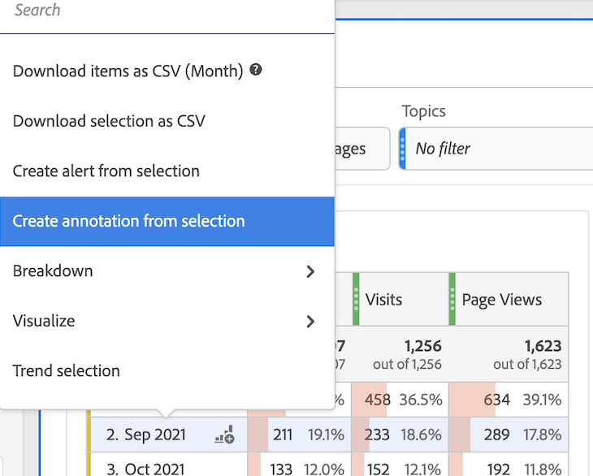
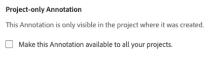

# Creare annotazioni

>[!NOTE]
>
>Questa funzione è attualmente in fase di test.

1. Per creare le annotazioni, è possibile iniziare in diversi modi:

| Metodo di creazione | Dettagli |
| --- | --- |
| **Vai a [!UICONTROL Analytics] > [!UICONTROL Components] > [!UICONTROL Annotation].** | Viene visualizzata la pagina Gestione annotazioni. Fai clic su [!UICONTROL Create New Annotation] e [!UICONTROL Annotation builder] si apre. |
| **Fare clic con il pulsante destro del mouse su un punto di una tabella.** | [!UICONTROL The Annotation builder] si apre. Per impostazione predefinita, le annotazioni create in questo modo sono visibili solo nel progetto in cui sono state create. Ma puoi renderli disponibili a tutti i progetti. Inoltre, noterai che le date e qualsiasi metrica, ecc., sono già state compilate.
 |
| **Fai clic con il pulsante destro del mouse su un punto in un [!UICONTROL Line] grafico.** | La [!UICONTROL Annotation builder] si apre. Per impostazione predefinita, le annotazioni create in questo modo sono visibili solo nel progetto in cui sono state create. Ma puoi renderli disponibili a tutti i progetti. Inoltre, noterai che le date e qualsiasi metrica, ecc., sono già state compilate.
 |
| **In Workspace, vai a [!UICONTROL Components] > [!UICONTROL Create annotation].** | La [!UICONTROL Annotation builder] si apre. |
| **Usa questo tasto di scelta rapida** per aprire il generatore di annotazioni: (PC) `ctrl` `shift` + o, (Mac) `shift` + `command` + o | Tieni presente che utilizzando il tasto di scelta rapida per creare un’annotazione, puoi creare un’annotazione per un giorno singolo per la data corrente, senza alcun ambito (metriche o dimensioni) preselezionato. |

1. Compila il [!UICONTROL Annotation builder] elementi.

   

   | Elemento | Descrizione |
   | --- | --- |
   | [!UICONTROL Project-only Annotation] | Per impostazione predefinita, l’annotazione si applica al progetto corrente. Selezionando questa casella, puoi rendere l’annotazione disponibile per tutti i progetti di tua proprietà.
  |
   | [!UICONTROL Title] | Denomina l’annotazione, ad esempio &quot;Memorial Day&quot; |
   | [!UICONTROL Description] | (Facoltativo) Fornisci una descrizione dell’annotazione, ad esempio &quot;Vacanza pubblica osservata negli Stati Uniti&quot;. |
   | [!UICONTROL Tags] | (Facoltativo) Organizza le annotazioni creando o applicando un tag . |
   | [!UICONTROL Applied date] | Seleziona l’intervallo di date o date che deve essere presente affinché l’annotazione sia visibile. |
   | [!UICONTROL Color] | Applica un colore all’annotazione. L’annotazione viene visualizzata nel progetto con il colore selezionato. Il colore può essere utilizzato per classificare le annotazioni, ad esempio festività pubbliche, eventi esterni, problemi di tracciamento, ecc. |
   | [!UICONTROL Scope] | (Facoltativo) Trascina le metriche che attivano l’annotazione. Trascina quindi eventuali dimensioni o segmenti che fungono da filtri (ad esempio, con cui sarà visibile l’annotazione). Se non si specifica un ambito, l’annotazione verrà applicata a tutti i dati.<ul><li>**[!UICONTROL Any of these metrics are present]**: Trascina fino a 10 metriche per attivare l’annotazione da visualizzare.</li><li>**[!UICONTROL With all of these filters]**: Trascina fino a 10 dimensioni o segmenti per filtrare quando viene visualizzata l’annotazione.</li></ul>
Casi di utilizzo: Un eVar ha interrotto la raccolta dei dati per un intervallo di date specifico. Trascina l’eVar nella **[!UICONTROL Any of these metrics are present]** finestra di dialogo. Oppure [!UICONTROL Visits] la metrica non riporta dati; segui lo stesso processo.
**Nota:** Qualsiasi annotazione applicata a un componente che viene quindi utilizzata come parte di una metrica calcolata o di una definizione di segmento NON eredita automaticamente l’annotazione. Per visualizzare l’annotazione, è necessario aggiungere alla sezione dell’ambito anche la metrica calcolata desiderata. È tuttavia necessario creare una nuova annotazione per qualsiasi segmento a cui si desidera aggiungere le stesse informazioni.
Esempio: Applicazione di un’annotazione [!UICONTROL Orders] in un giorno specifico. Quindi utilizza [!UICONTROL Orders] in una metrica calcolata per lo stesso intervallo di date. La nuova metrica calcolata non visualizza automaticamente l’annotazione per gli ordini; la metrica calcolata deve essere aggiunta anche alla sezione ambito per visualizzare l’annotazione. |
   | [!UICONTROL Apply to all report suites] | Per impostazione predefinita, l’annotazione si applica alla suite di rapporti di origine. Selezionando questa casella, puoi applicare l’annotazione a tutte le suite di rapporti dell’azienda. |

   {style=&quot;table-layout:auto&quot;}

1. Fai clic su **[!UICONTROL Save]**.
