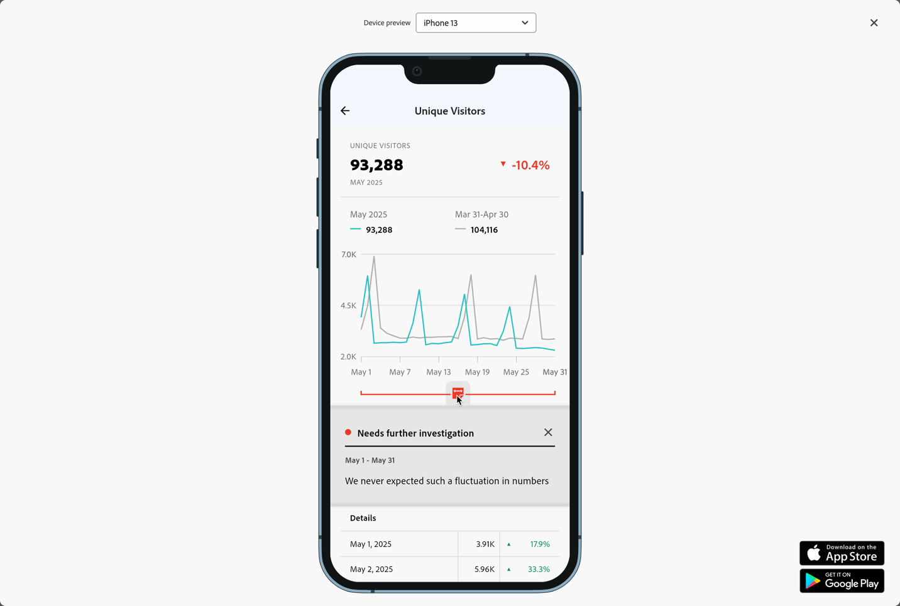

# Annotazioni delle scorecard per dispositivi mobili

Puoi visualizzare le annotazioni create in Workspace nelle scorecard per dispositivi mobili. Le annotazioni nelle scorecard per dispositivi mobili consentono di condividere dettagli sui dati contestuali e informazioni approfondite sull’organizzazione e sulle campagne.

## Visualizzare le annotazioni nelle scorecard per dispositivi mobili

Per rendere visibili le annotazioni nelle scorecard per dispositivi mobili, crea prima l’annotazione dai progetti Workspace o dal menu dei componenti.

Per informazioni sulla creazione di annotazioni, consulta [Creare annotazioni](create-annotations.md). Per impostazione predefinita, le annotazioni sono disattivate nelle scorecard per dispositivi mobili e devono essere abilitate per ogni scorecard che desideri rendere visibile nelle scorecard per dispositivi mobili.

1. Attiva le annotazioni. Per attivare le annotazioni, consulta [Attivare o disattivare le annotazioni](overview.md#turn-annotations-on-or-off).

1. Crea un’annotazione e assicurati che sia condivisa con tutti i tuoi progetti. Per ulteriori informazioni, consulta [Creare annotazioni](create-annotations.md).

1. Seleziona **[!UICONTROL Show annotations]** per visualizzare l’annotazione nelle scorecard per dispositivi mobili.

   

   Facoltativamente, puoi confermare che **[!UICONTROL Show annotations]** è selezionato in **[!UICONTROL Project]** > **[!UICONTROL Project info and settings]**

## Visualizzare le annotazioni nelle scorecard per dispositivi mobili

Quando le annotazioni sono abilitate, le icone delle annotazioni sono visibili nel Generatore di scorecard. Le annotazioni vengono visualizzate solo su grafici e tabelle nella visualizzazione dettagliata e non sono visibili dalla visualizzazione affiancata principale della scorecard.

Quando le icone delle annotazioni sono visibili, non puoi visualizzare o interagire completamente con le annotazioni nell’area di lavoro del generatore. Utilizza  **[!UICONTROL Preview]** per visualizzare e interagire con le annotazioni così come vengono visualizzate nell’app.

I colori delle annotazioni vengono selezionati al momento della creazione in Workspace. Le annotazioni grigie indicano la presenza di più annotazioni.

## Anteprima delle annotazioni

Puoi visualizzare l’anteprima delle annotazioni utilizzando l’Anteprima . Seleziona un’annotazione per aprirne i dettagli.

Se sono disponibili più annotazioni, nella parte inferiore dell&#39;annotazione verranno visualizzati più punti (●). Scorri verso sinistra o destra per passare da un’annotazione all’altra.

<!--
# Share Annotations in Mobile Scorecards

You can display annotations that are created in Workspace in Mobile Scorecards. This allows you to share contextual data nuances and insights about your organization and campaigns directly within Mobile Scorecard projects, viewable in the Analytics dashboards mobile app.

## Surface Annotations in Mobile Scorecards

To surface annotations in mobile scorecards, create the annotation first from Workspace projects or from the components menu.

For information on creating annotations, see [Create Annotations](create-annotations.md). Annotations are turned off in mobile scorecards by default and must be enabled for each scorecard that you want to surface in mobile scorecards.

1. Turn on annotations. To turn annotations on, see [Turn annotations on or off](overview.md#annotations-on-off).

1. Create an annotation and make sure it is shared to all your projects. To create an annotation in Workspace,  see [Create Annotations](create-annotations.md).

1. Select **Show annotations** to display the annotation in Mobile Scorecards.

   

1. Confirm that show annotations is selected, go to **Project** > **Project info and settings**.

   

## View annotations in Mobile Scorecards

When annotations are enabled, annotation icons are visible in the Scorecard Builder. Annotations appear only on charts and tables in the detailed view. Annotations are not visible from the main tile view of the scorecard.

 

When annotation icons are visible, you can't fully view or interact with annotations in the builder canvas. Use the Preview mode to view and interact with annotations as they appear in the app  **Preview**.

Annotation colors are selected when the annotation is created in workspace. Gray annotations indicated the presence of more than one annotation.

## View chart annotations

| Date | Appearance |
| --- | --- |
| **Single day** |     |
| **Date range** |  |
| **Overlapping annotations** |   To view annotation details in the Analytics dashboards app, tap an annotation icon.   When viewing an annotation in a chart, you can swipe left and right to navigate all annotations present in the chart. When viewing an annotation in the table, swipe left and right to navigate all annotations associated with that row item in the table.      In charts that do not have a time-based *x axis*, such as the donut or horizontal bar charts, annotations that apply to the chart can be viewed by tapping the icon located in the lower right-hand corner.   |
-->