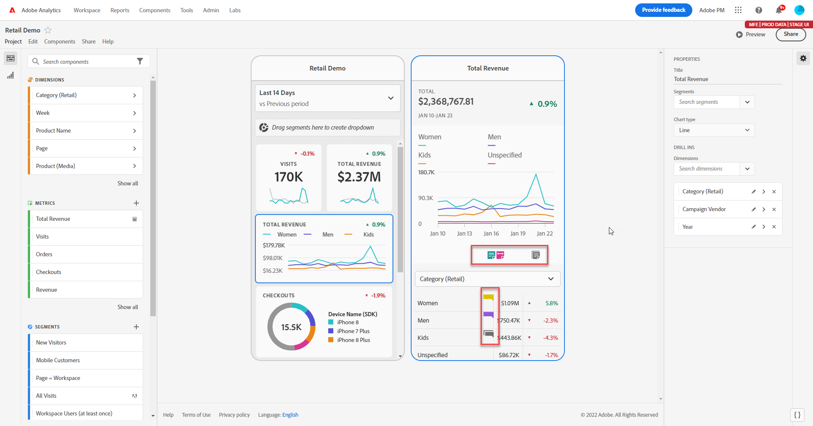

# Condividere le annotazioni nelle scorecard per dispositivi mobili

Puoi visualizzare le annotazioni create in Workspace nelle scorecard per dispositivi mobili. Ciò ti consente di condividere dettagli sui dati contestuali e informazioni approfondite sull’organizzazione e sulle campagne direttamente all’interno dei progetti delle scorecard per dispositivi mobili, visualizzabili nell’app mobile delle dashboard di Analytics.

## Rendere visibili le annotazioni nelle scorecard per dispositivi mobili

Per rendere visibili le annotazioni nelle scorecard per dispositivi mobili, crea prima l’annotazione dai progetti Workspace o dal menu dei componenti.

Per informazioni sulla creazione di annotazioni, consulta [Creare annotazioni](create-annotations.md). Per impostazione predefinita, le annotazioni sono disattivate nelle scorecard per dispositivi mobili e devono essere abilitate per ogni scorecard che desideri rendere visibile nelle scorecard per dispositivi mobili.

1. Attiva le annotazioni. Per attivare le annotazioni, consulta [Attivare o disattivare le annotazioni](overview.md#annotations-on-off).

1. Crea un’annotazione e assicurati che sia condivisa con tutti i tuoi progetti. Per creare un’annotazione in Workspace, vedi [Creare annotazioni](create-annotations.md).

1. Seleziona **Mostra annotazioni** per visualizzare l’annotazione nelle scorecard per dispositivi mobili.

   

1. Per confermare che la visualizzazione delle annotazioni sia selezionata, passa a **Progetto** > **Informazioni e impostazioni del progetto**.

   

## Visualizzare annotazioni nelle scorecard per dispositivi mobili

Quando le annotazioni sono abilitate, le icone di annotazione sono visibili nel generatore di scorecard. Le annotazioni vengono visualizzate solo su grafici e tabelle nella visualizzazione dettagliata e non sono visibili dalla visualizzazione affiancata principale della scorecard.

Quando le icone delle annotazioni sono visibili, non è possibile visualizzare o interagire completamente con le annotazioni nell’area di lavoro del generatore. Utilizza la modalità Anteprima per visualizzare e interagire con le annotazioni così come vengono visualizzate nell’app  **Anteprima**.

I colori delle annotazioni vengono selezionati quando l’annotazione viene creata in Workspace. Le annotazioni grigie indicano la presenza di più annotazioni.

## Visualizzare le annotazioni del grafico

| Data | Aspetto |
| --- | --- |
| **Giorno singolo** |    |
| **Intervallo date** |  |
| **Annotazioni sovrapposte** |   Per visualizzare i dettagli delle annotazioni nell’app delle dashboard di Analytics, tocca l’icona di un’annotazione.   Quando visualizzi un’annotazione in un grafico, puoi scorrere verso sinistra e destra per spostarti tra le annotazioni presenti nel grafico. Quando visualizzi un’annotazione nella tabella, scorri verso sinistra e destra per spostarti tra le annotazioni associate a tale elemento di riga nella tabella.      Nei grafici che non hanno un *asse X* basato sul tempo, ad esempio i grafici ad anello o a barre orizzontali, per visualizzare le annotazioni applicabili al grafico tocca l’icona situata nell’angolo in basso a destra.    |
