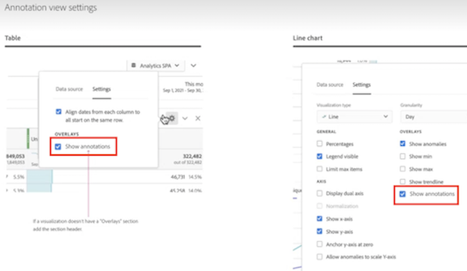

# Panoramica sulle annotazioni

Le annotazioni consentono di comunicare in modo efficace dettagli contestuali sui dati agli altri stakeholder nella propria organizzazione. Le annotazioni consentono di collegare gli eventi calendario a dimensioni o metriche specifiche. È possibile aggiungere a una data o un intervallo di date annotazioni relative a problemi noti, festività, nuove campagne, ecc. Puoi quindi visualizzare gli eventi in modo grafico e vedere se campagne o altri eventi hanno influenzato il traffico del sito, l’utilizzo di app mobile, i ricavi o su qualsiasi altra metrica.

Ad esempio, supponiamo che tu condivida dei progetti con la tua organizzazione. Se si è verificato un calo significativo dei visitatori univoci, è possibile creare un&#39;annotazione **Visitatori che diminuisce** e applicarla all&#39;intera suite di rapporti. Quando gli utenti visualizzano una suite di rapporti che include tale data, vedono l’annotazione all’interno dei loro progetti, insieme ai relativi dati.

Le annotazioni possono essere applicate a:

* Una singola data o un intervallo di date.

* L’intero set di dati o metriche, dimensioni o segmenti specifici personali.

* Il progetto in cui vengono create le annotazioni (impostazione predefinita) o tutti i progetti.

* La visualizzazione dei dati in cui vengono create le annotazioni (impostazione predefinita) o tutte le visualizzazioni dei dati.

Per le varie opzioni disponibili per la creazione di annotazioni, consulta [Creare annotazioni](create-annotations.md). Le annotazioni verranno quindi compilate, modificate e salvate nel [generatore di annotazioni](create-annotations.md#annotation-builder).

Utilizza [Gestione annotazioni](manage-annotations.md) per gestire le annotazioni.

## Attivare o disattivare le annotazioni

Le annotazioni possono essere attivate o disattivate a diversi livelli:

| Livello | Procedura |
|---|---|
| **Visualizzazione** | Abilita o disabilita  > **[!UICONTROL Settings]** > **[!UICONTROL Show annotations]**.  |
| **Progetto** | Dal menu di un progetto Workspace, seleziona **[!UICONTROL Project]** > **[!UICONTROL Project info & settings]** e abilita o disabilita **[!UICONTROL Show annotations]**.  |
| **Utente** | Dalla scheda **[!UICONTROL Components]**, seleziona **[!UICONTROL Preferences]** oppure dal menu di un progetto Workspace, seleziona **[!UICONTROL Project]** > **[!UICONTROL User preferences]**.  In **[!UICONTROL Preferences]**, seleziona **[!UICONTROL Projects & Analysis]**. Dalla barra della scheda a sinistra, seleziona **[!UICONTROL Data]**. In basso, abilita o disabilita **[!UICONTROL Show annotations]** sotto l’intestazione **[!UICONTROL Freeform table]**.  |

<!--
# Annotations overview

Annotations in Workspace enable you to effectively communicate contextual data nuances and insights to your organization. They let you tie calendar events to specific dimensions/metrics. You can annotate a date or date range with known data issues, public holidays, campaign launches, etc. You can then graphically display events and see whether campaigns or other events have affected your site traffic, revenue, or any other metric.

For example, let's say you are sharing projects with your organization. If you had a major spike in traffic due to a marketing campaign, you could create a "Campaign launch date" annotation and scope it for your whole report suite. When your users view any data sets that included that date, they see the annotation within their projects, alongside their data.

Keep this in mind:

* Annotations can be tied to a single date or to a date range.

* They can apply to your entire data set or to specified metrics, dimensions, or segments.

* They can apply to the project in which they were created (default) or to all projects.

* They can apply to the report suite in which they were created (default) or to all report suites.

## Permissions {#permissions}

By default, only Admins can create annotations. Users have rights to view annotations like they do with other other Analytics components (such as segments, calculated metrics, etc.).

However, Admins can give the [!UICONTROL Annotation Creation] permission (Analytics Tools) to users via the [Adobe Admin Console](https://experienceleague.adobe.com/docs/analytics/admin/admin-console/permissions/analytics-tools.html?lang=it).

## Turn annotations on or off {#annotations-on-off}

Annotations can be turned on or off at several levels:

* At the Visualization level: [!UICONTROL Visualization] settings > [!UICONTROL Show annotations]

* At the Project level: [!UICONTROL Project info & settings] > [!UICONTROL Show annotations]

* At the User level: [!UICONTROL Components] > [!UICONTROL User preferences] > [!UICONTROL Data] > [!UICONTROL Show annotations]

-->