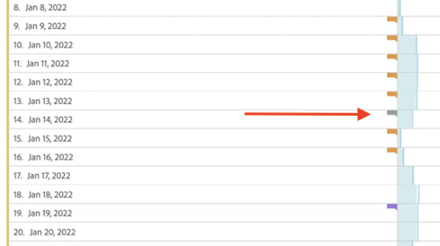
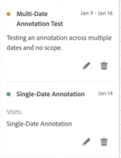

# Visualizzare le annotazioni

>[!NOTE]
>
>Il rollout graduale di questa funzione inizia il 23 marzo 2022. Disponibilità generale: 11 aprile 2022.

Le annotazioni si presentano in modo leggermente diverso, a seconda che si estendono su un singolo giorno o su un intervallo di date.

## Visualizzare annotazioni nei grafici a linee o nelle tabelle

| Date | Aspetto |
| --- | --- |
| **Giorno singolo** | 
Quando passi il cursore del mouse sull’annotazione, vengono visualizzati i relativi dettagli, è possibile modificarla selezionando l’icona a forma di penna oppure eliminarla:
  |
| **Intervallo date** | L’icona cambia e quando passi il cursore sopra di essa viene visualizzato l’intervallo di date.

Quando lo selezioni nel grafico a linee, vengono visualizzati i metadati dell’annotazione e puoi modificarli o eliminarli:
In una tabella viene visualizzata un’icona a ogni data dell’intervallo di date.
 |
| **Sovrapposizione delle annotazioni** | Nei giorni a cui è associata più di un’annotazione, l’icona viene visualizzata con un colore grigio.

Quando passi il cursore sull’icona grigia, vengono visualizzate tutte le annotazioni sovrapposte:
 |

## Visualizzare le annotazioni in un file .pdf

Poiché non è possibile passare il cursore sulle icone in un file .pdf, questo file (dopo l’esportazione) fornisce note di spiegazione nella parte inferiore di un pannello. Ecco un esempio:

## Visualizzare annotazioni con dati non con tendenze

A volte le annotazioni vengono visualizzate con dati non con tendenze, ma sono legate a una dimensione specifica. In tal caso, vengono visualizzati solo in un’annotazione di riepilogo nell’angolo in basso a destra. Ecco un esempio:

Il grafico di riepilogo viene visualizzato in tutti i tipi di visualizzazione nell’angolo, non solo nelle tabelle a forma libera non con tendenze e nei numeri di riepilogo. Viene inoltre visualizzato in visualizzazioni come [!UICONTROL Donut], [!UICONTROL Flow],[!UICONTROL Fallout],[!UICONTROL Cohort]e così via.

