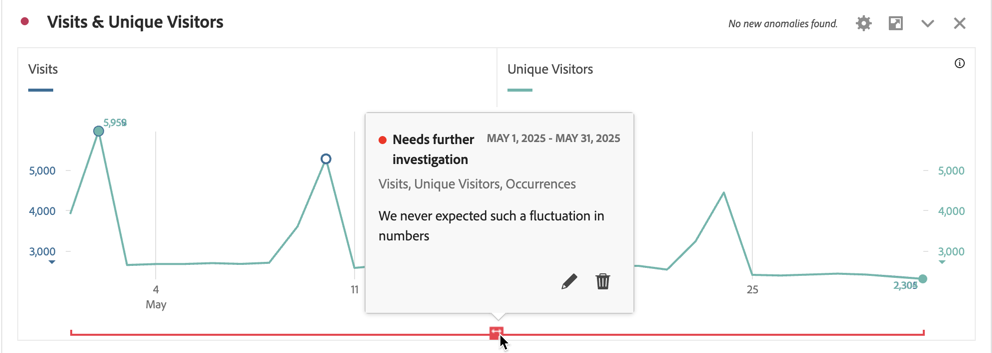
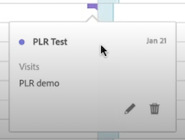
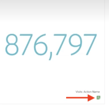

# Visualizzare le annotazioni

Le annotazioni si presentano in modo leggermente diverso, a seconda di dove vengono visualizzate e se si estendono su un singolo giorno o su un intervallo di date.

## Visualizzare le annotazioni in Workspace

| Tipo di visualizzazione | Descrizione |
| --- | --- |
| **Linee &#x200B;** **Giorno singolo** | Quando selezioni  in una visualizzazione a linee, si apre un riquadro a comparsa con i dettagli dell’annotazione.  Per modificare l’annotazione nel [generatore di annotazioni](create-annotations.md#annotation-builder), seleziona . Per eliminare l’annotazione, seleziona . |
| **Linee &#x200B;** **Intervallo date** | Quando selezioni  si apre un riquadro a comparsa con i dettagli dell’annotazione e una linea in basso che indica l’intervallo di date. Per modificare l’annotazione nel [generatore di annotazioni](create-annotations.md#annotation-builder), seleziona . Per eliminare l’annotazione, seleziona . |
| **Tabella a forma libera** | In una tabella a forma libera, puoi accedere a tutte le annotazioni dal pulsante delle annotazioni in alto a destra della visualizzazione. Seleziona  per visualizzare un (elenco a scorrimento) di tutte le annotazioni.  Per ogni annotazione, puoi selezionare  per modificare l’annotazione nel [generatore di annotazioni](create-annotations.md#annotation-builder) ed  per eliminarla. |

{style="table-layout:auto"}

## Visualizzare le annotazioni in un PDF

Quando scarichi il progetto come PDF o lo invii come PDF, le annotazioni vengono riepilogate nel PDF nella sezione Riepilogo annotazioni.

<!--
# View annotations

Annotations manifest slightly differently, depending on whether they span a single day or a date range.

## View annotations in Line charts or Tables

| Date | Appearance |
| --- | --- |
| **Single day** |   
When you hover over the annotation, you can see its details, you can edit it by selecting the pen icon, or you can delete it:
  |
| **Date range** |  The icon changes and when you hover over it, the date range appears.

When you select it in the line chart, the annotation metadata appear, and you can edit or delete it:
In a table, an icon appears on every date in the date range.
|
| **Overlapping annotations** | On days that have more than one annotation tied to them, the icon appears in a grey color.

When you hover over the grey icon, all overlapping annotations appear:
 |

{style="table-layout:auto"}

## View annotations in a .pdf file

Since you cannot hover over icons in a .pdf file, this file (after export) provides notes of explanations at the bottom of a panel. Here is an example:

## View annotations with non-trended data

Sometimes annotation are shown with non-trended data, but tied to a specific dimension. In that case, they appear only in a summary annotation in the bottom right corner. Here is an example:

The summary chart appears in all visualization types in the corner, not just in non-trended freeform tables and summary numbers. It also appears in visualizations like [!UICONTROL Donut], [!UICONTROL Flow],[!UICONTROL Fallout],[!UICONTROL Cohort], and so on.

-->