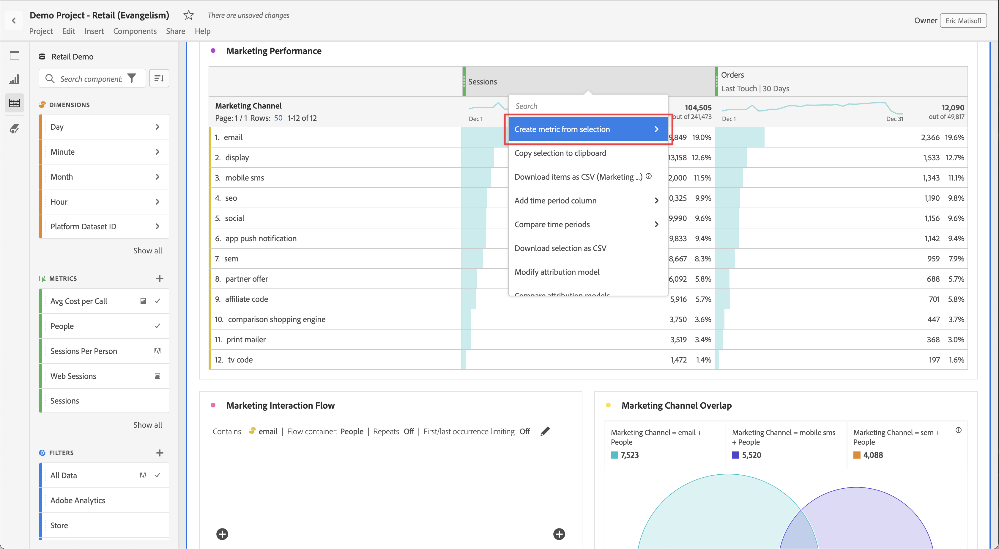

# Metriche

Le metriche consentono di quantificare i punti di dati in Analysis Workspace. Sono solitamente utilizzate come colonne in una visualizzazione e associate alle dimensioni.

## Utilizzare le metriche in Analysis Workspace

Le metriche sono flessibili per quanto riguarda il loro utilizzo in Analysis Workspace. Trascina una metrica in una tabella a forma libera vuota per visualizzare la tendenza della metrica nel periodo della data del progetto. Puoi anche trascinare una metrica quando è presente una dimensione per vedere in che modo tale metrica si confronta con ciascun elemento dimensione. Trascinare una metrica sopra un’intestazione di metrica esistente la sostituisce e trascinare una metrica accanto a un’intestazione consente di vedere entrambe le metriche una accanto all’altra.

Per informazioni su come aggiungere metriche e altri tipi di componenti ad Analysis Workspace, vedi [Utilizzare componenti in Analysis Workspace](use-components-in-workspace.md).

## Tipi di metriche

Adobe offre diversi tipi di metriche da utilizzare in Analysis Workspace:

* **Metriche standard**: la maggior parte delle metriche utilizzate nei progetti sono metriche standard. Gli esempi includono [visualizzazioni pagina](/help/components/metrics/page-views.md), [ricavi](/help/components/metrics/revenue.md) o [eventi personalizzati](/help/components/metrics/custom-events.md). Per ulteriori informazioni, consulta [Panoramica delle metriche](/help/components/metrics/overview.md) nella guida utente dei Componenti.

* **Metriche calcolate** : metriche definite dall&#39;utente basate su metriche standard, numeri statici o funzioni algoritmiche. Le metriche calcolate definite dall’utente mostrano l’icona di una calcolatrice nell’elenco dei componenti disponibili. Per ulteriori informazioni, consulta [Panoramica sulle metriche calcolate](/help/components/c-calcmetrics/cm-overview.md) nella guida utente dei componenti.

* **Modelli di metriche calcolate** : le metriche definite da Adobe si comportano in modo simile alle metriche calcolate. Puoi utilizzarli così come sono nei progetti Workspace o salvarne una copia per personalizzarne la logica. I modelli di metriche calcolate mostrano un’icona Adobe nell’elenco dei componenti disponibili.

Puoi vedere se una metrica è approvata  o meno. Per ulteriori dettagli su una metrica, passa il cursore del mouse sulla metrica e seleziona . Per ulteriori informazioni, vedere [Informazioni sul componente](use-components-in-workspace.md#component-info).

## Utilizzare le metriche in Analysis Workspace

Le metriche possono essere utilizzate in vari modi all’interno di Analysis Workspace. Per informazioni su come aggiungere metriche e altri tipi di componenti ad Analysis Workspace, vedi [Utilizzare componenti in Analysis Workspace](/help/analyze/analysis-workspace/components/use-components-in-workspace.md).

>[!BEGINSHADEBOX]

Vedi  [Usa metriche](https://video.tv.adobe.com/v/40817?quality=12&learn=on){target="_blank"} per un video demo.

>[!ENDSHADEBOX]

## Creare metriche calcolate

Le metriche calcolate consentono di vedere in che modo le metriche si relazionano tra loro, utilizzando semplici operatori o funzioni statistiche.

Esistono diversi modi per creare metriche calcolate. Il metodo scelto determina se la metrica calcolata è disponibile nell’elenco dei componenti in tutti i progetti o solo nel progetto in cui è stata creata.

### Creare metriche calcolate per tutti i progetti

È possibile utilizzare il [generatore di metriche calcolate](/help/components/c-calcmetrics/c-workflow/cm-workflow/c-build-metrics/cm-build-metrics.md) per [creare metriche calcolate](/help/components/c-calcmetrics/c-workflow/cm-workflow/cm-workflow.md). Quando vengono create in questo modo, le metriche calcolate sono disponibili nell’elenco dei componenti e possono essere utilizzate nei progetti di tutta l’organizzazione.

### Creare metriche calcolate per un singolo progetto

Puoi creare rapidamente una metrica calcolata disponibile solo per il progetto in cui è stata creata.

Per creare una metrica calcolata per un singolo progetto:

1. In Analysis Workspace, apri il progetto in cui desideri creare la metrica calcolata.

1. In una tabella a forma libera, fai clic con il pulsante destro del mouse sull’intestazione di colonna di una singola colonna.

   Oppure

   Selezionare due colonne tenendo premuto il tasto Maiusc, quindi fare clic con il pulsante destro del mouse su una delle colonne selezionate.

1. Seleziona **[!UICONTROL Create metric from selection]**

   

1. Per creare una metrica calcolata solo per questo progetto, scegli tra le opzioni disponibili.

   Quando è selezionata una singola colonna, sono disponibili le seguenti opzioni:

   * [!UICONTROL **Media**]: crea una nuova colonna che mostra il valore medio nel set di elementi dimensionali della colonna. I valori delle colonne utilizzano la funzione [Media](/help/components/c-calcmetrics/cm-reference/cm-functions.md#mean).

   * [!UICONTROL **Mediana**]: crea una nuova colonna che mostra il valore mediano nel set di elementi dimensionali della colonna. I valori delle colonne utilizzano la funzione [Mediana](/help/components/c-calcmetrics/cm-reference/cm-functions.md#median).

   * [!UICONTROL **Colonna max**]: crea una nuova colonna che mostra il valore più grande nel set di elementi dimensionali della colonna. I valori delle colonne utilizzano la funzione [Column Maximum](/help/components/c-calcmetrics/cm-reference/cm-functions.md#column-maximum).

   * [!UICONTROL **Colonna min**]: crea una nuova colonna che mostra il valore più piccolo nel set di elementi dimensionali della colonna. I valori delle colonne utilizzano la funzione [Column Minimum](/help/components/c-calcmetrics/cm-reference/cm-functions.md#column-minimum).

   * [!UICONTROL **Somma colonna**]: crea una nuova colonna che aggiunge tutti i valori numerici per una metrica all&#39;interno di una colonna (negli elementi di una dimensione). I valori delle colonne utilizzano la funzione [Somma colonne](/help/components/c-calcmetrics/cm-reference/cm-functions.md#column-sum).

   Quando sono selezionate due colonne, sono disponibili le seguenti opzioni:

   * [!UICONTROL **Dividi**]: crea una nuova colonna che divide i valori delle due colonne selezionate.

   * [!UICONTROL **Sottrai**]: crea una nuova colonna che sottrae i valori delle due colonne selezionate.

   * [!UICONTROL **Aggiungi**]: crea una nuova colonna che aggiunge i valori delle due colonne selezionate.

   * [!UICONTROL **Moltiplica**]: crea una nuova colonna che moltiplica i valori delle due colonne selezionate.

   * [!UICONTROL **Modifica percentuale**]: crea una nuova colonna che mostra la modifica percentuale tra le due colonne selezionate.

[Metriche calcolate: metriche senza implementazione](https://experienceleague.adobe.com/en/docs/analytics-learn/tutorials/components/calculated-metrics/calculated-metrics-implementationless-metrics) (3:42)

## Confrontare metriche con diversi modelli di attribuzione

Per confrontare rapidamente un modello di attribuzione con un altro, fare clic con il pulsante destro del mouse su una metrica e selezionare **[!UICONTROL Compare Attribution Models]**:

Questa scelta rapida consente di confrontare un modello di attribuzione con un altro senza trascinare una metrica e configurarla due volte.

## Utilizza la funzione [!UICONTROL cumulative average] per applicare l&#39;arrotondamento delle metriche

Video sull’argomento:

>[!BEGINSHADEBOX]

Vedi  [Media cumulativa](https://video.tv.adobe.com/v/27068?quality=12&learn=on){target="_blank"} per un video demo.

>[!ENDSHADEBOX]

