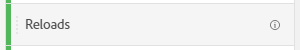

# Metriche

Le metriche consentono di quantificare i punti dati in Analysis Workspace. Vengono generalmente utilizzati come colonne in una visualizzazione e sono legati alle dimensioni.

Adobe offre diversi tipi di metriche da utilizzare in Analysis Workspace:

* **Metriche standard**: La maggior parte delle metriche utilizzate nei progetti sono metriche standard. Esempi [Visualizzazioni pagina](/help/components/metrics/page-views.md), [Entrate](/help/components/metrics/revenue.md)oppure [Eventi personalizzati](/help/components/metrics/custom-events.md). Vedi [Panoramica delle metriche](/help/components/metrics/overview.md) nella guida utente Componenti per ulteriori informazioni.

   

* **Metriche calcolate**: Metriche definite dall’utente basate su metriche standard, numeri statici o funzioni algoritmiche. Le metriche calcolate definite dall’utente mostrano un’icona del calcolatore nell’elenco dei componenti disponibili. Vedi [Panoramica sulle metriche calcolate](/help/components/c-calcmetrics/cm-overview.md) nella guida utente Componenti per ulteriori informazioni.

   

* **Modelli di metriche calcolate**: Metriche definite da un Adobe che si comportano in modo simile alle metriche calcolate. Puoi utilizzarli così come sono nei progetti Workspace oppure salvarne una copia per personalizzarne la logica. I modelli di metriche calcolate mostrano un Adobe di icona nell’elenco dei componenti disponibili.

   

Le metriche sono flessibili nel loro utilizzo in Analysis Workspace. Trascina una metrica in una tabella a forma libera vuota per visualizzare la tendenza di tale metrica nel periodo di data del progetto. Puoi anche trascinare una metrica quando è presente una dimensione per visualizzare tale metrica rispetto a ogni elemento di dimensione. Quando si trascina una metrica sopra un’intestazione di metrica esistente, questa viene sostituita e se si trascina una metrica accanto a un’intestazione è possibile visualizzare entrambe le metriche una accanto all’altra.

>[!VIDEO](https://video.tv.adobe.com/v/40817/?quality=12)

## Metriche calcolate

Le metriche calcolate consentono di vedere facilmente la correlazione tra le metriche utilizzando operatori semplici o funzioni statistiche. Esistono diversi modi per creare le metriche calcolate:

* Fai clic sull’icona più accanto all’intestazione Metriche , nell’elenco dei componenti a sinistra.
* Passa a **[!UICONTROL Components]** > **[!UICONTROL Calculated Metrics]** > **[!UICONTROL Add]**.
* Fai clic con il pulsante destro del mouse su un’intestazione di colonna > **[!UICONTROL Create metric from selection]** quando sono selezionate una o più celle di intestazione di colonna. Questa opzione crea automaticamente una metrica calcolata senza dover utilizzare il Generatore di regole di metrica calcolata.

[Metriche calcolate: metriche senza implementazione](https://experienceleague.adobe.com/docs/analytics-learn/tutorials/components/calculated-metrics/calculated-metrics-implementationless-metrics.html?lang=it) (3:42)

## Confrontare metriche con diversi modelli di attribuzione

Per confrontare in modo rapido e semplice un modello di attribuzione con un altro, fai clic con il pulsante destro del mouse su una metrica e seleziona **[!UICONTROL Compare Attribution Models]**:

Questa scorciatoia ti consente di confrontare in maniera facile e veloce un modello di attribuzione con un altro senza trascinare una metrica e configurarla due volte.

## Utilizza la [!UICONTROL cumulative average] funzione per applicare l’uniformità delle metriche

Video sull’argomento:

>[!VIDEO](https://video.tv.adobe.com/v/27068/?quality=12)
