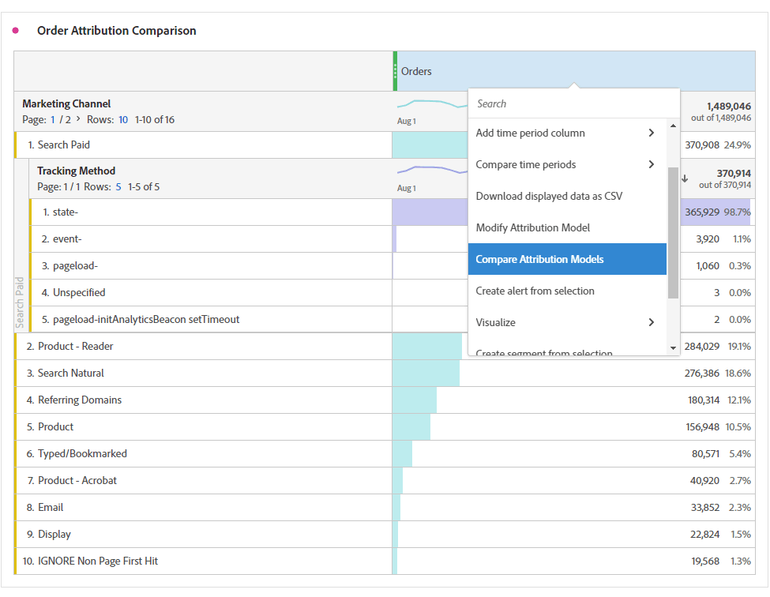

# Metriche

In Analysis Workspace, le metriche possono essere utilizzate in due modi.

Puoi trascinare una metrica standard, una metrica calcolata o un modello di metriche calcolate dal menu [!UICONTROL Components] nella tabella:

>[!NOTE]
>
>Anche se questo è apparentemente semplice, l’uso delle metriche è piuttosto efficace. Puoi aggiungere metriche a un report trascinando la metrica appropriata nella sezione delle metriche di una tabella. Puoi anche suddividere le dimensioni per metriche per avere un controllo preciso sulla visualizzazione della tabella. Inoltre, puoi inserire una metrica come dimensione e una dimensione come metrica per creare un rapporto nel tempo. Usa i vari componenti e scopri cosa puoi fare. Le possibilità sono infinite.

Oppure puoi fare clic su **[!UICONTROL Components]** > **[!UICONTROL New Metric]**. Verrà visualizzato il [Generatore di metrica calcolata](https://docs.adobe.com/content/help/it-IT/analytics/components/calculated-metrics/cm-overview.html), in cui puoi creare metriche personalizzate basate su metriche esistenti.

Per accelerare e semplificare la creazione delle metriche calcolate, al menu di scelta rapida delle colonne delle tabelle a forma libera è stato aggiunto il comando **[!UICONTROL Create metric from selection]**. Questa opzione viene visualizzata quando è selezionata almeno una cella di intestazione di colonna.

[Utilizzo delle metriche di partecipazione su YouTube](https://www.youtube.com/watch?v=ngmJHcg65o8&amp;list=PL2tCx83mn7GuNnQdYGOtlyCu0V5mEZ8sS&amp;index=32) (4:16)

## Confrontare metriche con diversi modelli di attribuzione

Per confrontare in modo rapido e semplice un modello di attribuzione con un altro, fai clic con il pulsante destro del mouse su una metrica e seleziona **[!UICONTROL Add comparative attribution model]**:

Questa scorciatoia ti consente di confrontare in maniera facile e veloce un modello di attribuzione con un altro senza trascinare una metrica e configurarla due volte.
