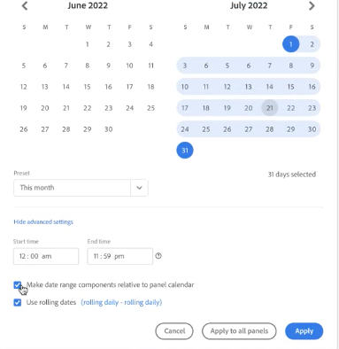

# Panoramica del calendario e degli intervalli di date

Nel calendario, puoi specificare date e intervalli di date o selezionare un predefinito.

Ecco un video sull’utilizzo di intervalli di date e calendari in Analysis Workspace:

>[!VIDEO](https://video.tv.adobe.com/v/23973/?quality=12)

Le selezioni di calendario sono applicabili a livello del singolo pannello, ma è possibile applicarle a tutti i pannelli. Quando fai clic su un intervallo di date in Workspace, l’interfaccia mostra il mese del calendario corrente e il mese del calendario precedente. È possibile regolare questi due calendari facendo clic sulle frecce destra e sinistra nei rispettivi angoli superiori.

Il primo clic su un calendario avvia una selezione di intervalli di date. Il secondo clic completa la selezione di un intervallo di date, che viene evidenziato. Se si tiene premuto il tasto `Shift` (o se si fa clic con il pulsante destro del mouse), si aggiunge all’intervallo attualmente selezionato.

È inoltre possibile trascinare le date (e dimensioni orarie) in un progetto Workspace. Puoi selezionare specifici giorni, settimane, mesi, anni, oppure una data continua.

[Utilizzo degli intervalli di date e del calendario in Analysis Workspace](https://experienceleague.adobe.com/docs/analytics-learn/tutorials/analysis-workspace/calendar-and-date-ranges/using-dates-in-analysis-workspace.html?lang=it) (4:07)

| Impostazione | Descrizione |
|--- |--- |
| Giorni selezionati | Giorni/settimane/mesi/anni selezionati. |
| Rendere i componenti dell’intervallo di date relativi al calendario del pannello | Mantieni coerenti le date in base all’intervallo di date del pannello. |
| Uso delle date continue | Le date continue consentono di generare un rapporto dinamico per un determinato periodo di tempo precedente o successivo all’esecuzione del rapporto. Ad esempio, per un rapporto su tutti gli ordini inseriti il “Mese scorso” (in base al campo Data creazione) eseguito in dicembre, vengono presentati gli ordini di novembre. Se esegui di nuovo lo stesso rapporto a gennaio, puoi vedere gli ordini di dicembre.<ul><li>**[!UICONTROL Date Preview]** (Anteprima data): indica il periodo di tempo coperto dal calendario continuo.</li><li>**[!UICONTROL Start]**: puoi scegliere il giorno, la settimana, il mese, il trimestre o l’anno corrente.</li><li>**[!UICONTROL End]**: puoi scegliere il giorno, la settimana, il mese, il trimestre o l’anno corrente.</li></ul>Per visualizzare un esempio, vedi [Intervalli di date personalizzati](/help/analyze/analysis-workspace/components/calendar-date-ranges/custom-date-ranges.md).  Selezionato per impostazione predefinita. |
| Intervallo date | Consente di scegliere un intervallo di date predefinito. Il valore predefinito è Ultimi 30 giorni. **[!UICONTROL This week/month/quarter/year (excluding today)]** consente di scegliere tra intervalli di date che non includono dati per giorni parziali a partire da oggi. |
| Applica a tutti i pannelli | Consente di selezionare l’intervallo di date per il pannello corrente e per tutti gli altri pannelli del progetto. |
| Applica | Applica l’intervallo di date solo al pannello corrente. |

## Informazioni sugli intervalli di date relativi al pannello {#relative-panel-dates}

Se lavori in Workspace, puoi rendere i componenti dell’intervallo di date relativi al calendario del pannello in modo che i dati visualizzati nella barra a sinistra (o all’interno dei componenti) siano basati sull’intervallo di date del pannello. Tre casi d’uso comuni in cui vengono applicate le date dei pannelli relativi sono grafici combinati, riepilogo delle metriche chiave e intervalli di date delle tabelle a forma libera.

Per utilizzare intervalli di date relativi al pannello

1. Seleziona la **Area di lavoro** scheda .
1. Seleziona **Progetto vuoto**.
1. Aggiungi dimensioni, metriche e segmenti dalla barra a sinistra.
1. Fai clic sul campo dell’intervallo di date del pannello per attivare/disattivare l’impostazione dell’intervallo di date relativo al pannello.
1. Seleziona o deseleziona **Rendere i componenti dell’intervallo di date relativi al calendario del pannello**.
   * Seleziona l’opzione per rendere i componenti dell’intervallo di date relativi al calendario del pannello.
   * Deselezionando questa opzione, gli intervalli di date all’interno del pannello (Riepilogo metriche chiave, Grafici combinati o Pillole date viola) non verranno aggiornati se l’intervallo di date del pannello viene modificato. Questa è l’impostazione predefinita.

   

1. Fai clic su **Applica**.
Le date relative vengono visualizzate in alto a destra.

   