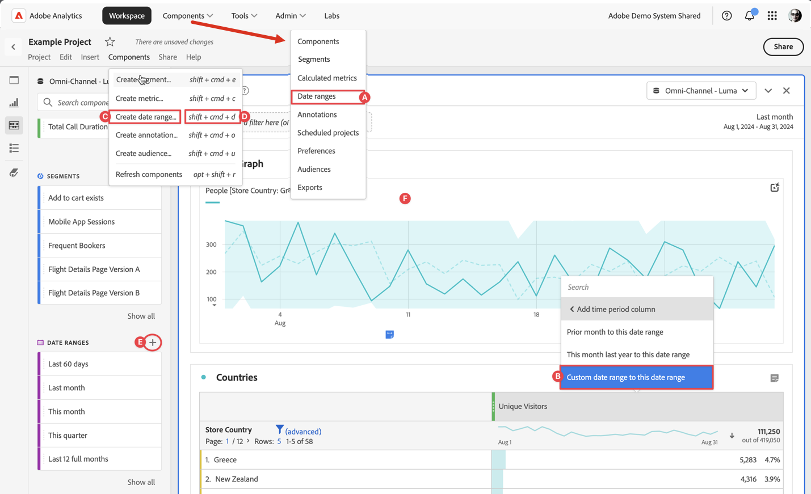

# Creare intervalli di date

Chiunque può creare un intervallo di date personalizzato. Puoi creare un intervallo di date nei seguenti modi:



* **A**: nell’interfaccia principale, seleziona **[!UICONTROL Components]** e quindi **[!UICONTROL Date range]**. Seleziona  **[!UICONTROL Add]** dal gestore [[!UICONTROL Date range]](manage.md).
* **B**: in un progetto Workspace, dal menu di scelta rapida di una visualizzazione seleziona **[!UICONTROL Custom date range to this date range]**.
* **C**: in un progetto Workspace, seleziona **[!UICONTROL Components]** dal menu e quindi **[!UICONTROL Create date range]**.
* **D**: in un progetto Workspace, utilizza la scelta rapida da tastiera **[!UICONTROL ctrl+shift+d]** (Windows) o **[!UICONTROL shift+command+d]** (macOS).
* **E**: in un progetto Workspace, dal pannello Componenti a sinistra, seleziona  in  **Intervalli di date**.
* **F**: in una visualizzazione supportata, come ad esempio una visualizzazione a linee, dal menu di scelta rapida di un punto dati, seleziona **[!UICONTROL Annotate Selection]**.

Per definire l’annotazione, utilizza [[!UICONTROL Date range builder]](#annotation-builder):

<!-- Should we really mention API here. If so, we can do it all over the place in the docs...
| **Use the [Customer Journey Analytics Annotations API](https://developer.adobe.com/cja-apis/docs/endpoints/annotations/)** | The Customer Journey Analytics Annotations APIs allow you to create, update, or retrieve annotations programmatically through Adobe Developer. These APIs use the same data and methods that Adobe uses inside the product UI. |
-->


## Generatore di intervalli di date {#date-range-builder}

<!-- markdownlint-disable MD034 -->

>[!CONTEXTUALHELP]
>id="components_dateranges_endtime"
>title="Ora di fine"
>abstract="Gli orari di fine includono sempre 59 secondi."

<!-- markdownlint-enable MD034 -->


Le finestre di dialogo **[!UICONTROL New date range]** o **[!UICONTROL Edit date range]** vengono utilizzate per creare nuovi intervalli di date o modificare quelli esistenti.


1. Specifica un **[!UICONTROL Title]** per l’intervallo di date. Ad esempio: **[!UICONTROL Quarterly]**.
1. Facoltativamente, specificare una **[!UICONTROL Description]**.
1. Organizzare il segmento creando o applicando uno o più **[!UICONTROL Tags]**. Inizia a digitare per trovare i tag esistenti che puoi selezionare. Oppure premi **[!UICONTROL ENTER]** per aggiungere un nuovo tag. Seleziona  per rimuovere un tag. |
1. Seleziona un **[!UICONTROL Date Range]** selezionando prima la data di inizio e quindi la data di fine.
In alternativa, puoi selezionare **[!UICONTROL Preset]** dal menu a discesa [!UICONTROL *Seleziona un predefinito*].

1. Facoltativamente, seleziona **[!UICONTROL Show advanced settings]** per:

   * Specificare **[!UICONTROL Start time]** e **[!UICONTROL End time]** diversi da `12:00 AM` (`0:00`) e `11:59 PM` (`23:59`) predefiniti. Gli orari di fine includono sempre 59 secondi. Per un intervallo di date che si estende su più giorni, l’ora di inizio si applica al primo giorno dell’intervallo di date e l’ora di fine si applica all’ultimo giorno dell’intervallo di date. Utilizza **[!UICONTROL (Reset time values)]** per ripristinare le impostazioni predefinite dell’ora di inizio e di fine.
   * **[!UICONTROL Use rolling dates]**. Se abilitati, gli intervalli di date predefiniti come **[!UICONTROL Last 7 full days]** vengono aggiornati in modo dinamico in base all’avanzamento della data e dell’ora corrente. Se disattivate, tali predefiniti non vengono aggiornati una volta applicati.

     È possibile selezionare il testo tra parentesi (ad esempio **[!UICONTROL fixed start - rolling quarterly]**) per estendere il pannello e specificare i dettagli per **[!UICONTROL Start]** e **[!UICONTROL End]**.

     

      1. Seleziona **[!UICONTROL Start of]**, **[!UICONTROL End of]**, or **[!UICONTROL Fixed day]**.
      1. Dopo aver selezionato **[!UICONTROL Start of]** o **[!UICONTROL End of]**, è possibile creare un’espressione completa. Ad esempio: **[!UICONTROL End of]** **[!UICONTROL current quarter]** **[!UICONTROL minus]** `20` **[!UICONTROL days]**. Seleziona il valore appropriato per ogni singola parte dell’espressione.
         * Seleziona un valore corrente. Ad esempio: **[!UICONTROL current quarter]**.
         * Seleziona un valore per il calcolo aggiuntivo. Ad esempio: **[!UICONTROL minus]**.
         * Dopo aver specificato un calcolo aggiuntivo, specifica un valore. Ad esempio: `20`.
         * Dopo aver specificato un calcolo aggiuntivo, seleziona il periodo di tempo da utilizzare per il calcolo. Ad esempio: **[!UICONTROL days]**.

     Seleziona **[!UICONTROL Hide details]** per nascondere i dettagli del calcolo delle date continue.

1. Seleziona:
   * **[!UICONTROL Save]** per salvare l’intervallo di date.
   * **[!UICONTROL Save As]** per salvare una copia dell’intervallo di date.
   * **[!UICONTROL Cancel]** per annullare le modifiche apportate a un intervallo di date o per annullare la creazione di un nuovo intervallo di date.


<!--


You can create a date range using either of the following two methods:

* Directly in a workspace project by clicking the '`+`' button next to the list of date range components on the left
* Within the date range manager

To create a date range in the date range manager:

1. Log in to [analytics.adobe.com](https://analytics.adobe.com) using your AdobeID credentials.
1. Navigate to [!UICONTROL Components] > [!UICONTROL Date Ranges].
1. Click the [!UICONTROL Add] button to open the modal window that creates a date range.

## Create a date range modal window

The modal window has four fields you can edit:

* **Date range**: The date range you want for this component.
* **Title**: The name you want for this component. The title is used in workspace projects.
* **Description**: The description you want for this component. The description is seen when clicking the  icon.
* **Tags**: Use tags to organize your date ranges. A date range can belong to multiple tags.

## Selecting a date range

When clicking the date range in the modal window, you have several options:

* **Calendar**: Select the start and end date.
* **Use rolling dates**: Check this box if you want the date range to change as time goes on. Do not check this box if you want your date range to remain static.
* **Select preset**: Use this drop-down selection if you want a custom date range based on a range that Adobe offers by default. When you select a preset, you can further customize the date range to suit your needs. It does not affect the preset that Adobe offers.

## Rolling date ranges

If you want a rolling date range, you can customize when it rolls. You can control when the start and end dates roll independently of each other.

* **When the date starts**: Choose if the date starts at the beginning of a time period, at the end of a time period, or use a fixed day.
* **The time period to use**: Choose how often the date range rolls. You can have it roll every day, every week, every month, every quarter, or every year.
* **Offset**: Choose the offset of the date range. You can add or subtract days, weeks, months, quarters, or years.

## Rolling date examples

Some date ranges can be useful in certain reports.

Year-to-date:

```text
Start: Start of current year
End: End of current day
```

Last Thursday to this Thursday:

```text
Start: Start of current week minus 3 days
End: Start of current week plus 4 days
```

Fiscal year (for example, if a fiscal year starts in December)

```text
Start: Start of current year minus 1 month
End: End of current year minus 1 month
```


-->
