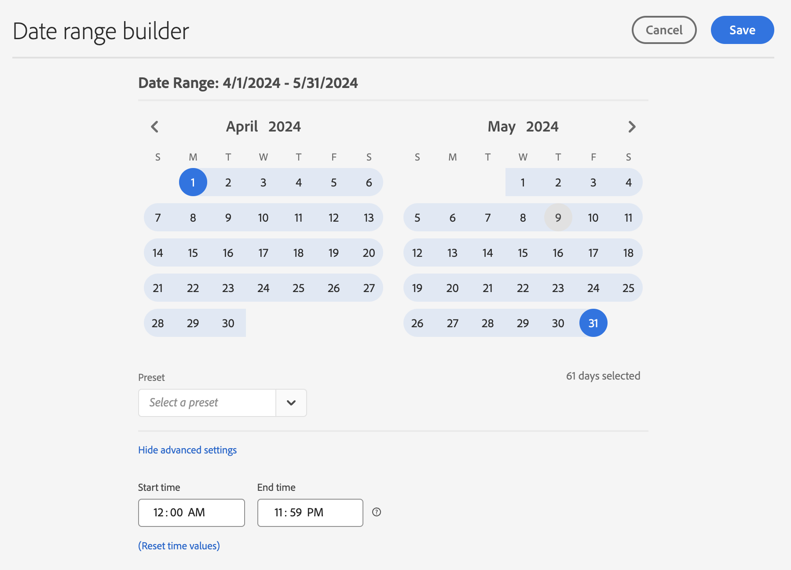

# Creazione di intervalli di date personalizzati

Crea intervalli di date personalizzati in Analysis Workspace e salvali come componenti Tempo.

**[!UICONTROL Components]** &gt; **[!UICONTROL New Date Range]**

Un intervallo di date si applica a livello del pannello. To add a date range to your project, click **Panels** &gt; *`<select panel>`*, and specify a new date range.

## Date range for "two months ago" {#section_C4109C57CB444BB2A79CC8082BD67294}

Il seguente intervallo di date personalizzato mostra un intervallo per “due mesi fa”, con una visualizzazione del riepilogo delle modifiche che mostra i cambiamenti direzionali.

L'intervallo di date personalizzato viene visualizzato nella parte superiore del pannello dei componenti [!UICONTROL Date Range] (Intervallo date) all'interno del progetto:

Puoi trascinare l’intervallo di date personalizzato all’interno di una colonna vicino a un intervallo di date continuo mensile personalizzato, utilizzando l’impostazione predefinita Mese precedente per un confronto. Aggiungi una visualizzazione di riepilogo delle modifiche e seleziona i totali da ogni colonna per mostrare il cambiamento direzionale:

## Use a 7-day rolling date range {#section_7EF63B2E9FF54D2E9144C4F76956A8DD}

Un intervallo di date si applica a livello del pannello. Per aggiungere al progetto un intervallo di date, fai clic su **Azioni** &gt; **Aggiungi pannello** e specifica un nuovo intervallo di date.

Nel Generatore intervalli di date, puoi creare un intervallo di date personalizzato che viene visualizzato nel pannello Componenti insieme agli altri intervalli di date.

Ad esempio, puoi creare un intervallo di date che specifica una finestra di 7 giorni che termina una settimana fa:

Seleziona *`rolling daily`*.

* Le impostazioni Inizio corrispondono *`current day minus 14 days`*.

* Le impostazioni Fine corrispondono *`current day minus 7 days`*.

L’intervallo di date può diventare un componente da trascinare in qualsiasi tabella a forma libera.
