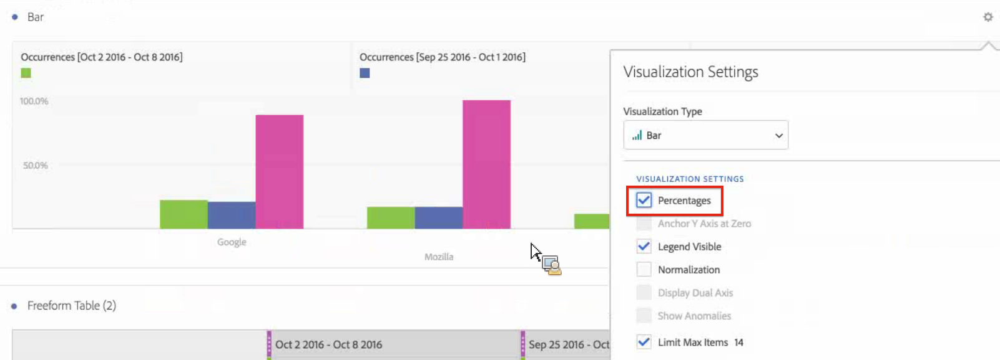

# Confronto delle date

In Analysis Workspace, il confronto delle date ti consente di prendere una qualsiasi colonna contenente un intervallo di date e di creare un confronto tra date comune, come: anno su anno, trimestre su trimestre, mese su mese, ecc...

## Confronta periodi di tempo {#section_C4E36BFE0F5C4378A74E705747C9DEE4}

L’analisi richiede contesto e spesso tale contesto viene fornito da un periodo di tempo precedente. Ad esempio, la domanda “Rispetto allo stesso periodo dello scorso anno, quanto stiamo andando meglio/peggio?” è fondamentale per comprendere la propria attività. Il confronto delle date include automaticamente una colonna “differenza” che mostra il cambiamento percentuale, confrontato a un periodo di tempo specificato.

1. Crea una tabella a forma libera, con qualsiasi dimensione e metrica desideri confrontare in un periodo di tempo.
1. Right-click a table row and select **[!UICONTROL Compare Time Periods]**.

   

   >[!IMPORTANT]
   >
   >Questa opzione di clic con il pulsante destro del mouse è disabilitata per le righe metriche, le righe di intervallo date e le righe di dimensione del tempo.

1. A seconda di come hai impostato l’intervallo di date della tabella, hai a disposizione queste opzioni per il confronto:

   | Opzione | Descrizione |
   |---|---|
   | **[!UICONTROL Prior week/month/quarter/year to this date range]** | Effettua il confronto con la settimana/il mese, ecc... subito precedente a questo intervallo di date. |
   | **[!UICONTROL This week/month/quarter/year last year]** | Effettua il confronto con il medesimo intervallo di date di un anno fa. |
   | **[!UICONTROL Select range]** | Ti consente di selezionare un intervallo di date personalizzato. |

   >[!NOTE]
   >
   >When you select a custom number of days, for example October 7 - October 20 (a 14-day range), you will get only 2 options: **[!UICONTROL Prior 14 days before this date range]**, and **[!UICONTROL Select range]**.

1. Il confronto risultante è simile a questo:

   

   Le righe nella colonna Modifica percentuale appaiono nere per i valori negativi e verdi per quelli positivi.

1. (Facoltativo) Così come in tutti gli altri progetti di Workspace, puoi creare visualizzazioni sulla base di questi confronti temporali. Ad esempio, questo è un grafico a barre:

   

   Note that in order to show the percentage change in the bar chart, you have to have the [!UICONTROL Percentages] setting checked in the [!UICONTROL Visualization Settings].

## Add a time period column for comparison {#section_93CC2B4F48504125BEC104046A32EB93}

Ora puoi aggiungere a ciascuna colonna di una tabella un periodo di tempo diverso da quello impostato nel calendario corrente. Questa funzione offre un altro metodo per confrontare le date.

1. Right-click a column in the table and select **[!UICONTROL Add Time Period Column]** 

1. A seconda di come hai impostato l’intervallo di date della tabella, hai a disposizione queste opzioni per il confronto:

   | Opzione | Descrizione |
   |---|---|
   | **[!UICONTROL Prior week/month/quarter/year to this date range]** | Aggiunge una colonna con settimana/mese/ecc... subito precedente a questo intervallo di date. |
   | **[!UICONTROL This week/month/quarter/year last year]** | Aggiunge lo stesso intervallo di date, un anno fa. |
   | **[!UICONTROL Select range]** | Ti consente di selezionare un intervallo di date personalizzato. |

   >[!NOTE]
   >
   >When you select a custom number of days, for example October 7 - October 20 (a 14-day range), you will get only 2 options: **[!UICONTROL Prior 14 days before this date range]**, and **[!UICONTROL Select range]**.

1. Il periodo di tempo verrà inserito nella parte superiore della colonna selezionata:

   

1. Puoi aggiungere tutte le colonne di tempo che desideri, oltre ad abbinare intervalli di date diversi:

   

1. Inoltre, puoi ordinare tutte le colonne, azione che modificherà l’ordine dei giorni a seconda della colonna che stai ordinando.

## Align column dates to start on same row {#section_5085E200082048CB899C3F355062A733}

A new setting for all tables lets you **[!UICONTROL Align Dates from each column to all start on the same row (applies to entire table)]**. “Si applica all’intera tabella” significa che se effettui, ad esempio, una suddivisione nella tabella, e se cambi questa impostazione per la suddivisione, questa modificherà l’impostazione per tutta la tabella.

>[!IMPORTANT]
>
>This setting is **disabled** (unchecked) for all existing projects and **enabled** (checked) for all new projects.

Ad esempio: Quando scegli di allineare le date, se effettui un confronto mese-su-mese tra ottobre e settembre 2016, la colonna a sinistra inizierà con il 1 ottobre e la colonna a destra inizierà con il 1 settembre:

<!-- 

See Jonny Moon's email from November 3. 

 -->

