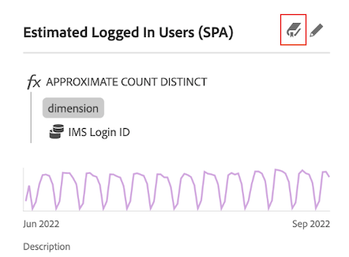

# Panoramica del dizionario dati {#data-dictionary-overview}

<!-- markdownlint-disable MD034 -->

>[!CONTEXTUALHELP]
>id="component_datadictionary"
>title="Dizionario dei dati"
>abstract="Il dizionario dati consente sia agli utenti che agli amministratori di tenere traccia dei componenti del proprio ambiente Analytics e di comprenderli meglio.  Gli amministratori di Analytics sono responsabili della cura delle informazioni su ciascun componente nel dizionario dati."

<!-- markdownlint-enable MD034 -->

Il dizionario dei dati in Analysis Workspace consente sia gli utenti che gli amministratori di tenere traccia dei componenti nel proprio ambiente Analytics e di comprenderli meglio.

Gli amministratori di Analytics sono responsabili della cura delle informazioni su ciascun componente nel dizionario dei dati per renderlo disponibile agli utenti.

>[!BEGINSHADEBOX]

Per un video demo, consulta  [Dizionario dati per Analysis Workspace](https://video.tv.adobe.com/v/3418028/?quality=12&learn=on){target="_blank"}.

>[!ENDSHADEBOX]

## Vantaggi per gli utenti

Il dizionario dei dati aiuta gli utenti a comprendere meglio ogni componente disponibile.

Le informazioni disponibili nel dizionario dei dati includono:

* Funzione e uso previsto di un componente.

* Componenti generalmente utilizzati con quello che stai visualizzando.

* Componenti simili a quello visualizzato.

* Indica se un componente è approvato dall&#39;amministratore di sistema.

Per informazioni su come accedere al dizionario dei dati e per informazioni dettagliate sulle informazioni in esso contenute, vedi [Visualizzare le informazioni sui componenti nel dizionario dei dati](view-data-dictionary.md).

## Vantaggi per gli amministratori

Il dizionario dei dati aiuta gli amministratori di sistema a tenere traccia e a curare i componenti nel loro ambiente Analytics.

Gli amministratori di Analytics possono utilizzare il dizionario dati per i seguenti scopi:

* Identificare i componenti duplicati che devono essere consolidati.

* Identificare i componenti che non raccolgono dati in modo che possano essere aggiornati o eliminati.

* Identificare i componenti non ancora approvati.

* Aggiornare le descrizioni dei componenti direttamente in Analysis Workspace. Eventuali aggiornamenti apportati alle descrizioni dei componenti nel dizionario dei dati vengono riflessi nella visualizzazione dati.

  Allo stesso modo, qualsiasi aggiornamento apportato alle descrizioni dei componenti nella visualizzazione dati si riflette in Analysis Workspace.

  Per ulteriori informazioni sull’aggiunta di descrizioni dei componenti in Analysis Workspace o in una suite di rapporti, consulta [Aggiungere descrizioni dei componenti](/help/analyze/analysis-workspace/components/add-component-descriptions.md).

## Accedere al dizionario dei dati

In Analysis Workspace è possibile accedere al dizionario dei dati in uno dei seguenti modi:

* Da  nel pannello del pulsante.

* Da  nella finestra a comparsa delle informazioni di un componente.

Per informazioni dettagliate sulle varie opzioni disponibili nel dizionario dei dati, vedi [Visualizzare le informazioni sui componenti nel dizionario dei dati](view-data-dictionary.md).

## Aggiornare e curare il dizionario dei dati

Gli amministratori di Adobe Analytics sono responsabili della gestione di un dizionario dati integro per la propria organizzazione, come descritto in [Monitorare l&#39;integrità del dizionario dati](monitor-data-dictionary-health.md).

Come parte di questo processo, gli amministratori di Adobe Analytics possono modificare le informazioni su ciascun componente nel dizionario dati, come descritto in [Modifica le voci dei componenti nel dizionario dati](edit-entries-data-dictionary.md).

## Spostare, ridurre a icona o chiudere il dizionario dei dati

All’apertura del dizionario dei dati (come descritto in [Accedere al dizionario dei dati](#access-the-data-dictionary)), esso viene visualizzato come una finestra sopra Analysis Workspace.

Puoi modificare la finestra del dizionario dei dati in uno dei seguenti modi:

* Trascinala in qualsiasi area di Analysis Workspace

  Se chiudi e riapri Analysis Workspace, la finestra del dizionario dei dati rimane nel punto in cui l’hai spostata l’ultima volta. <!--True?-->

* Riduci a icona la finestra.

  Se ridotto a icona, il dizionario dei dati viene visualizzato come una scheda blu nell’angolo inferiore destro di Analysis Workspace.

  Quando selezioni la scheda blu, viene aperto il dizionario dei dati del componente visualizzato più di recente.

* Chiudete la finestra.

<!--
# Data Dictionary overview

The Data Dictionary in Analysis Workspace helps both users and administrators keep track of and better understand the components in their Analytics environment.   

Analytics administrators are responsible for curating information about each component in the Data Dictionary to make it available to users.

>[!BEGINSHADEBOX]

See  [Data dictionary](https://video.tv.adobe.com/v/3418028?quality=12&learn=on){target="_blank"} for a demo video.

>[!ENDSHADEBOX]

## Benefits for users

The Data Dictionary helps users gain a better understanding of each component that is available to them. 

Information available in the Data Dictionary includes: 

* A component's function and intended use

* Components typically used with the one you are viewing

* Components that are similar to the one you are viewing

* Whether a component is approved by the system administrator 

For information about how to access the Data Dictionary and for details about the information it contains, see [View component information in the Data Dictionary](/help/analyze/analysis-workspace/components/data-dictionary/view-data-dictionary.md).

## Benefits for administrators

The Data Dictionary helps system administrators keep track of and curate the components in their Analytics environment. 

Following are some of the ways Analytics administrators can use the Data Dictionary: 

* Identify duplicate components that need to be consolidated.

* Identify components that aren't collecting any data so they can be either updated or deleted.

* Identify components that are not yet approved.

* Update component descriptions directly in Analysis Workspace. Any updates made to component descriptions in the Data Dictionary are reflected in the Report Suite.

  Similarly, any updates made to component descriptions in the Report Suite are reflected in Analysis Workspace.

  For more information about adding component descriptions in either Analysis Workspace or in a Report Suite, see [Add component descriptions](/help/analyze/analysis-workspace/components/add-component-descriptions.md).

## Access the Data Dictionary

You can access the Data Dictionary in any of the following ways within Analysis Workspace:

* From the **Data Dictionary** icon in the left rail.

  

* From the **Data Dictionary** icon within the info popover of a component. 

  

For detailed information about the various options available in the Data Dictionary, see [View component information in the Data Dictionary](/help/analyze/analysis-workspace/components/data-dictionary/view-data-dictionary.md).

## Update and curate the Data Dictionary

Analytics administrators are responsible for maintaining a healthy Data Dictionary for their organization, as described in [Monitor Data Dictionary Health](/help/analyze/analysis-workspace/components/data-dictionary/monitor-data-dictionary-health.md).

As part of this process, Analytics administrators can edit information about each component in the data dictionary, as described in [Edit component entries in the Data Dictionary](/help/analyze/analysis-workspace/components/data-dictionary/edit-entries-data-dictionary.md).

## Move, minimize, or close the Data Dictionary

When you open the Data Dictionary (as described in [Access the Data Dictionary](#access-the-data-dictionary)), it displays as a window on top of Analysis Workspace. 

You can manipulate the Data Dictionary window in any of the following ways:

* Drag it to any area within Analysis Workspace 

  If you close and re-open Analysis Workspace, the Data Dictionary window remains in the location where you last moved it.

* Minimize it

  When minimized, the Data Dictionary appears as a blue tab in the lower-right corner of Analysis Workspace.

  When you select the blue tab, the Data Dictionary opens to the component you were most recently viewing. 

* Close it

-->