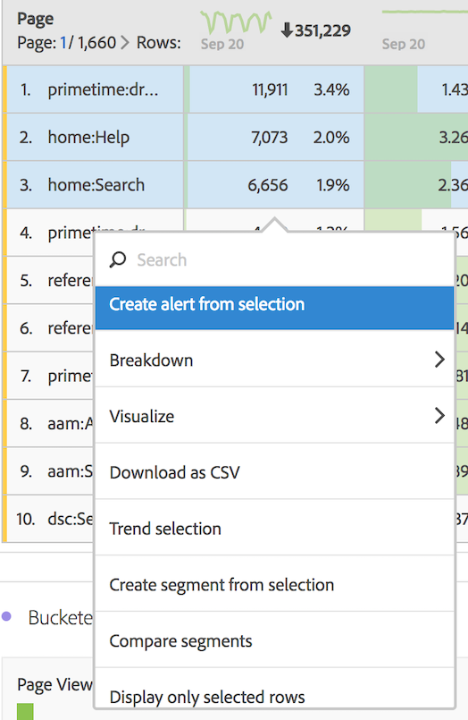

# Suddividere dimensioni

È possibile suddividere dimensioni ed elementi dimensionali in Analysis Workspace.

Analizza i dati in tantissimi modi per ogni necessità; realizza query con metriche, dimensioni, segmenti, linee temporali e altri valori rilevanti.

1. [Crea un progetto](/help/analyze/analysis-workspace/home.md) con una tabella di dati.
1. Nella tabella di dati, fai clic con il pulsante destro del mouse su un elemento e seleziona **[!UICONTROL Breakdown]** > *`<item>`*.

   

   Puoi analizzare metriche per elementi dimensionali o segmenti di pubblico in diversi periodi di tempo selezionati. Puoi anche effettuare analisi molto più dettagliate.

   >[!NOTE]
   >
   >È possibile mostrare nella tabella un massimo di 200 analisi. Questo limite aumenterà per le esportazioni.

[Aggiungere dimensioni e metriche al progetto in Analysis Workspace](https://docs.adobe.com/content/help/en/analytics-learn/tutorials/analysis-workspace/metrics/adding-dimensions-and-metrics-to-your-project-in-analysis-workspace.html) (11:39)

[Utilizzo delle dimensioni nelle tabelle a forma libera](https://docs.adobe.com/content/help/it-IT/analytics-learn/tutorials/analysis-workspace/building-freeform-tables/working-with-dimensions-in-a-freeform-table.html) (15:35)

## Applicare modelli di attribuzione ai raggruppamenti

A qualsiasi raggruppamento all’interno di una tabella può essere applicato anche qualsiasi modello di attribuzione. Tale modello di attribuzione può essere lo stesso o diverso dalla colonna principale. Ad esempio, puoi analizzare gli ordini lineari sulla dimensione canali di marketing, ma applicare ordini a forma di U agli specifici codici di tracciamento all’interno di un canale. Per modificare il modello di attribuzione applicato a un raggruppamento, passa il cursore sul modello di raggruppamento e fai clic su **[!UICONTROL Edit]**:

