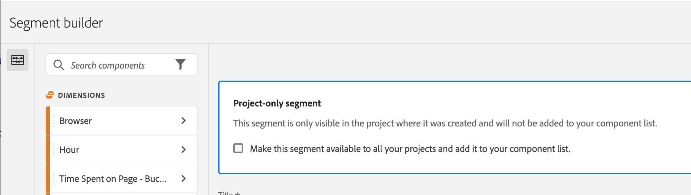

# Segmenti rapidi

I segmenti rapidi consentono di esplorare facilmente i dati all’interno di un determinato progetto, senza la necessità di creare un segmento più complesso nell’elenco dei componenti. [Generatore di segmenti](/help/components/segmentation/segmentation-workflow/seg-build.md).

Quando crei segmenti rapidi, tieni presente quanto segue:

* I segmenti rapidi si applicano solo al progetto in cui sono stati creati. Non sono disponibili in altri progetti e non possono essere condivisi con altri utenti.
* Sono consentite fino a 3 regole.
* I contenitori nidificati o le regole sequenziali non sono supportati.

Il video seguente illustra come utilizzare i segmenti rapidi:

>[!VIDEO](https://video.tv.adobe.com/v/341466/?quality=12&learn=on)

## Creare un segmento rapido

Qualsiasi utente in Analysis Workspace può creare un segmento rapido.

Per creare un segmento rapido:

1. Per iniziare a creare il segmento rapido, scegli uno dei seguenti metodi:

   * **Ad hoc (trascinamento della selezione):** Dalla barra a sinistra, trascina un componente nell’area di rilascio accanto a **Segmento** nell’intestazione del pannello, quindi seleziona la **Modifica** per regolare il segmento.

     

     >[!NOTE]
     >
     > Quando crei un segmento rapido ad hoc (trascinamento della selezione), tieni presente quanto segue:
     > * I seguenti tipi di componenti non sono supportati: metriche calcolate e dimensioni, nonché metriche da cui non è possibile creare segmenti.
     > * Per eventi e dimensioni intere, Analysis Workspace crea dei segmenti di hit di tipo “esiste”. Esempi: `Hit where eVar1 exists` o `Hit where event1 exists`.
     > * Se nella zona di rilascio dei segmenti viene rilasciato &quot;Non specificato&quot; o &quot;Nessuno&quot;, vengono automaticamente convertiti in un segmento di tipo &quot;non esiste&quot; in modo da essere trattati correttamente nei segmenti.

   * **Utilizzo dell’icona del segmento:** In una tabella a forma libera, seleziona la **Segmento** nell’intestazione del pannello.

     

1. Regolare una delle seguenti impostazioni:

   | Impostazione | Descrizione |
   | --- | --- |
   | [!UICONTROL Name] | Il nome predefinito di un segmento è una combinazione dei nomi delle regole nel segmento. Puoi rinominare il segmento in un nome più descrittivo. |
   | [!UICONTROL Include/exclude] | Puoi includere o escludere componenti nella definizione del segmento, ma non entrambi. |
   | Contenitore [!UICONTROL Hit/Visit/Visitor] | I segmenti rapidi comprendono un solo [contenitore di segmenti](https://experienceleague.adobe.com/docs/analytics/components/segmentation/seg-overview.html#section_AF2A28BE92474DB386AE85743C71B2D6) che consente di includere (o escludere) una dimensione, una metrica o un intervallo di date nel segmento. [!UICONTROL Visitor] contiene i dati generali specifici del visitatore per visite e visualizzazioni di pagina. A [!UICONTROL Visit] contenitore consente di impostare regole per suddividere i dati del visitatore in base alle visite e a [!UICONTROL Hit] Il contenitore consente di suddividere le informazioni sui visitatori in base alle singole visualizzazioni di pagina. Il valore predefinito è [!UICONTROL Hit]. |
   | [!UICONTROL Components] (Dimension/metrica/intervallo di date) | Definisci fino a 3 regole aggiungendo componenti (dimensioni, metriche, intervalli di date o valori di dimensioni). Ci sono 3 modi per trovare il componente giusto:<ul><li>Inizia a digitare; il generatore di segmenti rapidi trova automaticamente il componente appropriato.</li><li>Utilizza l’elenco a discesa per trovare il componente.</li><li>Trascina e rilascia i componenti dalla barra a sinistra.</li></ul> |
   | [!UICONTROL Operator] | Utilizza il menu a discesa per trovare gli operatori standard e gli operatori [!UICONTROL Distinct Count]. Consulta [Operatori di segmenti](/help/components/segmentation/seg-reference/seg-operators.md). |
   | Segno più (+) | Aggiunge un’altra regola, |
   | Qualificatori AND/OR | Puoi aggiungere i qualificatori “AND” o “OR” alle regole, ma non puoi combinare “AND” e “OR” in una singola definizione di segmento. |
   | [!UICONTROL Apply] | Applica questo segmento al pannello. Se il segmento non contiene dati, ti viene chiesto se desideri continuare. |
   | [!UICONTROL Open builder] | Visualizza il Generatore di segmenti. Dopo aver salvato o applicato il segmento nel Generatore di segmenti, non viene più considerato un &quot;segmento rapido&quot;. Diventa parte della libreria di segmenti dell’elenco di componenti. 
Per rendere il componente disponibile in tutti i progetti e nella barra a sinistra, seleziona l’opzione [!UICONTROL **Rendi questo segmento disponibile a tutti i tuoi progetti e aggiungilo all&#39;elenco dei tuoi componenti**].

Per ulteriori informazioni, consulta la sezione [Salvare un segmento rapido come segmento dell’elenco di componenti](#save-a-quick-segment-as-a-component-list-segment) in questo articolo.

**Nota:** Solo gli utenti con l’autorizzazione per la creazione di segmenti in [Adobe Admin Console](/help/admin/admin-console/permissions/analytics-tools.md) può aprire il Generatore di segmenti.
 |
   | [!UICONTROL Cancel] | Annulla questo segmento rapido (non applicarlo). |
   | [!UICONTROL Date range] | La convalida utilizza l’intervallo di date del pannello per la ricerca dei dati. Tuttavia, qualsiasi intervallo di date applicato a un segmento rapido sovrascrive l’intervallo di date del pannello nella sua parte superiore. |
   | Anteprima (in alto a destra) | Ti consente di verificare se disponi di un segmento valido e la sua ampiezza. Rappresenta il raggruppamento del set di dati che verranno visualizzati quando applichi questo segmento. Potresti ricevere un avviso che indica che questo segmento non contiene dati. In questo caso, puoi procedere o modificare la definizione del segmento. |

1. Seleziona [!UICONTROL **Applica**] per salvare le modifiche.

## Modificare segmenti rapidi

1. Passa il puntatore sul segmento rapido e seleziona **Modifica** icona.

   

1. Modifica la definizione e/o il nome del segmento.

1. Seleziona [!UICONTROL **Applica**].

## Salvare un segmento rapido come segmento dell’elenco di componenti

>[!IMPORTANT]
>
> Quando salvi un segmento rapido, considera quanto segue:
> 
> * Per salvare un segmento rapido, è necessario disporre dell’autorizzazione Creazione segmento nel [Adobe Admin Console](/help/admin/admin-console/permissions/analytics-tools.md).
> 
> * Dopo aver salvato o applicato il segmento, non è più possibile modificarlo nel generatore di segmenti rapidi. Piuttosto, utilizza il Generatore di segmenti regolare.

Puoi scegliere di salvare i segmenti rapidi come segmenti dell’elenco dei componenti. I vantaggi dei segmenti dell’elenco di componenti includono:

* Disponibilità in tutti i progetti Workspace
* Supporto di segmenti più complessi e di segmenti sequenziali

Puoi salvare i segmenti dal Generatore di segmenti rapidi o dal [!UICONTROL Filter Builder].

### Salva nel generatore di segmenti rapidi {#save2}

1. Dopo aver applicato il segmento rapido, posiziona il cursore su di esso e seleziona l’icona Info (&quot;i&quot;).
1. Seleziona **[!UICONTROL Make available to all projects and add to your component list]**.
1. (Facoltativo) Rinomina il segmento.
1. Seleziona **[!UICONTROL Save]**.

   Il segmento ora viene visualizzato nell’elenco dei componenti nella barra a sinistra. Inoltre, la barra laterale del segmento cambia da blu chiaro a blu più scuro, indicando che non può più essere modificata o aperta nel generatore di segmenti rapidi.

### Salvare nel Generatore di segmenti {#save3}

1. Dopo aver applicato il segmento rapido, posiziona il cursore su di esso e seleziona l’icona Info (&quot;i&quot;).
1. Seleziona **[!UICONTROL Save segment]**
1. (Facoltativo) Rinomina il segmento, quindi seleziona [!UICONTROL **Applica**].

   Torna a Workspace e osserva che la barra laterale del segmento cambia da blu chiaro a blu scuro, indicando che non può più essere modificata o aperta nel generatore di segmenti rapidi. E salvandolo, diventa parte dell&#39;elenco dei componenti.

Dopo aver applicato il segmento, puoi scegliere di aggiungerlo all’elenco dei componenti del segmento e renderlo disponibile per tutti i progetti.

1. Passa il puntatore sul segmento salvato e seleziona l’icona a forma di matita.

1. Seleziona [!UICONTROL **Apri generatore**].

1. Nella parte superiore del Generatore di segmenti, osserva [!UICONTROL **Segmento solo progetto**] finestra di dialogo:

   

1. Seleziona la casella di controllo accanto a **[!UICONTROL Make available to all your projects and add to your component list.]**

1. Seleziona **[!UICONTROL Save]**.

   Il segmento ora viene visualizzato nell’elenco dei componenti del segmento per tutti i progetti.
È inoltre possibile [condividere il segmento](https://experienceleague.adobe.com/docs/analytics/analyze/analysis-workspace/curate-share/curate.html?lang=it#concept_4A9726927E7C44AFA260E2BB2721AFC6) con altre persone della tua organizzazione.

## Esempio di segmento rapido

L’esempio seguente di un segmento combina dimensioni e metriche:

## Problema noto

1. Creare un segmento rapido con 2 voci e **[!UICONTROL Save]** come Test1.
1. Clic **[!UICONTROL Save as]** e salva questo segmento rapido come Test2.
1. Modificate il segmento rapido Test2 e salvatelo nuovamente come Test2.
Il segmento rapido Test1 viene modificato da Test2.
