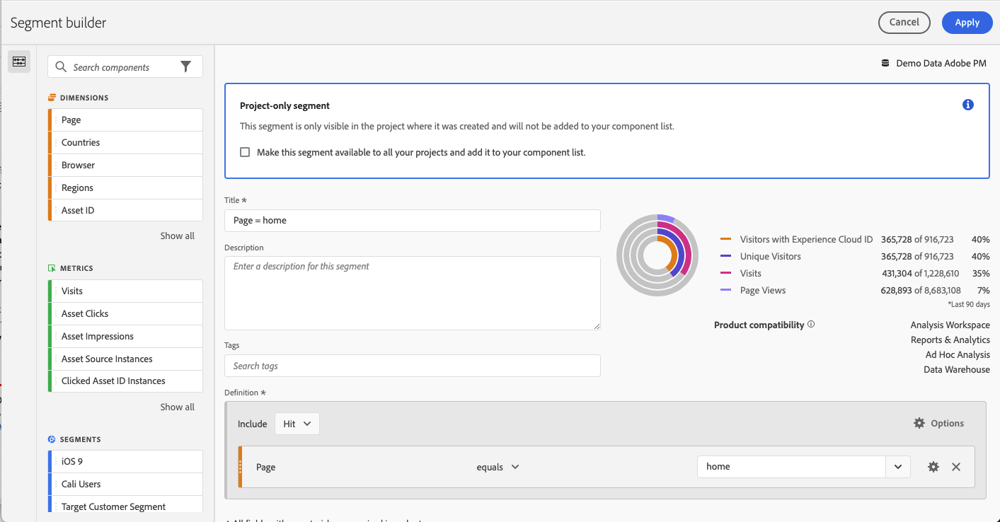

# Segmenti rapidi

Puoi creare segmenti rapidi all’interno di un progetto, senza ricorrere al più complesso [generatore di segmenti](/help/components/segmentation/segmentation-workflow/seg-build.md). Segmenti rapidi

* Applica solo ai progetti in cui sono stati creati (è possibile modificarli).
* Consenti fino a 3 regole.
* Non inserire contenitori nidificati o regole sequenziali.
* Lavora in progetti con più suite di rapporti.

Per un confronto tra le funzionalità dei segmenti rapidi e quelle dei segmenti veri e propri a livello di componente, visita [questa pagina](/help/analyze/analysis-workspace/components/segments/t-freeform-project-segment.md).

>[!IMPORTANT]
> I segmenti rapidi sono attualmente in fase di test limitati e saranno generalmente disponibili il 21 ottobre 2021.

## Prerequisiti

Chiunque può creare un [!UICONTROL Quick Segment]. Tuttavia, per poter salvare un segmento rapido o aprirlo in [!UICONTROL Segment Builder] è necessario disporre dell&#39;autorizzazione [!UICONTROL Segment Creation] in [Adobe Admin Console](https://experienceleague.adobe.com/docs/analytics/admin/admin-console/permissions/summary-tables.html?lang=it#analytics-tools).

## Creare segmenti rapidi

In una tabella a forma libera, fai clic sull’icona Filtro+ nell’intestazione del pannello:

Configura il segmento rapido da questa lavagna vuota:

| Impostazione | Descrizione |
| --- | --- |
| Nome | Il nome predefinito di un segmento è una combinazione dei nomi delle regole nel segmento. È possibile rinominare il segmento. |
| Includere/escludere | Puoi includere o escludere componenti nella definizione del segmento, ma non entrambi. |
| Contenitore Hit/Visita/Visitatore | I segmenti rapidi comprendono un solo [contenitore di segmenti](https://experienceleague.adobe.com/docs/analytics/components/segmentation/seg-overview.html?lang=it#section_AF2A28BE92474DB386AE85743C71B2D6) che consente di includere (o escludere) una dimensione, una metrica o un intervallo di date nel segmento. [!UICONTROL Visitor] contiene i dati generali specifici del visitatore per visite e visualizzazioni di pagina. Un contenitore [!UICONTROL Visit] consente di impostare regole per suddividere i dati del visitatore in base alle visite, mentre un contenitore [!UICONTROL Hit] consente di suddividere le informazioni del visitatore in base alle singole visualizzazioni di pagina. Il valore predefinito è [!UICONTROL Hit]. |
| Componenti (Dimensione/metrica/intervallo di date) | Definisci fino a 3 regole aggiungendo componenti (dimensioni e/o metriche e/o intervalli di date) e relativi valori. Ci sono 3 modi per trovare il componente giusto:<ul><li>Inizia a digitare; il generatore di [!UICONTROL Quick Segment] trova automaticamente il componente appropriato.</li><li>Utilizza l’elenco a discesa per trovare il componente.</li><li>Trascina e rilascia i componenti dalla barra a sinistra.</li></ul> |
| Operatore | Utilizza il menu a discesa per trovare gli operatori standard e gli operatori [!UICONTROL Distinct Count]. [Ulteriori informazioni](https://experienceleague.adobe.com/docs/analytics/components/segmentation/segment-reference/seg-operators.html?lang=it) |
| Segno più (+) | Aggiunge un’altra regola, |
| Qualificatori AND/OR | Puoi aggiungere i qualificatori “AND” o “OR” alle regole, ma non puoi combinare “AND” e “OR” in una singola definizione di segmento. |
| Applica | Applica questo segmento al pannello. Se il segmento non contiene dati, ti verrà chiesto se desideri continuare. |
| Apri Generatore | Visualizza il Generatore di segmenti. Una volta salvato o applicato nel Creatore di segmenti, non viene più considerato un “Segmento rapido”. Diventa parte della libreria di segmenti dell’elenco di componenti. |
| Annulla | Annulla questo segmento rapido, non applicarlo. |
| Intervallo date | La convalida utilizza l’intervallo di date del pannello per la ricerca dei dati. Tuttavia, qualsiasi intervallo di date applicato a un segmento rapido sovrascrive l’intervallo di date del pannello nella sua parte superiore. |
| Anteprima (in alto a destra) | Ti consente di verificare se disponi di un segmento valido e la sua ampiezza. Rappresenta il raggruppamento del set di dati che verranno visualizzati quando applichi questo segmento. Potresti ricevere un avviso che indica che questo segmento non contiene dati. In questo caso, puoi procedere o modificare la definizione del segmento. |

Esempio di segmento che combina dimensioni e metriche:

Il segmento viene visualizzato nella parte superiore. Osserva la barra laterale a strisce blu, invece della barra laterale blu dei segmenti a livello di componente nella libreria dei segmenti a sinistra.

## Modificare segmenti rapidi

1. Passa il puntatore sul segmento rapido e seleziona l’icona a forma di matita.
1. Modifica la definizione e/o il nome del segmento.
1. Fai clic su [!UICONTROL Apply].

## Salvare segmenti rapidi

>[!IMPORTANT]
>Una volta salvato o applicato il segmento, non è più possibile modificarlo nel Generatore di segmenti rapidi ma solo nel Generatore di segmenti regolare.

1. Dopo aver applicato il segmento rapido, posiziona il puntatore su di esso e seleziona l’icona Info (“i”).

   

1. Fai clic su **[!UICONTROL Make available to all projects and add to your component list]**.
1. (Facoltativo) Rinomina il segmento.
1. Fai clic su **[!UICONTROL Save]**.

La barra laterale del segmento cambia da blu a blu a righe. Ora viene visualizzato nell’elenco dei componenti nella barra a sinistra.

## Cosa sono i segmenti solo progetto?

I segmenti Solo progetto sono segmenti rapidi o segmenti di progetto ad hoc Workspace. Quando li modifichi o li apri in [!UICONTROL Segment Builder], viene visualizzata la casella Solo progetto. Se APPLICHI un segmento rapido nel generatore ma non selezioni la casella che lo rende disponibile, si tratta comunque di un segmento solo progetto ma non può più essere aperto nel [!UICONTROL Quick Segment Builder].

Se selezioni la casella e fai clic su **[!UICONTROL SAVE]**, diventa un segmento dell’elenco di componenti.

