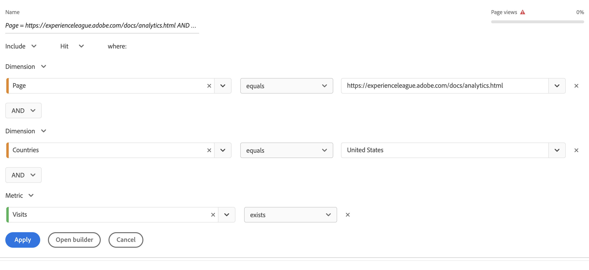

# Segmenti rapidi

Puoi creare segmenti rapidi all&#39;interno di un progetto per bypassare la complessità del generatore di segmenti [completo](/help/components/segmentation/segmentation-workflow/seg-build.md). Per un confronto tra le attività dei segmenti veloci e quelle dei segmenti a livello di componente completi, visita [qui](/help/analyze/analysis-workspace/components/segments/t-freeform-project-segment.md).

>[!IMPORTANT]
> I segmenti rapidi sono attualmente in fase di test limitati e non sono ancora generalmente disponibili.

## Creare segmenti rapidi

1. In una tabella a forma libera, fai clic sull’icona del filtro+ nell’intestazione del pannello:

   

   Tieni presente che:

   - Esiste un solo contenitore di segmenti che consente di includere una dimensione/metrica/intervallo di date nel segmento (o escluderlo da).
   - Puoi impostare il contenitore a livello di Hit, Visita o Visitatore. Il valore predefinito è Hit.

1. Aggiungi una dimensione/metrica/intervallo di date in uno dei tre modi seguenti:

   - Inizia a digitare e il generatore di segmenti rapidi trova automaticamente il componente appropriato.
   - Utilizza l’elenco a discesa per trovare il componente.
   - Trascina i componenti dalla barra a sinistra.

1. Specifica la prima regola, ad esempio `Page equals workspace`. Puoi avere fino a tre regole nelle definizioni dei segmenti. Fai clic sul segno &quot;+&quot; per aggiungere un’altra regola. Puoi aggiungere i qualificatori &quot;AND&quot; o &quot;OR&quot; alle regole, ma non puoi combinare &quot;AND&quot; e &quot;OR&quot; in una singola definizione di segmento.

   Ecco un esempio di segmento che combina dimensioni e metriche:

   

1. Fai clic su **[!UICONTROL Apply]** per applicare questo segmento al pannello.
Il segmento viene visualizzato nella parte superiore. Osserva la relativa barra laterale grigia, invece della barra blu per i segmenti a livello di componente a sinistra.

   

## Rendere pubblici i segmenti rapidi

Puoi scegliere di rendere questi segmenti pubblici (globali), seguendo questi passaggi:

1. Passa il puntatore del mouse sul segmento rapido e fai clic sull’icona &quot;i&quot;.
1. Fai clic su **[!UICONTROL Open builder]**.
Viene aperto il segmento nel Generatore di segmenti.
   >[!NOTE]
   >Una volta applicato o salvato il segmento nel Generatore di segmenti, non è più possibile modificarlo nel Generatore di segmenti rapidi.
1. Fai clic su **[!UICONTROL OK]**.
1. Nel Generatore di segmenti, fai clic su **[!UICONTROL Apply]**.
1. Torna a Workspace e osserva come il segmento ora ha una barra laterale blu che indica che fa parte della libreria dei componenti.

   

