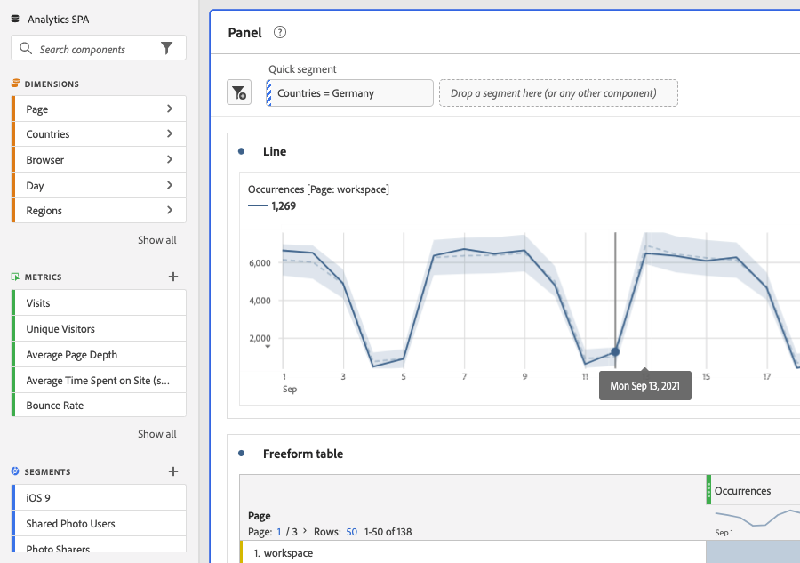

# Segmenti rapidi

Puoi creare segmenti rapidi all’interno di un progetto, senza ricorrere al più complesso [generatore di segmenti](/help/components/segmentation/segmentation-workflow/seg-build.md). Segmenti rapidi

* Applica come [segmenti solo progetto](https://experienceleague.adobe.com/docs/analytics/analyze/analysis-workspace/components/segments/quick-segments.html#what-are-project-only-segments%3F).
* Consenti fino a 3 regole.
* Non inserire contenitori nidificati o regole sequenziali.

Per un confronto tra le funzionalità dei segmenti rapidi e quelle dei segmenti veri e propri a livello di componente, visita [questa pagina](/help/analyze/analysis-workspace/components/segments/t-freeform-project-segment.md).

Ecco una panoramica video dei segmenti rapidi:

>[!VIDEO](https://video.tv.adobe.com/v/341466/?quality=12&learn=on)

## Prerequisiti

Chiunque può creare un [!UICONTROL Quick Segment]. Tuttavia, per poter salvare un segmento rapido o aprirlo in [!UICONTROL Segment Builder] è necessario disporre dell&#39;autorizzazione [!UICONTROL Segment Creation] in [Adobe Admin Console](https://experienceleague.adobe.com/docs/analytics/admin/admin-console/permissions/summary-tables.html#analytics-tools).

## Creare segmenti rapidi

In una tabella a forma libera, fai clic sull’icona Filtro+ nell’intestazione del pannello:

Configura il segmento rapido da questa lavagna vuota:

| Impostazione | Descrizione |
| --- | --- |
| Nome | Il nome predefinito di un segmento è una combinazione dei nomi delle regole nel segmento. È possibile rinominare il segmento. |
| Includere/escludere | Puoi includere o escludere componenti nella definizione del segmento, ma non entrambi. |
| Contenitore Hit/Visita/Visitatore | I segmenti rapidi comprendono un solo [contenitore di segmenti](https://experienceleague.adobe.com/docs/analytics/components/segmentation/seg-overview.html#section_AF2A28BE92474DB386AE85743C71B2D6) che consente di includere (o escludere) una dimensione, una metrica o un intervallo di date nel segmento. [!UICONTROL Visitor] contiene i dati generali specifici del visitatore per visite e visualizzazioni di pagina. A [!UICONTROL Visit] consente di impostare regole per suddividere i dati del visitatore in base alle visite e a [!UICONTROL Hit] Il contenitore ti consente di suddividere le informazioni sui visitatori in base alle singole visualizzazioni di pagina. Il valore predefinito è [!UICONTROL Hit]. |
| Componenti (Dimensione/metrica/intervallo di date) | Definisci fino a 3 regole aggiungendo componenti (dimensioni e/o metriche e/o intervalli di date) e relativi valori. Ci sono 3 modi per trovare il componente giusto:<ul><li>Inizia a digitare; il generatore di [!UICONTROL Quick Segment] trova automaticamente il componente appropriato.</li><li>Utilizza l’elenco a discesa per trovare il componente.</li><li>Trascina e rilascia i componenti dalla barra a sinistra.</li></ul> |
| Operatore | Utilizza il menu a discesa per trovare gli operatori standard e gli operatori [!UICONTROL Distinct Count]. [Ulteriori informazioni](https://experienceleague.adobe.com/docs/analytics/components/segmentation/segment-reference/seg-operators.html?lang=it) |
| Segno più (+) | Aggiunge un’altra regola, |
| Qualificatori AND/OR | Puoi aggiungere i qualificatori “AND” o “OR” alle regole, ma non puoi combinare “AND” e “OR” in una singola definizione di segmento. |
| Applica | Applica questo segmento al pannello. Se il segmento non contiene dati, ti verrà chiesto se desideri continuare. |
| Apri Generatore | Visualizza il Generatore di segmenti. Una volta salvato o applicato nel Creatore di segmenti, non viene più considerato un “Segmento rapido”. Diventa parte della libreria di segmenti dell’elenco di componenti. |
| Annulla | Annulla questo segmento rapido, non applicarlo. |
| Intervallo date | La convalida utilizza l’intervallo di date del pannello per la ricerca dei dati. Tuttavia, qualsiasi intervallo di date applicato a un segmento rapido sovrascrive l’intervallo di date del pannello nella sua parte superiore. |
| Anteprima (in alto a destra) | Ti consente di verificare se disponi di un segmento valido e la sua ampiezza. Rappresenta il raggruppamento del set di dati che verranno visualizzati quando applichi questo segmento. Potresti ricevere un avviso che indica che questo segmento non contiene dati. In questo caso, puoi procedere o modificare la definizione del segmento. |

Esempio di segmento che combina dimensioni e metriche:

Il segmento viene visualizzato nella parte superiore. Osserva la barra laterale a strisce blu, invece della barra laterale blu dei segmenti a livello di componente nella libreria dei segmenti a sinistra.

## Modificare segmenti rapidi

1. Passa il puntatore sul segmento rapido e seleziona l’icona a forma di matita.
1. Modifica la definizione e/o il nome del segmento.
1. Fai clic su [!UICONTROL Apply].

## Salvare segmenti rapidi

>[!IMPORTANT]
>Una volta salvato o applicato il segmento, non è più possibile modificarlo nel Generatore di segmenti rapidi ma solo nel Generatore di segmenti regolare. Solo gli amministratori dei prodotti Adobe Analytics e il creatore del segmento rapido possono salvare le modifiche a un segmento rapido esistente.

1. Dopo aver applicato il segmento rapido, posiziona il puntatore su di esso e seleziona l’icona Info (“i”).

   

1. Fai clic su **[!UICONTROL Make available to all projects and add to your component list]**.
1. (Facoltativo) Rinomina il segmento.
1. Fai clic su **[!UICONTROL Save]**.

La barra laterale del segmento cambia da blu striato a blu più chiaro. Viene ora visualizzato anche nell’elenco dei componenti della barra a sinistra.

## Cosa sono i segmenti solo progetto?

I segmenti solo progetto sono segmenti che si applicano solo al progetto corrente in cui sono stati creati. Non saranno disponibili in altri progetti e non possono essere condivisi con altri utenti. Sono progettati per un’esplorazione rapida dei dati senza dover creare e salvare un segmento nella barra a sinistra. È possibile creare segmenti solo progetto nella zona di rilascio del pannello con i segmenti Quick o [segmenti ad hoc](https://experienceleague.adobe.com/docs/analytics/analyze/analysis-workspace/components/segments/ad-hoc-segments.html).

Se viene aperto un segmento solo progetto nella variabile [!UICONTROL Segment Builder], viene visualizzata una notifica solo per il progetto. Se non selezioni &quot;Rendi questo segmento disponibile.&quot; e fai clic su **[!UICONTROL APPLY]**, il segmento rimane un segmento solo progetto. Nota: se applichi un segmento rapido dal Generatore di segmenti, non può più essere aperto nel [!UICONTROL Quick Segment Builder].

Se selezioni &quot;Rendi disponibile questo segmento.&quot; e fai clic su **[!UICONTROL SAVE]**, il segmento diventa disponibile nell’elenco dei componenti della barra a sinistra e può essere utilizzato in altri progetti. Può essere condiviso anche con altri utenti dal Gestore segmenti.

## Problema noto

1. Crea un segmento rapido con 2 voci e **[!UICONTROL Save]** come Test1.
1. Fai clic su **[!UICONTROL Save as]** e salva questo segmento rapido come Test2.
1. Modifica il segmento rapido Test2 e salvalo nuovamente come Test2.
Il segmento rapido Test1 viene modificato da Test2.
