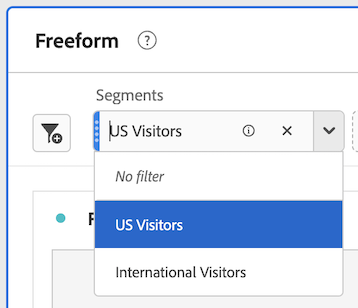

# Utilizzare i componenti in Analysis Workspace

I componenti costituiscono i dati effettivi di qualsiasi progetto in Analysis Workspace. I componenti sono costituiti da dimensioni, metriche, segmenti e intervalli di date. Puoi aggiungere componenti a un progetto trascinandoli in visualizzazioni o pannelli.

Per informazioni generali sui tipi di componenti che è possibile aggiungere, vedere [Panoramica dei componenti](/help/analyze/analysis-workspace/components/analysis-workspace-components.md).

>[!TIP]
>
>Per informazioni su ciascun componente, seleziona l’icona Informazioni accanto al nome di un componente nella barra a sinistra di Analysis Workspace, oppure vedi [Guida ai componenti di Analytics](/help/components/home.md).

## Inizia ad aggiungere componenti a un progetto

1. [Creare un progetto in Analysis Workspace](/help/analyze/analysis-workspace/build-workspace-project/create-projects.md) se non lo hai già fatto.

1. [Aggiungi un pannello](/help/analyze/analysis-workspace/c-panels/panels.md) o [aggiungere una visualizzazione](/help/analyze/analysis-workspace/visualizations/freeform-analysis-visualizations.md#add-visualizations-to-a-panel) al progetto in Analysis Workspace.

   Se aggiungi un componente a un progetto vuoto, viene automaticamente creata una visualizzazione a forma libera.

1. Seleziona l’icona **[!UICONTROL Components]** nella barra a sinistra.

   

1. Scorri fino al componente da aggiungere o cerca il componente che desideri aggiungere, quindi trascinalo su un pannello o una visualizzazione all’interno del progetto.

   Ad esempio, puoi trascinare un segmento nella zona di rilascio del segmento nell’intestazione di un pannello.

   

1. Per informazioni più dettagliate, continua con una delle sezioni seguenti, a seconda del tipo di componente che stai aggiungendo:

   * [Aggiungere dimensioni a un progetto](#add-dimensions-to-a-project)

   * [Aggiungere metriche a un progetto](#add-metrics-to-a-project)

   * [Aggiungere segmenti a un progetto](#add-segments-to-a-project)

   * [Aggiungere intervalli di date a un progetto](#add-date-ranges-to-a-project)

## Aggiungere dimensioni a un progetto

[Dimension](/help/components/dimensions/overview.md) sono variabili in Adobe Analytics che in genere contengono valori stringa. Le dimensioni comuni includono [Pagina](/help/components/dimensions/page.md), [Dominio di riferimento](/help/components/dimensions/referring-domain.md) o una [eVar](/help/components/dimensions/evar.md). Al contrario, le [metriche](/help/components/metrics/overview.md) contengono valori numerici che si legano a una dimensione. Un rapporto di base mostra righe di valori stringa (dimensione) rispetto a una colonna di valori numerici (metrica).

1. Inizia ad aggiungere una dimensione al progetto in Analysis Workspace, come descritto in [Inizia ad aggiungere componenti a un progetto](#begin-adding-components-to-a-project).

1. Scegliere uno dei metodi seguenti per aggiungere dimensioni e determinare il tipo di dati da analizzare:

   * Trascina una dimensione in una visualizzazione (ad esempio una tabella a forma libera) in Analysis Workspace.

     

   * Trascina una o più dimensioni dalla barra a sinistra alla zona di rilascio del segmento per creare un segmento ad hoc, come descritto in [Aggiungere segmenti a un progetto](#add-segments-to-a-project).

     

Per ulteriori informazioni sull’utilizzo delle dimensioni in Analysis Workspace, consulta [Anteprima dimensioni](/help/analyze/analysis-workspace/components/dimensions/view-dimensions.md), [Suddividere dimensioni](/help/analyze/analysis-workspace/components/dimensions/t-breakdown-fa.md), e [Dimensioni suddivise in base al tempo](/help/analyze/analysis-workspace/components/dimensions/time-parting-dimensions.md).

## Aggiungere metriche a un progetto

[Metriche](/help/analyze/analysis-workspace/components/apply-create-metrics.md) consente di quantificare i punti dati in Analysis Workspace. Sono più comunemente utilizzate come colonne in una visualizzazione e legate alle dimensioni.

Per aggiungere una metrica a un progetto in Analysis Workspace:

1. Inizia ad aggiungere una metrica al progetto in Analysis Workspace, come descritto in [Inizia ad aggiungere componenti a un progetto](#begin-adding-components-to-a-project).

1. Per aggiungere una metrica in Analysis Workspace, scegli uno dei seguenti metodi:

   * Trascina una metrica nella zona di rilascio della metrica in una tabella a forma libera vuota per visualizzare la tendenza della metrica nel periodo di date del progetto.

     

   * Trascina una metrica quando è presente una dimensione per visualizzarla rispetto a ciascun elemento dimensione.

   * Trascina una metrica sopra un’intestazione di metrica esistente per sostituirla.

   * Trascina una metrica accanto a un’intestazione per vedere entrambe le metriche una accanto all’altra.

Per ulteriori informazioni sull’utilizzo delle metriche in Analysis Workspace, consulta [Metriche](/help/analyze/analysis-workspace/components/apply-create-metrics.md).

## Aggiungere segmenti a un progetto

[Segmenti](/help/components/segmentation/seg-overview.md) consente di identificare sottoinsiemi di visitatori in base a caratteristiche o interazioni specifiche.

Per aggiungere un segmento a un progetto in Analysis Workspace:

1. Inizia ad aggiungere un segmento al progetto in Analysis Workspace, come descritto in [Inizia ad aggiungere componenti a un progetto](#begin-adding-components-to-a-project).

1. Per iniziare a filtrare il pannello, scegli uno dei seguenti metodi:

   * Trascina un singolo segmento dalla barra a sinistra alla zona di rilascio del segmento.

     

   * Tenete premuto il tasto Maiusc o Ctrl per selezionare più segmenti nella barra a sinistra, quindi tenete premuto il tasto Maiusc mentre li rilasciate nella zona di rilascio del segmento.

     

     Viene creato un menu a discesa che consente agli utenti del pannello di scegliere il filtro da applicare. Il menu a discesa contiene [!UICONTROL **Nessun filtro**] opzione che gli utenti possono selezionare, lasciando il pannello non filtrato.

     Puoi selezionare (x) per rimuovere qualsiasi opzione dal menu a discesa. Se si rimuove il [!UICONTROL **Nessun filtro**] , è necessario un filtro.

   * Crea segmenti ad hoc trascinando componenti diversi dai segmenti nella zona di rilascio. In questo modo puoi risparmiare tempo e fatica andando al Generatore di segmenti. I segmenti creati in questo modo vengono automaticamente definiti come segmenti a livello di hit. Puoi modificarli come di consueto facendo clic sull’icona delle informazioni (i) accanto al segmento, quindi sull’icona Modifica a forma di matita per accedere al Generatore di segmenti.

     I segmenti ad hoc sono un tipo di segmento rapido e sono locali per il progetto. Non vengono visualizzati nella barra a sinistra, a meno che tu non li renda pubblici.

     Per ulteriori informazioni, consultare [Segmenti rapidi](/help/analyze/analysis-workspace/components/segments/quick-segments.md).

Per ulteriori informazioni su come utilizzare la zona di rilascio dei segmenti su un pannello per filtrare il pannello, consulta [Zona di rilascio](/help/analyze/analysis-workspace/c-panels/panels.md#drop-zone) in [Panoramica dei pannelli](/help/analyze/analysis-workspace/c-panels/panels.md).

## Aggiungere intervalli di date a un progetto

[Intervalli di date](/help/analyze/analysis-workspace/components/calendar-date-ranges/custom-date-ranges.md) determina l’intervallo di tempo di reporting in Analysis Workspace e può essere applicato a uno o più pannelli all’interno di un progetto.

Per impostazione predefinita, ogni pannello include un intervallo di date. Esistono diversi modi per aggiornare un intervallo di date per un pannello. Un modo per aggiornare un intervallo di date per un pannello in Analysis Workspace consiste nel trascinare un componente intervallo di date dalla barra a sinistra:

1. Inizia ad aggiungere un intervallo di date al progetto in Analysis Workspace, come descritto in [Inizia ad aggiungere componenti a un progetto](#begin-adding-components-to-a-project).

1. Trascina un intervallo di date dalla barra a sinistra all’intervallo di date corrente nella parte superiore destra del pannello.

   

Per ulteriori informazioni sull’utilizzo di calendari e intervalli di date in Analysis Workspace, consulta [Panoramica del calendario e degli intervalli di date](/help/analyze/analysis-workspace/components/calendar-date-ranges/calendar.md).
